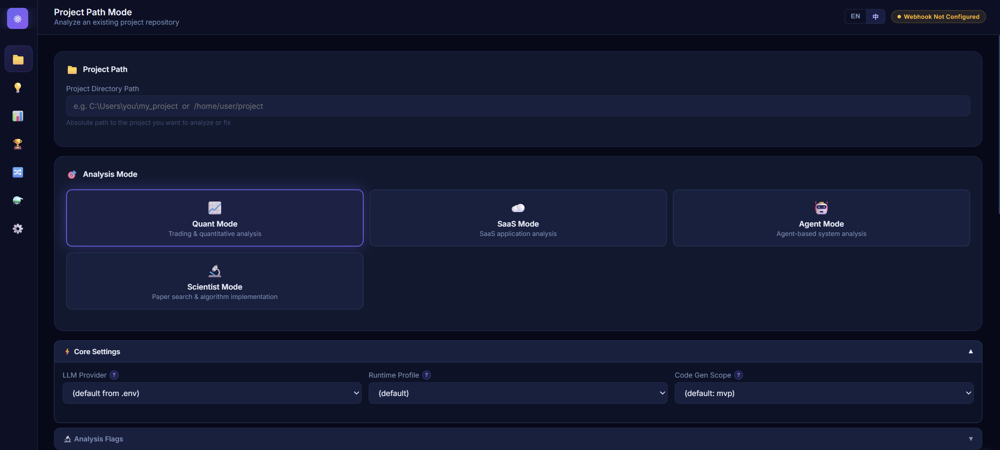
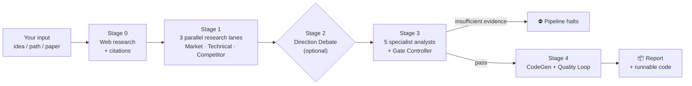

# Crucible

<p align="center">
  
</p>

<p align="center">
  
  
  
</p>

<p align="center">
  <b>Languages:</b> <b>English (current)</b> · <a href="README_zh.md">中文</a><br>
  <b>Full manuals:</b> <a href="README_FULL.md">Full English manual</a> · <a href="README_FULL_zh.md">完整中文手冊</a>
</p>

---

> **Turn "I have an idea" into "runnable code + a 5-analyst risk review."**
> An AI-native multi-agent research engine for investment research, SaaS product analysis, agent architecture evaluation, and academic paper reproduction.

---

## 30 seconds

**Input** — a one-line idea, an existing project directory, or a paper title
**Output** — a structured analysis report (consensus / disagreement / risks / kill criteria) **plus runnable code**
**How** — five specialist AI analysts + a quality gate that **halts the pipeline when evidence is too thin** (instead of confidently producing garbage)

---

## What will you use it for?

| | |
|---|---|
| **🪙 Quant traders / researchers**<br>"I have a strategy idea — is it worth pursuing?"<br><sub>→ Quant mode: research + backtest + tearsheet</sub> | **🛠️ SaaS / product builders**<br>"I want a differentiated product — where are the real pain points?"<br><sub>→ SaaS mode: market + competitor + adoption barriers</sub> |
| **📚 Academic researchers**<br>"I want to reproduce and ablate this paper."<br><sub>→ Scientist mode: algorithm + reproducibility + benchmark</sub> | **🤖 AI agent developers**<br>"I'm building an agent — is the architecture sound?"<br><sub>→ Agent mode: state boundaries + replay safety</sub> |

**Already have a project to fix?** Any of the four research modes can be paired with **Project Path mode** — point Crucible at a directory and it will analyse, fix bugs, and apply additive changes only (existing APIs preserved).

→ Full mode reference: [README_FULL.md#pipeline-modes](README_FULL.md#pipeline-modes)

---

## Start in 3 steps

### Recommended: the WebUI (no CLI flags to memorize)

```bash
git clone https://github.com/Starlight143/crucible.git
cd crucible
pip install -r requirements.txt
```

Then double-click `launch_webui.bat` (Windows) — the browser opens automatically.

**First-run setup:** open the Settings page and paste one API key:

- [**OpenRouter**](https://openrouter.ai/) — recommended; multi-model routing with USD cost tracking
- [**Alibaba Coding Plan**](https://help.aliyun.com/zh/model-studio/) — token-only cost tracking
- **Or run [Ollama](https://ollama.ai) locally** — set `LLM_PROVIDER=ollama`; no key needed, zero ongoing cost

<details>
<summary><b>How do I get an API key?</b></summary>

- **OpenRouter (recommended):** create an account at [openrouter.ai](https://openrouter.ai/) → **Keys** → **Create Key** → copy it → paste it into Crucible's Settings page (or set `OPENROUTER_API_KEY` in your `.env`). Add credit to use paid models; several models have free tiers.
- **Alibaba Coding Plan:** sign up at [Model Studio](https://help.aliyun.com/zh/model-studio/), create an API key, paste it in Settings.
- **Ollama (no key):** install [Ollama](https://ollama.ai), `ollama pull <model>`, set `LLM_PROVIDER=ollama` — fully local, no key, no per-token cost.

Your provider key stays in your local `.env`; Crucible only ever sends it to the provider you chose.
</details>

<details>
<summary><b>Optional: contribute to / read the shared cloud insight corpus</b></summary>

Crucible can mirror its run-insight ledger to a shared, Cloudflare-backed corpus so contributors accumulate signal together. This is **opt-in and access is by request** — it is **not** required to run Crucible (the default backend keeps everything on your own disk).

Request an **ingest** token (contribute your runs) or a **read** token (fetch the distilled summaries) via the [issue tracker](https://github.com/Starlight143/crucible/issues). You'll be given a token to put in `.env`:

```bash
CRUCIBLE_RUN_INSIGHTS_BACKEND=dual
CRUCIBLE_RUN_INSIGHTS_API_URL=<the Worker URL you are given>
CRUCIBLE_RUN_INSIGHTS_API_TOKEN=<your issued token>
```

Ingest tokens are write-only (you cannot read others' raw data); read tokens only ever see curated, distilled output.
</details>

That's it. Pick a mode, type your idea (or paste a project path), hit Run.

<details>
<summary><b>Prefer the CLI? Click to expand.</b></summary>

```bash
# Interactive mode
python run_crucible.py

# Dry-run: scan context without calling LLMs
python run_crucible.py --dry-run

# Self-check only
python run_crucible.py --self-check

# With Direction Debate
python run_crucible.py --direction-debate

# Full production scope with cost tracking
python run_crucible.py --scope production --cost-trace --cost-report
```

Full flag reference: [README_FULL.md](README_FULL.md), or `python run_crucible.py --help`.

</details>

<details>
<summary><b>Production deployment (Gunicorn). Click to expand.</b></summary>

```bash
pip install gunicorn
gunicorn --config gunicorn_config.py "webui.app:app"
```

Key env overrides: `GUNICORN_BIND` (default `0.0.0.0:8080`), `GUNICORN_WORKERS`, `GUNICORN_TIMEOUT` (default `300`s — must exceed your longest pipeline run).

</details>

---

## How it works



Five stages. Any stage can halt the pipeline if its quality gate fails — by design.

→ Stage-by-stage breakdown: [README_FULL.md#stage-details](README_FULL.md#stage-details)

---

## Can I trust the output?

- ✅ **Every claim is traceable to a cited source** — the Research Synthesizer drops unsupported claims to `unknowns` or flags them as `hallucination_flags`
- ✅ **Every decision is traceable to a specific analyst finding** — full evidence chain preserved in output artifacts
- ✅ **The pipeline halts automatically when evidence is insufficient** — no confident-but-wrong outputs
- ✅ **3 255+ automated tests, 100% passing** — covering injection, SSRF, redaction, numerical stability, and cross-process races
- ✅ **Backtest data integrity is enforced by default** — synthetic fallback data is rejected unless you explicitly opt in (`BACKTEST_REQUIRE_REAL_DATA=1` is the default)
- ✅ **Pydantic-validated outputs at every stage** — downstream stages never parse free text

---

## License

- **Free for personal, open-source, and academic use** — [AGPL v3](LICENSE)
- **Commercial use** — closed-source distribution, proprietary SaaS that does not publish source, embedded use, or any deployment that cannot satisfy AGPL-3.0 requires a commercial license

Commercial inquiries: **supervenus928@gmail.com** · See [COMMERCIAL_LICENSE.md](COMMERCIAL_LICENSE.md)

---

## More

- 📘 [Full English manual](README_FULL.md) · [完整中文手冊](README_FULL_zh.md)
- 🏗️ [Architecture](ARCHITECTURE.md)
- 📝 [CHANGELOG](CHANGELOG.md)
- 🤝 [Contributing](CONTRIBUTING.md)
- ⚙️ [Configuration reference](.env.example)

See [CHANGELOG.md](CHANGELOG.md) for the full version history.
