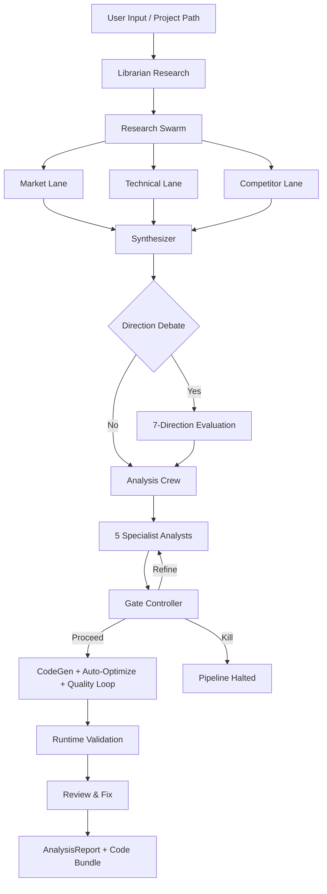

# Crucible

**An AI-native multi-agent research engine that turns investment research, SaaS product analysis, and agent architecture evaluation into repeatable, auditable, quality-gated multi-stage workflows.**

---

## Why Crucible

Traditional research — whether quantitative, product, or architectural — suffers from three systemic problems:

1. **Single-prompt outputs are unstable.** One LLM call cannot reliably produce research-grade results. Outputs vary wildly across runs, hallucinations go undetected, and weak assumptions go unchallenged.

2. **Research is not reproducible or auditable.** When an analyst writes a memo, the reasoning path is opaque. When AI generates a report, the evidence chain is even more opaque. Neither can be systematically reviewed, replayed, or improved.

3. **Feasibility, risk, and limitations are afterthoughts.** Most research tools optimize for generating conclusions — not for evaluating whether those conclusions are achievable, what could go wrong, or what evidence is missing.

Crucible takes a different approach: **treat research as a multi-stage, multi-agent workflow with explicit quality gates.**

---

## Pipeline Overview

```
Research Question / Project Path
         │
         ▼
┌──────────────────────┐
│  Stage 0: Librarian  │  Web search + citations + market data → ResearchContext
└──────────┬───────────┘
           ▼
┌──────────────────────┐
│  Stage 1: Research   │  3 parallel lanes (Market, Technical, Competitor)
│  Swarm               │  → Synthesizer: cross-validates, grounds citations
└──────────┬───────────┘
           ▼
┌──────────────────────┐
│  Stage 2: Direction  │  7 strategic directions → Evidence Audit
│  Debate  (optional)  │  → Multi-axis Comparator → Judge selects best
└──────────┬───────────┘
           ▼
┌──────────────────────┐
│  Stage 3: Analysis   │  5 specialist analysts (Research, Risk, Ops, Biz, Critic)
│  Crew                │  → Gate Controller: proceed / targeted rerun / kill
└──────────┬───────────┘
           ▼
┌──────────────────────┐
│  Stage 4: CodeGen    │  Multi-file generation → Runtime validation
│  + Quality Loop      │  → Quality loop → Review & Fix
└──────────┬───────────┘
           ▼
    AnalysisReport + Code Bundle
    (consensus, disagreement, experiments, score, risk level, runnable code)
```

---

## Pipeline Modes

| Mode | Research Focus | Target Users |
|------|---------------|--------------|
| **Quant** | Market microstructure, signal decay, data quality, execution feasibility, backtest automation, parameter optimization | Quant trading teams, researchers |
| **SaaS** | User pain points, workflow friction, adoption barriers, integration patterns | Product teams, SaaS builders |
| **Agent** | Automation scope, state boundaries, replay safety, deterministic execution | AI agent developers, automation engineers |
| **Scientist** | Paper search and comprehension, algorithm implementation, reproducibility, ablation studies, benchmark comparison | Researchers, ML engineers |

---

## Quick Start

### Prerequisites

- Python 3.10+
- API key for one of the supported LLM providers:
  - [OpenRouter](https://openrouter.ai/) — default, multi-model routing with USD cost tracking
  - [Alibaba Coding Plan](https://help.aliyun.com/zh/model-studio/) — token-cost tracking, single-file batch codegen
  - [Ollama](https://ollama.ai) — fully local, no API key required

### Install

```bash
git clone https://github.com/Starlight143/crucible.git
cd crucible
pip install -r requirements.txt
```

For local development (lint / type-check / security scan):

```bash
pip install -r requirements.txt -r requirements-dev.txt
```

### Configure

```bash
cp .env.example .env
# Edit .env — set your API key and model names
```

The minimum required setting is one of:
- `OPENROUTER_API_KEY` (default provider)
- `ALIBABA_CODING_PLAN_API_KEY`
- `LLM_PROVIDER=ollama` (no key needed)

See [.env.example](.env.example) for the full configuration reference.

### Run

```bash
# Interactive mode (prompts for input)
python run_crucible.py

# Dry-run: scan context without calling LLMs
python run_crucible.py --dry-run

# Self-check only
python run_crucible.py --self-check

# With Direction Debate enabled
python run_crucible.py --direction-debate

# Full production scope with cost tracking
python run_crucible.py --scope production --cost-trace --cost-report
```

---

## WebUI

A graphical interface for all pipeline features — no CLI flags to memorize.

```
launch_webui.bat    ← double-click to start (Windows)
```

Auto-detects an available port (8080–9000). On first run, installs `flask` automatically.

| Page | Purpose |
|------|---------|
| **Idea Mode** | Enter a natural-language idea or strategy; generate code and analysis |
| **Project Path** | Point at an existing project for bug-fix or feature enhancement |
| **Dashboard** | Run history, cost trends, quality distribution, pipeline stage radar |
| **Leaderboard** | Backtest strategy rankings by Sharpe / Return / Drawdown |
| **Compare Runs** | Side-by-side diff of two runs: analysis, scores, costs, gate decisions |
| **A/B Test** | Launch two pipeline variants simultaneously and compare results |
| **Settings** | GUI editor for `.env`; live API key test button; webhook delivery history |

### Production deployment (Gunicorn)

```bash
pip install gunicorn
gunicorn --config gunicorn_config.py "webui.app:app"
```

Key environment overrides: `GUNICORN_BIND` (default `0.0.0.0:8080`), `GUNICORN_WORKERS`, `GUNICORN_TIMEOUT` (default `300`s — must exceed your longest pipeline run).

---

## LLM Provider Setup

Set `LLM_PROVIDER` in `.env` to switch providers:

| Provider | `LLM_PROVIDER` value | Notes |
|----------|---------------------|-------|
| **OpenRouter** | `openrouter` | Default. Supports multi-model routing, USD cost tracking |
| **Alibaba Coding Plan** | `alibaba_coding_plan` | Token-only cost tracking; single-file batch codegen |
| **Ollama** | `ollama` | Fully local. Set `OLLAMA_BASE_URL` if not on `localhost:11434` |

Each provider supports independent model overrides for the Librarian, primary analysis, and Direction Judge stages. See [.env.example](.env.example) for the full variable list.

---

## Key CLI Flags

```bash
# CodeGen output scope
python run_crucible.py --scope mvp          # minimal runnable (default)
python run_crucible.py --scope full          # fully modular system
python run_crucible.py --scope production    # full + tests + Dockerfile + CI

# Auto-optimize: generate → critique → refine loop
python run_crucible.py --codegen-auto-optimize --codegen-optimize-rounds 3

# Gate controller
python run_crucible.py --gate-control        # kill pipeline on weak evidence
python run_crucible.py --selective-rerun     # re-run only flagged analysts

# Budget limits
python run_crucible.py --budget-soft-cost 3 --budget-hard-cost 6

# Post-processing (all combinable)
python run_crucible_enhanced.py run \
  --security-scan \
  --deployment-artifacts \
  --generate-tests \
  --independent-validation \
  --backtest-runner \
  --html-report
```

Run `python run_crucible.py --help` for the full flag reference.

---

## Example Output

Each pipeline run produces typed JSON artifacts:

```json
{
  "project_name": "metadata_universe_builder",
  "score": 74,
  "risk_level": "Medium",
  "consensus": "All analysts agree that a static-first, empirically-validated coverage catalog is the correct starting point.",
  "disagreement": "Risk and Ops analysts disagree on schema drift severity.",
  "experiments": [
    {
      "goal": "Validate field accuracy across 5 exchanges using live API probes",
      "criteria": "Accuracy >= 90% on 8 core fields"
    }
  ],
  "analyst_findings": {
    "research": "Strong market signal: no open-source tool provides...",
    "risk": "Three material risks identified: (1) Schema drift...",
    "ops": "Execution sequence: Week 1-2: manual curation...",
    "biz": "Two viable monetization paths...",
    "critic": "The 15-exchange target may be overambitious..."
  }
}
```

Outputs are written to `saved_projects/` and include: `analysis_result.json`, generated `code/`, `run_meta.json`, `security_report.json`, `deployment/` (Dockerfile, K8s manifests, Helm chart), and more.

---

## Architecture



---

## Design Principles

**Research, not conclusions.** The system produces structured research artifacts — consensus *and* disagreement, evidence *and* unknowns, proposed experiments *and* kill criteria. It does not emit a single recommendation.

**Gated, not end-to-end.** The Gate Controller can halt the pipeline when evidence is insufficient. This prevents the common AI failure mode of producing confident outputs from weak inputs.

**Typed, not free-text.** Every stage produces Pydantic-validated output. Downstream stages never parse free text. Schema evolution is explicit and backward-compatible.

**Auditable, not opaque.** Every claim is traceable to a citation. Every decision is traceable to a specific analyst finding. The full evidence chain is preserved in output artifacts.

**Parallel where possible, sequential where necessary.** Research lanes run in parallel. The Gate Controller runs sequentially after all analysts complete. This balances throughput with quality control.

---

## Testing

```bash
# Full test suite (1747 tests)
python -m pytest tests -q -p no:cacheprovider

# Smoke test (fast, no LLM calls)
python crucible/smoke_test.py

# Self-check
python run_crucible.py --self-check

# Type checking / lint
python -m mypy
python -m ruff check crucible/
```

---

## Project Structure

```
crucible/
├── run_crucible.py          # Main entry point
├── run_crucible_enhanced.py      # Enhanced runner with post-processing pipeline
├── launch_webui.bat                # WebUI launcher (Windows)
├── .env.example                    # Full configuration reference
├── requirements.txt                # Runtime dependencies
├── requirements-dev.txt            # Dev/test dependencies
├── gunicorn_config.py              # Production WSGI config
├── crucible/
│   ├── modules/                    # Pipeline stage implementations (Stages 0–4)
│   ├── features/                   # Post-processing and enhancement modules
│   ├── web_research/               # Web search clients + crew factory
│   └── ...                         # Infrastructure modules
├── webui/
│   ├── app.py                      # Flask backend + REST API
│   └── templates/index.html        # Single-page frontend
└── tests/                          # 1747 tests
```

For a detailed description of every infrastructure module, feature module, and pipeline section, see [ARCHITECTURE.md](ARCHITECTURE.md).

---

## Changelog

See [CHANGELOG.md](CHANGELOG.md) for the full version history.

---

## License

Crucible is **dual-licensed**:

- **Open source — [AGPL v3](LICENSE).** Free for projects that publish their source under AGPL, including any service that exposes Crucible over a network (AGPL-3.0 §13 — Remote Network Interaction).
- **Commercial license** — required for closed-source distribution, proprietary SaaS that does not publish source, embedded use, or any deployment that cannot satisfy AGPL-3.0. Also required if you need indemnification, warranty, or SLA-backed support. See [COMMERCIAL_LICENSE.md](COMMERCIAL_LICENSE.md).

**Commercial inquiries: supervenus928@gmail.com**
