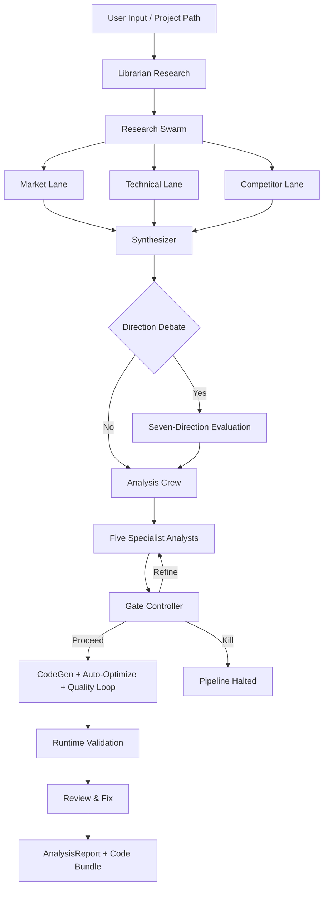

# Crucible — Detailed User Manual

<p align="center">
  
</p>

**Languages / 語言:** **English (current)** · [中文完整手冊](README_FULL_zh.md)
**Short version / 簡短版本:** [Short English README](README.md) · [簡短中文 README](README_zh.md)

---

**An AI-native multi-agent research engine that turns investment research, SaaS product analysis, agent architecture evaluation, and academic paper reproduction into repeatable, auditable, quality-gated multi-stage workflows.**

> This is the **detailed user manual**. For a high-level overview see [README.md](README.md). For internal architecture see [ARCHITECTURE.md](ARCHITECTURE.md). For version history see [CHANGELOG.md](CHANGELOG.md).

---

## Why Crucible

Traditional research workflows — quantitative, product, or architectural — suffer from three systemic problems:

1. **Single-prompt outputs are unstable.** One LLM call cannot reliably produce research-grade output. Variance across runs is enormous, hallucinations go undetected, and weak assumptions are never challenged.
2. **Research is neither reproducible nor auditable.** When an analyst writes a memo, the reasoning path is opaque. When AI generates a report, the evidence chain is even more opaque. Neither can be systematically reviewed, replayed, or improved.
3. **Feasibility, risk, and limitations are afterthoughts.** Most tools optimize for generating conclusions, not for evaluating whether those conclusions are achievable, what could go wrong, or what evidence is missing.

Crucible takes a different approach: **treat research as a multi-stage, multi-agent workflow with explicit quality gates.**

---

## Pipeline Overview

The pipeline decomposes research into multiple stages. Each stage produces structured, typed output for downstream consumers:

```
Research Question / Project Path
         │
         ▼
┌──────────────────────┐
│  0. Librarian        │  Web search + citations + market data
│     (Idea mode)      │  → ResearchContext
└──────────┬───────────┘
           ▼
┌──────────────────────┐
│  1. Research Swarm   │  3 parallel lanes (Market, Technical, Competitor)
│                      │  → Synthesizer: cross-validate + ground citations
└──────────┬───────────┘
           ▼
┌──────────────────────┐
│  2. Direction Debate │  7 strategic directions → Evidence Audit
│     (optional)       │  → Multi-axis Comparator → Judge selects
└──────────┬───────────┘
           ▼
┌──────────────────────┐
│  3. Analysis Crew    │  5 specialist analysts (Research, Risk, Ops, Biz, Critic)
│                      │  → Gate Controller (proceed / refine / kill)
└──────────┬───────────┘
           ▼
┌──────────────────────┐
│  4. CodeGen + QA     │  Multi-file generation → Runtime validation
│                      │  → Quality loop → Review & Fix
└──────────┬───────────┘
           ▼
    AnalysisReport + Code Bundle
    (consensus, disagreement, experiments, score, risk level, runnable code)
```

---

## Stage Details

### Stage 0: Librarian Research

A web search agent and a Librarian LLM cooperatively conduct preliminary literature and market research, producing a `ResearchContext` consumed by every downstream stage. Search results use a two-layer cache:

- The complete `ResearchContext` is cached by `run_librarian_research` via a SHA-256 key (TTL = `LIBRARIAN_CACHE_WINDOW_HOURS`).
- Individual `(provider, query)` lookups are cached in `_SEARCH_QUERY_CACHE` (TTL = 1 hour) so unrelated `user_problem`s with overlapping queries do not produce redundant HTTP requests.
- The `context7` provider is excluded from per-query caching because each call carries full context arguments.

### Stage 1: Research Swarm

Three independent research agents run in parallel, each with specialised evidence-extraction rules:

| Lane | Focus |
|------|-------|
| **Market** | User pain points, workflow friction, adoption barriers, market precedents |
| **Technical** | Architectural patterns, production constraints, failure modes |
| **Competitor** | Competitors, alternatives, open-source equivalents, positioning |

The **Research Synthesizer** merges all three lanes and cross-validates: only claims with citation support survive. Unsupported claims are moved to `unknowns` or flagged as `hallucination_flags`.

### Stage 2: Direction Debate

When a research question has multiple viable paths, the system generates **seven mutually exclusive strategic directions** and evaluates them via a structured procedure:

1. **Direction Proposer** — generates 7 options, each with thesis, metric, test, and risk
2. **Evidence Auditor** — scores evidence quality for every direction
3. **Direction Comparator** — multi-axis ranking (feasibility, reversibility, validation speed, evidence strength, downside severity, unresolved unknowns)
4. **Direction Judge** — selects the winner with go-conditions, kill-criteria, and a validation plan

#### Optional: Direction Debate Audit Mode

Direction Debate Audit Mode is an opt-in capability that captures the per-specialist **disagreement log** — the structural payoff over a vanilla PROCEED/KILL verdict.  Same-model-family crews share blind spots, so unanimous high-confidence verdicts are often the cases where a reviewer should be most suspicious.  Audit mode surfaces this structurally.

When enabled (`CRUCIBLE_DEBATE_AUDIT_MODE=1`), every specialist (Explorer, Comparator, Skeptic, Evidence Auditor, Judge) emits a structured `AUDIT_FINDING` block containing its assumptions, supporting evidence, concerns, explicit disagreements with prior agents, and what information would change its mind.  The Judge additionally emits a `GATE_VERDICT` block in an expanded decision space — `PROCEED` / `BRANCH` / `KILL` / `NEEDS_MORE_DATA` — instead of the legacy binary force-none signal.

Two ledger event kinds (`direction_debate_finding`, `direction_debate_verdict`) capture the audit trail in the existing `.crucible_insights/debate.jsonl` stream.  A deterministic, embedding-free consensus-risk computation flags `zero_disagreement_recorded`, `low_diversity_high_confidence`, per-agent over-confidence (`<role>_too_confident_no_concerns`), and shared-assumption groupthink — all without invoking an LLM.

An optional **External Critic** (`CRUCIBLE_DEBATE_EXTERNAL_CRITIC=1`) acts as a sixth agent that re-judges the Judge's verdict using *only* the raw research evidence and the Judge's terminal decision token.  The Critic does not see the prior agents' chain-of-thought, so it is isolated from sequential anchoring bias.  By default Critic dissent is recorded in the audit trail but the Judge verdict stands; set `CRUCIBLE_DEBATE_CRITIC_OVERRIDE_PROCEED=1` to let a Critic `KILL` override Judge `PROCEED`.

The audit-mode pipeline is **observation-only**: it captures the disagreement trace but does not change which directions are selected, so it can be enabled in production without affecting run outcomes.  See `.env.example` for the full env-var surface and the `Direction Debate Audit` group in the Settings page for per-toggle descriptions.

#### Optional: Librarian Web Research Hardening

The librarian research stage gains five resilience and quality layers that work transparently when enabled (defaults are production-safe — operators typically leave them alone):

- **Disk-persistent search cache** at `saved_projects/.cache/search_cache.sqlite3`.  Per-provider TTL reflects how fast each source drifts (12 h for DuckDuckGo, 24 h for GitHub, 168 h for arXiv).  Refinement iterations on the same topic hit cache instead of re-fetching — typical repeat-run HTTP cost drops 80 %+.
- **Adaptive per-provider cooldown** on 429 / 202 responses.  When DuckDuckGo enters bot-detection mode or any provider rate-limits, the dispatcher backs off with exponential growth (60 s → 120 s → ... up to 30 min) and silently routes around the cooled provider instead of retrying into the wall.
- **Four new zero-auth providers**: OpenAlex (100 k req/day, academic), Crossref (DOI metadata, cross-discipline), Wikipedia REST (definitional Tier-1 baseline), SearXNG (opt-in federated meta-search).  Configured via `LIBRARIAN_EXTRA_PROVIDERS` (default `openalex,crossref,wikipedia`).  All inherit the same cache / cooldown / dedup / SSRF infrastructure.
- **Cross-provider query deduplication**: same normalised query against multiple providers in the same query class fires only the first one — saves ~30 % of HTTP calls when lanes share queries.  Toggle via `LIBRARIAN_CROSS_PROVIDER_DEDUP_ENABLED`.
- **Domain authoritative-source pinning** in `crucible/config/domain_pins.json`.  When a user problem matches an operator-curated pin (e.g. crypto perpetuals → Binance docs, tradfi metrics → Wikipedia Sharpe-ratio page), the librarian pre-fetches those URLs as Tier-1 anchors *before* search dispatch.  Closes the gap where DuckDuckGo returns Tier-2/3 transcriptions but misses the authoritative API docs.
- **Bilingual query expansion** for CJK queries: when the native-language result count falls below `LIBRARIAN_BILINGUAL_QUERY_THRESHOLD=3`, the librarian auto-issues an English mirror of the query (via the librarian LLM by default).  Cross-language results are deduped so the same paper found via Chinese title + English title only counts once.
- **HTTP/2 + connection keep-alive** for outbound calls (optional `h2` dependency; graceful degrade to HTTP/1.1 when not installed).

These all integrate with the SSRF protection from prior v1.1.x audits (no `follow_redirects=True`, every redirect re-checks via `_is_public_http_url`, no IPv6 scope-id smuggling, no IPv4-embedded-IPv6 bypass).  See the `.env.example` and the four new Settings groups (`Librarian Search Cache`, `Librarian Provider Resilience`, `Librarian Extra Providers`, `Librarian Query Quality`) for the per-key knobs.

A complementary control (`CRUCIBLE_DEBATE_TOLERATE_UNVERIFIABLE_EVIDENCE`) lets the operator opt into "degrade-not-die" semantics when the direction-debate gate exhausts its refinement iterations.  Currently observation-only — the corresponding ledger event identifies which runs would have benefited; the behavioural change (returning a low-confidence direction instead of `None`) ships in a follow-up.

### Stage 3: Analysis Crew

Five specialist analysts evaluate the research independently:

| Analyst | Role |
|---------|------|
| **Research** | Market opportunity, user assumptions, product-market signals |
| **Risk** | Irreversible risks, failure conditions, kill criteria |
| **Ops** | Execution sequencing, delivery constraints, monitoring needs |
| **Biz** | Monetisation, distribution, unit economics |
| **Critic** | Challenges assumptions, exposes hidden coupling, rigorous review |

Outputs flow through a quality gate:

- **Gate Context Compactor** — deduplicates and compresses analyst findings
- **Gate Controller** — decides `proceed`, `targeted analyst rerun`, or `kill`
- **Format Checker** — assembles the final `AnalysisReport` without adding new information

### Stage 4: CodeGen + Quality Loop

After clearing the gate, multi-file code generation runs:

- Generates code in batches according to a manifest and dependency graph
- `py_compile` + entrypoint detection + import / smoke validation
- Quality loop (LLM-backed quality gate, capped by max iteration limits)
- Review & Fix repair pass
- **Auto-Optimize** (optional): a `codegen_critic` agent scores output and injects critique feedback for up to N rounds until the threshold is met

---

## Pipeline Modes

| Mode | Research focus | Target users |
|------|----------------|--------------|
| **Quant** | Market microstructure, signal decay, data quality, execution feasibility, backtest automation, parameter optimization | Quant trading teams, researchers |
| **SaaS** | User pain points, workflow friction, adoption barriers, integration patterns | Product teams, SaaS builders |
| **Agent** | Automation scope, state boundaries, replay safety, deterministic execution | AI agent developers, automation engineers |
| **Scientist** | Paper search and comprehension, algorithm implementation, reproducibility, ablation studies, benchmark comparison | Researchers, ML engineers, academics |

---

## Input Modes

The system supports two input modes that determine the pipeline's first half. The second half (CodeGen + post-processing) is shared by both.

### Idea Mode

**Use case:** Starting a new project, MVP, strategy research, or technical feasibility analysis from scratch.

**Flow:**

1. User enters an idea, requirement, or research question
2. **Librarian Research** (Stage 0): web search + citations → `ResearchContext`
3. **Research Swarm** (Stage 1): 3 parallel lanes collect Market/Technical/Competitor evidence
4. **Direction Debate** (Stage 2, optional): generate 7 directions → debate → select
5. **Analysis Crew** (Stage 3): 5 analysts evaluate independently → Gate Controller decision
6. **CodeGen + QA** (Stage 4): multi-file generation → runtime validation → Review & Fix
7. **Post-processing**: security scan → deployment artifacts (with K8s/Helm) → test generation → API patching → independent validation → auto-remediation → backtest automation → memory → dependency audit → quality analysis → HTML report → CI → registry → notifications

### Project Path Mode

**Use case:** Minimum-change fixes, bug fixes, or feature enhancements on an existing project.

**Flow:**

1. User specifies a project path (local directory)
2. The system reads project structure, entrypoints, and dependencies to build context
3. A repair-oriented agent focuses on bugs, structural problems, or specified feature requirements
4. Existing APIs, primary behaviour, and file structure are preserved (additive changes only)
5. Modifications are reviewed and runtime-validated
6. **Post-processing**: identical to Idea mode

> **Post-processing is shared by both modes.** Once CodeGen finishes, every post-processing flag (`--security-scan`, `--deployment-artifacts`, `--generate-tests`, `--api-autopatch`, `--independent-validation`, `--auto-remediation`, `--backtest-runner`, `--dependency-audit`, `--code-quality`, `--html-report`, `--run-registry`, `--notify`, `--ci-output`, etc.) is available regardless of input mode. The only difference is how upstream context is gathered.

---

## Example Output

Each pipeline run produces typed JSON artifacts. A real analysis report:

```json
{
  "project_name": "metadata_universe_builder",
  "score": 74,
  "risk_level": "Medium",
  "consensus": "All analysts agree that a static-first, empirically-validated coverage catalog is the correct starting point...",
  "disagreement": "Risk and Ops analysts disagree on schema drift severity...",
  "experiments": [
    {
      "goal": "Validate field accuracy across 5 exchanges using live API probes",
      "criteria": "Accuracy >= 90% on 8 core fields"
    }
  ],
  "analyst_findings": {
    "research": "Strong market signal: no open-source tool provides...",
    "risk": "Three material risks identified: (1) Schema drift...",
    "ops": "Execution sequence: Week 1-2: manual curation...",
    "biz": "Two viable monetization paths...",
    "critic": "The 15-exchange target may be overambitious..."
  }
}
```

Outputs are written to `saved_projects/`, typically including:

- `analysis_result.json` — analysis report (`AnalysisReport` Pydantic model serialisation, with `schema_version`; load via `load_analysis_report_safe(path)` which transparently handles legacy field renames and unknown fields without raising)
- `run_meta.json` — execution metadata
- `run_snapshot.json` — pipeline snapshot
- `runtime_validation.log` — runtime validation log
- `review_report.json` — review report
- `README.md` — generated project documentation
- `requirements.txt` — generated project dependencies
- `code/` — generated code

---

## Quick Start

### Prerequisites

- Python 3.10+
- API key for one of the supported LLM providers:
  - [OpenRouter](https://openrouter.ai/) — default
  - [Alibaba Coding Plan](https://help.aliyun.com/zh/model-studio/) — token-only cost tracking
  - [Ollama](https://ollama.ai) — fully local, no API key required

### Install

```bash
git clone https://github.com/Starlight143/crucible.git
cd crucible
pip install -r requirements.txt
```

For local dev (lint / type-check / security scan):

```bash
pip install -r requirements.txt -r requirements-dev.txt
```

Dependency split:

- [requirements.txt](/requirements.txt) — runtime dependencies
- [requirements-dev.txt](/requirements-dev.txt) — dev / validation dependencies
- `bandit`, `pip-audit` are dev-only; not in the runtime install set
- `yfinance`, `ccxt` are optional dependencies for the backtest runner (only required when `--backtest-runner` needs real market data)

### Configure

```bash
cp .env.example .env
# Edit .env to fill in API key and model settings
```

### Run

```bash
# Interactive mode (prompts for input)
python run_crucible.py

# Self-check only (no LLM calls)
python run_crucible.py --self-check

# Dry-run: scan context without calling LLMs
python run_crucible.py --dry-run
```

---

## WebUI

The WebUI provides a graphical interface to every pipeline feature — no CLI flags to memorize.

### Launch

Double-click `launch_webui.bat`; the browser opens automatically. On first run `flask` is installed automatically.

```
launch_webui.bat   ← double-click to launch
```

- Auto-detects an available localhost port (8080–9000 range)
- If launched with admin privileges, automatically adds a hosts entry so the browser shows a friendly URL
- Otherwise falls back to `http://localhost:<port>`

### Pages

| Page | Purpose |
|------|---------|
| **Project Path** | Point at an existing project for analysis or repair; full CLI flag panel |
| **Idea Mode** | Enter a natural-language idea or strategy and generate code; full CLI flag panel |
| **Dashboard** | Run history, cost trends, quality distribution, pipeline-stage radar chart, daily/monthly budget bar |
| **Leaderboard** | Backtest strategy ranking, sortable by Sharpe / Return / Drawdown, etc. |
| **Compare Runs** | Side-by-side diff of two runs: analysis, scores, costs, gate decisions, code file count |
| **A/B Test** | Launch two pipeline configurations (Variant A / B) simultaneously; metrics comparison and winner declaration on completion |
| **Settings** | GUI editor for `.env`; live API key Test button; webhook delivery history. Covers every settable item: Backtest, Quant Analytics Suite (Walk-Forward / Signal / Regime / MC / Factor / Risk), Transaction Cost Model, Tearsheet Report, Multi-Language CodeGen, Document Ingestion, GitHub Analyzer, etc. |

### Flag Selector

Both the Project Path and Idea pages have an expandable, grouped flag panel:

- **Core Settings** — Provider / Runtime Profile / Scope (dropdowns)
- **Analysis Flags** — dry-run, direction-debate, strict-json, cache, etc. (checkboxes)
- **Code Generation** — auto-optimize rounds / threshold (number inputs)
- **Budget & Limits** — soft-cost / hard-cost / max-tokens (number inputs)
- **Post-Processing** — security-scan, deployment-artifacts, generate-tests, etc. (checkboxes, defaults shown)
- **Advanced Features** — backtest-runner, dedup-check, multilang-codegen, etc.
- **Per-Stage Model Overrides** — independent model selection for Librarian, Analysis, and Direction Judge
- **Diff & VCS** (Project Path only) — diff-aware, diff-base-ref
- **External Data** — sources, symbols, date range

Flags with default-on values (memory, security-scan, deployment-artifacts) are pre-checked and labelled `ON`.

### Backend API Routes

| Method | Route | Description |
|--------|-------|-------------|
| GET | `/` | Main SPA |
| GET | `/api/env` | Read `.env` as `{key: value}` |
| POST | `/api/env` | Atomic write of `.env` |
| GET | `/api/env/schema` | Grouped schema from `.env.example` |
| POST | `/api/run` | Start a pipeline run, returns `{run_id}` |
| GET | `/api/run/<id>` | Run status + buffered output |
| GET | `/api/run/<id>/stream` | SSE line-by-line output (auto-terminates) |
| DELETE | `/api/run/<id>` | Cancel a running run |
| GET | `/api/dashboard` | Aggregated stats from `saved_projects/` |
| GET | `/api/runs` | Recent completed runs |
| GET | `/api/cost-trend` | Historical score/run trend (for charting); accepts `?limit=30&mode=quant` |
| GET | `/api/leaderboard` | Backtest leaderboard; accepts `?sort_by=sharpe_ratio&mode=quant&limit=50` |
| GET | `/api/run/<id>/detail` | Full JSON report + code file listing |
| GET | `/api/run/<id>/backtest-chart` | Equity curve + drawdown curve + monthly returns |
| GET | `/api/run/<id>/stages` | Stage timing + token estimates (HITL state) |
| POST | `/api/run/<id>/signal` | Send a signal to a running pipeline's stdin (HITL approval) |
| GET | `/api/run/compare` | Side-by-side diff of two runs: `?a=<id>&b=<id>` |
| POST | `/api/ab-test/run` | Launch an A/B test (two configurations in parallel) |
| GET | `/api/ab-test/<ab_id>` | A/B test status + metrics comparison |
| POST | `/api/env/validate` | Validate API-key reachability; returns `{valid, latency_ms}` |
| GET | `/api/run/stage-models` | Current model name for each stage |
| GET | `/api/budget/status` | Today / month-to-date / cumulative cost stats |
| GET | `/api/webhook/history` | Last 50 webhook delivery attempts |
| POST | `/api/notify/test` | Test a webhook URL (with retry reporting) |
| GET | `/api/insights/summary` | Run Insights ledger summary: per-stream event counts + recent global feed |
| GET | `/api/insights/events` | Paginated event feed; supports `?stream=output\|error\|debate\|params&run_id=&kind=&limit=&since=` |
| GET | `/api/run/<id>/insights` | All ledger events for a single run, grouped by stream |

### Production Deployment (Gunicorn)

Beyond the development Flask server, `gunicorn_config.py` (repo root) provides a production-ready configuration:

```bash
pip install gunicorn
gunicorn --config gunicorn_config.py "webui.app:app"
```

Primary settings (all overridable via environment variables):

| Variable | Default | Description |
|----------|---------|-------------|
| `GUNICORN_BIND` | `0.0.0.0:8080` | Listen address and port |
| `GUNICORN_WORKERS` | `min(2×CPU+1, 8)` | Worker processes (must be > 0) |
| `GUNICORN_THREADS` | `2` | Threads per worker |
| `GUNICORN_TIMEOUT` | `300` | Worker silent timeout (seconds); must exceed your longest pipeline run |
| `GUNICORN_MAX_REQUESTS` | `500` | Max requests per worker before restart (memory-leak guard) |
| `GUNICORN_FORWARDED_ALLOW_IPS` | `127.0.0.1` | Trusted X-Forwarded-For source IPs; set to your upstream proxy IP in production |
| `GUNICORN_LOG_LEVEL` | `info` | Log level |

### Dependencies

The WebUI requires only `flask` (auto-installed by the launcher). Production deployment additionally requires `gunicorn`. All other dependencies are shared with the main pipeline.

---

## Architecture



> For module-level architecture (pipeline section files, infrastructure modules, feature modules, web research) see [ARCHITECTURE.md](ARCHITECTURE.md).

---

## LLM Provider Setup

Three providers are supported via the `LLM_PROVIDER` environment variable:

| Provider | `LLM_PROVIDER` value | API base | Notes |
|----------|----------------------|----------|-------|
| **OpenRouter** | `openrouter` | `https://openrouter.ai/api/v1` | Default; multi-model routing; USD cost tracking |
| **Alibaba Coding Plan** | `alibaba_coding_plan` | `https://coding-intl.dashscope.aliyuncs.com/v1` | Token-only cost tracking; single-file batch codegen; auto-injects `x-source: opencode` header |
| **Ollama** | `ollama` | `http://localhost:11434/v1` (default) | Fully local LLM, offline; no API key; OpenAI-compatible API |

### Environment Variables

Copy [.env.example](/.env.example) to `.env` first, then fill in the required values.

**OpenRouter (default):**

| Variable | Description |
|----------|-------------|
| `OPENROUTER_API_KEY` | **Required** — OpenRouter API key |
| `OPENROUTER_PRIMARY_MODEL` | Primary pipeline model |
| `OPENROUTER_DIRECTION_JUDGE_MODEL` | Stage 0 Direction Judge model |
| `OPENROUTER_LIBRARIAN_MODEL` | Librarian / research model |
| `OPENROUTER_LLM_TIMEOUT_SECONDS` | Request timeout (seconds) |

**Alibaba Coding Plan:**

| Variable | Description |
|----------|-------------|
| `ALIBABA_CODING_PLAN_API_KEY` | **Required** — Alibaba Coding Plan API key |
| `ALIBABA_CODING_PLAN_BASE_URL` | API base URL override |
| `ALIBABA_CODING_PLAN_PRIMARY_MODEL` | Primary pipeline model |
| `ALIBABA_CODING_PLAN_DIRECTION_JUDGE_MODEL` | Direction Judge model |
| `ALIBABA_CODING_PLAN_LIBRARIAN_MODEL` | Librarian model |

**Ollama (local LLM):**

1. Install [Ollama](https://ollama.ai) and start the service: `ollama serve` (or let the system service start it).
2. Pull the model (initial download, may take several minutes): `ollama pull llama3.2`
3. Verify the service: `curl http://localhost:11434/api/tags`
4. Set `LLM_PROVIDER=ollama` in `.env`

> **Note:** Ollama models run on local CPU/GPU and are slower than cloud APIs. Increase `OPENROUTER_LLM_TIMEOUT_SECONDS` (e.g. to 1800) to avoid timeouts. If the Ollama service is not running, you will see `Connection refused` at startup.

| Variable | Default | Description |
|----------|---------|-------------|
| `OLLAMA_BASE_URL` | `http://localhost:11434/v1` | Ollama service API base URL |
| `OLLAMA_PRIMARY_MODEL` | `llama3.2` | Primary pipeline model |
| `OLLAMA_DIRECTION_JUDGE_MODEL` | `llama3.2` | Stage 0 Direction Judge model |
| `OLLAMA_LIBRARIAN_MODEL` | `llama3.2` | Librarian / research model |

### Feature Flags

| Variable | Description |
|----------|-------------|
| `STRICT_JSON=1` | Force JSON output |
| `COST_TRACE=1` | Enable cost tracing |
| `LOCAL_CACHE=1` | Enable local LLM cache |
| `CRUCIBLE_LOG_LEVEL=INFO` | Log level |
| `CRUCIBLE_JSON_LOGS=1` | JSON-formatted logs |
| `CRUCIBLE_ENV_FILE=.env` | Custom env file path |
| `CODEX_ENTRYPOINT=api/main.py:app` | Runtime validation entrypoint override |
| `API_VERSION_CHECK_ENABLED=1` | Enable API version checking |

### Run Insights Ledger

| Variable | Default | Description |
|----------|---------|-------------|
| `CRUCIBLE_RUN_INSIGHTS_ENABLED` | `1` | Master switch. Set `0` to disable the entire subsystem (recorder returns a `_NullRecorder`, all emit points become no-ops, WebUI shows "subsystem is disabled"). |
| `CRUCIBLE_RUN_INSIGHTS_RECORD_OUTPUT` | `1` | Record `output_method` events when section 07 successfully saves a project. |
| `CRUCIBLE_RUN_INSIGHTS_RECORD_ERRORS` | `1` | Record `error_record` events when `resilience.kickoff_crew_with_retry` exhausts retries. |
| `CRUCIBLE_RUN_INSIGHTS_RECORD_DEBATE` | `1` | Record `direction_debate_rejection` events when Stage 0 force-nones or parse-fails after all fallbacks. |
| `CRUCIBLE_RUN_INSIGHTS_RECORD_PARAMS` | `auto` | `auto` = record in Quant mode only (matches the "Quant records runtime parameters, non-Quant does not" requirement); set `1` to force-on / `0` to force-off. Typos fall back to `auto` (never truthy-coerce). |
| `CRUCIBLE_RUN_INSIGHTS_REDACT` | `1` | Redact sensitive fields (`api_key`, `token`, `secret`, `webhook_url`, `auth`, etc.) recursively before write. Set `0` for raw payloads. |
| `CRUCIBLE_RUN_INSIGHTS_BACKEND` | `local` | Storage backend: `local` (JSONL streams under `.crucible_insights/`). `cloudflare` / `dual` are reserved names — the protocol seam is in place but the implementations raise `NotImplementedError`. |
| `CRUCIBLE_RUN_INSIGHTS_DIR` | `.crucible_insights` | Ledger root directory (relative paths anchor to `PROJECT_ROOT`). |
| `CRUCIBLE_RUN_INSIGHTS_INLINE_MAX_BYTES` | `4096` | Payloads larger than this are spilled to `blobs/<content_id>.json` and referenced by `payload_blob` hash. |
| `CRUCIBLE_RUN_INSIGHTS_MAX_ENTRIES_PER_STREAM` | `2000` | FIFO cap per stream — older entries pruned via atomic temp-file swap once the limit is reached. |
| `CRUCIBLE_RUN_ID` | — | Auto-injected by the WebUI when spawning a pipeline subprocess; binds `run_correlation.set_run_id()` so all telemetry, logs, and ledger entries share the same correlation id. Direct CLI invocations auto-generate a UUID4. |

Additional reserved keys for the planned retrieval + LLM skill distillation layer appear in `.env.example` but are not yet honoured: `CRUCIBLE_RUN_INSIGHTS_API_URL`, `CRUCIBLE_RUN_INSIGHTS_API_TOKEN`, `CRUCIBLE_RUN_INSIGHTS_RETRIEVAL_*`, `CRUCIBLE_RUN_INSIGHTS_INJECT_*`, `CRUCIBLE_RUN_INSIGHTS_DISTILLATION_*`.

### Direction Debate / Gate

| Variable | Description |
|----------|-------------|
| `DIRECTION_REFINEMENT_ENABLED=1` | Allow Direction Debate to do supplementary research refinement when evidence is insufficient (does not auto-enable Stage 0) |
| `DIRECTION_REFINEMENT_MAX_ITERATIONS=2` | Max refinement iterations |
| `GATE_DIRECTION_FEEDBACK_ENABLED=1` | Allow the Gate Controller to send `evidence` / `detail` shortfalls back to refinement when applicable |

`GATE_DIRECTION_FEEDBACK_ENABLED` only takes effect when **all** of the following hold:

- Gate Controller is enabled
- Selective rerun is enabled
- The flow is **not** Project Path mode

### Infrastructure Module Variables

These tune the behaviour of cross-cutting infrastructure modules without code changes. Module internals are documented in [ARCHITECTURE.md](ARCHITECTURE.md).

**Context Budget (`context_budget.py`)**

| Variable | Default | Description |
|----------|---------|-------------|
| `CONTEXT_BUDGET_TOKENS` | `80000` | Max estimated tokens; compaction triggers at `COMPACT_RATIO` |
| `CONTEXT_BUDGET_COMPACT_RATIO` | `0.85` | Threshold ratio for triggering compaction (0.5–1.0) |
| `CONTEXT_BUDGET_KEEP_RECENT` | `6` | Recent messages always preserved during compaction |
| `CONTEXT_BUDGET_CHARS_PER_TOKEN` | `4` | Char/token estimation coefficient |

**Convergence Guard (`convergence_guard.py`)**

| Variable | Default | Description |
|----------|---------|-------------|
| `CONVERGENCE_MAX_ITERATIONS` | `50` | Max loop iterations (0 = unlimited) |
| `CONVERGENCE_TIMEOUT_SECONDS` | `3600` | Wall-clock timeout in seconds (0.0 = unlimited) |
| `CONVERGENCE_STALE_THRESHOLD` | `5` | Consecutive identical signatures before `StaleLoopWarning` (0 = disabled) |
| `CONVERGENCE_STALE_RAISES` | `false` | When `true`, repeated signatures raise `ConvergenceError` instead of warning |

**HTTP Retry (`http_retry.py`)**

| Variable | Default | Description |
|----------|---------|-------------|
| `HTTP_RETRY_MAX_ATTEMPTS` | `3` | Max retries for `@with_http_retry` |
| `HTTP_RETRY_BACKOFF_SECONDS` | `2.0` | Initial backoff seconds (exponential base) |
| `HTTP_RETRY_MAX_BACKOFF_SECONDS` | `30.0` | Backoff upper bound |
| `HTTP_RETRY_TIMEOUT_SECONDS` | `30` | Per-request timeout for `safe_get`/`safe_post` |
| `HTTP_RETRY_MAX_BYTES` | `2097152` | Max response body bytes for `safe_get` (2 MB) |

**Project Memory (`features/project_memory.py`)**

| Variable | Default | Description |
|----------|---------|-------------|
| `PROJECT_MEMORY_PROMPT_CHARS` | `16000` | Max chars of memory injected into prompts (~4000 tokens); older entries dropped first |

**Telemetry (`telemetry.py`)**

| Variable | Default | Description |
|----------|---------|-------------|
| `TELEMETRY_QUEUE_SIZE` | `1000` | Background event queue depth; events silently dropped when full (`dropped` counter increments) |

**File Cache (`_file_cache.py`)**

| Variable | Default | Description |
|----------|---------|-------------|
| `FILE_CACHE_MAX_ENTRIES` | `256` | LRU file-cache max entries (keyed by `(abspath, mtime_ns)`) |

---

## Common Commands

### Help

```bash
python run_crucible.py --help
```

### Runtime Validation Entrypoint

```bash
python run_crucible.py --entrypoint api/main.py:app
python run_crucible.py --entrypoint api/main.py:app,service.py:application
python run_crucible.py --entrypoint api/main.py:create_app()
```

### Direction Debate

```bash
python run_crucible.py --direction-debate
python run_crucible.py --direction-debate-only
python run_crucible.py --direction-debate --strict-json --cost-trace --cache --cost-report --api-version-check
```

Stage 0 Direction Debate is now controlled exclusively by CLI flags:

- `--direction-debate`
- `--direction-debate-only`

There is no longer an "env-default-on" main-line behaviour for Stage 0 Direction Debate.

### API Version Check

```bash
python run_crucible.py --api-version-check
python run_crucible.py --no-api-version-check
```

### CodeGen Scope (Output Size)

`--scope` controls how complete the CodeGen output is. Default is `mvp` (minimum runnable); raise to `full` (full modular system) or `production` (full + tests + Docker + CI).

```bash
# Default — minimum runnable implementation
python run_crucible.py --scope mvp

# Full modular system
python run_crucible.py --scope full

# Production-ready (tests + Dockerfile + GitHub Actions CI)
python run_crucible.py --scope production

# Combine with auto-optimize
python run_crucible.py --scope full --codegen-auto-optimize --codegen-optimize-rounds 3
```

| Flag | Default | Description |
|------|---------|-------------|
| `--scope mvp` | ✓ default | Minimum runnable implementation, behaviour as before |
| `--scope full` | off | Full modular system, no tests or deployment configs |
| `--scope production` | off | Full scope + pytest test suite + Dockerfile + CI |

**Per-mode `full` / `production` outputs:**

**Quant mode:**
- `full`: full quant trading system — `risk_manager.py` (Kelly / volatility-target / max drawdown protection), `portfolio.py` (multi-asset position ledger), `performance.py` (Sharpe / Sortino / Calmar / CAGR / rolling metrics + HTML/CSV report), `cli.py` (backtest / live / report / optimize subcommands), structured logging
- `production`: above + `tests/` (strategy / backtest / data_provider / risk_manager / performance per-module tests) + Dockerfile + docker-compose + `.github/workflows/ci.yml` + Makefile

**SaaS mode:**
- `full`: full FastAPI service — SQLAlchemy 2.0 async + Alembic migrations, JWT auth (python-jose + passlib), full CRUD (schemas.py + crud.py), pydantic-settings configuration, structured logging + correlation-ID middleware
- `production`: above + pytest-asyncio test suite + Dockerfile + docker-compose (with PostgreSQL) + CI

**Agent mode:**
- `full`: full headless service — `job_queue.py` (`asyncio.Queue` + JobWorker), `tool_registry.py` (ToolRegistry + input schema validation), `retry.py` (async decorator + CircuitBreaker), pydantic-settings configuration, JSON structured logging, graceful shutdown (SIGINT/SIGTERM)
- `production`: above + pytest-asyncio test suite + Dockerfile + systemd service file + CI

> **Note:** Validation-scope (when Gate Controller enables validation scope) always takes precedence over `--scope`.
> All codegen components (primary crew, timeout-recovery crew, manifest planner) — their goals, backstories, manifest planning rules, and output rules — switch to validation mode to ensure Gate decisions are not overridden.
>
> **Timeout recovery behaviour:** when the primary crew times out and the recovery fallback fires, the recovery agent receives a goal consistent with `--scope` (under full/production scope, it is told to "attempt full system; do best-effort when context is insufficient" rather than silently degrading to a minimal scaffold).
>
> **Code fixer (Project Path mode):** `_mode_code_fix_rule_lines` deliberately does not accept a `scope` parameter — the goal of code fix is always "minimum-change bug fix", independent of the original generation's scope, to prevent full/production rules from misleading the fixer into adding new modules.

### CodeGen Auto-Optimize

`--codegen-auto-optimize` inserts a **generate → critique → refine** loop after CodeGen. Each round is scored by the `codegen_critic` agent; if the score is below threshold, specific issues and improvement suggestions are injected into the next round's prompt.

```bash
# Enable with defaults (max 3 rounds, threshold 0.80)
python run_crucible.py --codegen-auto-optimize

# Custom rounds and threshold
python run_crucible.py --codegen-auto-optimize --codegen-optimize-rounds 5 --codegen-optimize-threshold 0.85

# Combined with other flags
python run_crucible.py --codegen-auto-optimize --codegen-optimize-rounds 3 --budget-hard-cost 4 --cost-report
```

| Flag | Default | Description |
|------|---------|-------------|
| `--codegen-auto-optimize` | off | Enable generate → critique → refine loop |
| `--codegen-optimize-rounds N` | `3` | Max N rounds (min 1). Critic scoring runs every round; stops early when threshold is met; final return is the highest-scoring bundle. |
| `--codegen-optimize-threshold SCORE` | `0.80` | Stop early when critic score reaches this threshold (range 0.0–1.0). |

**Behaviour:**

- After each `codegen` round, the `codegen_critic` agent emits a `CritiqueBundle` (score, issues, suggestions, summary).
- If score ≥ threshold, the current best bundle is emitted immediately.
- If score < threshold, the critique is injected into the prompt context for the next round's generation.
- The system tracks scores throughout and returns the historically best-scoring bundle.
- **Plateau detection:** if two consecutive rounds improve the score by less than 0.01, the loop stops early to avoid wasting budget.
- If the budget hard limit triggers, the loop stops before the next round begins, returning the current best bundle.
- Critic failure (JSON parse failure or LLM timeout) does not affect the main flow; the current bundle continues.
- `--codegen-auto-optimize` is Idea-mode only; the Project Path code fixer does not apply it.

### Gate Controller / Selective Rerun

```bash
python run_crucible.py --gate-control
python run_crucible.py --no-gate-control
python run_crucible.py --selective-rerun
python run_crucible.py --no-selective-rerun
```

Gate-feedback behaviour:

- `evidence` path: rerun only the analysts named by the Gate
- When `--direction-debate` is also active, the `evidence` path returns to the currently selected direction to top up evidence/detail; it does not re-open new direction proposals
- `detail` path: rerun only the analysts named by the Gate; does not re-open Direction Debate
- The feedback loop is bounded to at most 2 round-trips

### Runtime Profile / Budget

```bash
python run_crucible.py --runtime-profile lite
python run_crucible.py --runtime-profile pro --budget-soft-cost 3 --budget-hard-cost 6 --budget-max-tokens 120000
python run_crucible.py --runtime-profile enterprise --cost-report
```

---

## Validation & Testing

### Self-check

```bash
python run_crucible.py --self-check
```

### Smoke Test

```bash
python crucible/smoke_test.py
```

### Full pytest

```bash
python -m pytest tests -q -p no:cacheprovider
```

> The full pytest suite passes on every release; see `CHANGELOG.md` for the per-version baseline test count and `tests/` for the actual files.

### unittest

```bash
python -m unittest discover -s tests -p "test_*.py"
```

### Ruff / mypy

```bash
python -m ruff check <changed-python-files>
python -m mypy
```

Tests and runtime use a repo-local temp root via `CODEX_TMP_DIR`: default `.tmp/runtime/session-<pid>-<uuid>`. Each Python process uses an isolated session directory, avoiding pytest's numbered-temp-directory residue or ACL contamination on Windows / sandbox environments.

### Security Scan

```bash
python -m bandit -q -r crucible -x crucible/modules/section_04_web_research_and_direction.py
python -m pip_audit -r requirements.txt
python -m pip_audit -r requirements-dev.txt
```

---

## Design Principles

**Research, not conclusions.** The system produces structured research artifacts — consensus *and* disagreement, evidence *and* unknowns, proposed experiments *and* kill criteria. It does not emit a single recommendation.

**Gated, not end-to-end.** The Gate Controller can halt the pipeline when evidence is insufficient. This prevents the common AI failure mode of producing confident outputs from weak inputs.

**Typed, not free-text.** Every stage produces Pydantic-validated output. Downstream stages never parse free text. Schema evolution is explicit and backward-compatible.

**Auditable, not opaque.** Every claim is traceable to a citation. Every decision is traceable to a specific analyst finding. The full evidence chain is preserved in output artifacts.

**Parallel where possible, sequential where necessary.** Research lanes run in parallel. The Gate Controller runs sequentially after all analysts complete. This balances throughput with quality control.

---

## Enhanced Runner

`run_crucible_enhanced.py` is the enhanced entry point that wraps the core pipeline with pre- and post-processing capabilities:

```bash
python run_crucible_enhanced.py [subcommand] [flags]
```

Without a subcommand, all parameters are forwarded to the core pipeline (fully backward-compatible).

### Subcommands

| Command | Modes | Description |
|---------|-------|-------------|
| `run` | Idea / Path | Run the core pipeline (Stages 0–4); on completion, run any enabled post-processing features in order. All pre/post flags can be combined. |
| `watch <dir>` | Path | Monitor `<dir>` for file changes (watchdog preferred, polling fallback); after debounce, retrigger `run` as a subprocess. Each trigger runs in an isolated subprocess (no shared LLM state). Forwards `--security-scan`, `--deployment-artifacts`, `--use-memory`, `--independent-validation`. |
| `batch <dir>` | Idea | Scan all subdirectories of `<dir>` containing Python files; run `run` for each as a subprocess. Limited parallelism (`--batch-workers N`, max 4). Produces `batch_summary.json`. Forwards `--security-scan`, `--deployment-artifacts`, `--independent-validation`. |
| `compare <run_a> <run_b>` | — | Does not run the pipeline. Compares two completed run directories: score/risk/confidence delta, added/resolved blocking risks, direction changes, code unified diff. Produces `comparison_report.json` in `<run_b>/`. |
| `postprocess <run_dir>` | — | Does not run the pipeline. Re-runs post-processing (security scan, deployment artifacts, test generation, API patching, independent validation, etc.) on an existing run directory — useful for retroactively applying features or refreshing artifacts. All post-flags available. |
| `abtest` | Idea / Path | Runs two pipeline variants (Variant A / Variant B) with the same input, compares score, risk, gate decision, consensus, blocking risks, etc. Each variant runs in a fully isolated subprocess (no LLM state contamination). `--variant-a-context` / `--variant-b-context` inject extra guidance per variant; `--variant-a-args` / `--variant-b-args` pass distinct core CLI flags; `--shared-args` for flags shared by both. Subprocess stdout/stderr always redirected to `{output_dir}/{label}.log` to prevent interleaving (especially in parallel mode). Produces `ab_test_report.json` in `--output-dir`. Set `AB_TEST_PARALLEL=1` to run variants in parallel. |

### `run` Subcommand Flags

#### Pre-flags (Run Before Pipeline)

| Flag | Default | Modes | Description |
|------|---------|-------|-------------|
| `--diff-aware / --no-diff-aware` | off | **Path only** | Run `git diff` on `--project-dir` before the pipeline starts; show files added/modified/deleted since `--diff-base-ref`. **Informational only**, does not alter pipeline behaviour. Meaningless in Idea mode (no project to diff). |
| `--diff-base-ref REF` | `HEAD~1` | **Path only** | Git ref to compare against (commit SHA, branch, tag). Only meaningful when `--diff-aware` is on. |
| `--project-dir PATH` | — | **Path only** | Absolute path to the project to read. Without it, `--diff-aware` does not run. |
| `--use-memory / --no-use-memory` | on | **Idea + Path** | Enable cross-run project memory. Pipeline shows memory store state at start; on completion, persists this run's direction decisions, confirmed tech choices, failed experiments, and blocking risks to `project_memory.jsonl` (JSONL append-only ledger). On future runs of similar projects, analyst agents reference history to avoid repeating mistakes. Each project keeps at most `ENHANCED_PROJECT_MEMORY_MAX_ENTRIES` entries (default 50). |
| `--interactive / --no-interactive` | off | **Idea + Path** | Open an interactive context-collection dialogue before pipeline launch (TTY only; auto-skipped in CI). Guides the user through: focus areas, design constraints, risk preference (conservative/moderate/aggressive), prior hypotheses, free-text notes. Collected context is written to `_interactive_context.txt` and injected via `PIPELINE_INTERACTIVE_CONTEXT` env var; librarian/analyst stages reference it. Auto-cleaned after the run. |
| `--dedup-check / --no-dedup-check` | off | **Idea + Path** | Compare this run's topic against historical `analysis_result.json` summaries via TF-IDF cosine similarity to detect semantically duplicate runs. When similarity ≥ `DEDUP_SIMILARITY_THRESHOLD` (default 0.85), prompt the user in a TTY environment to confirm continuation; auto-continue in non-TTY (CI). Auto-upgrades to bigram + sublinear TF when `scikit-learn` is installed. |

#### Post-flags (Run After CodeGen)

Post-processing runs in order after the core pipeline emits the `code/` directory. **All post-flags work for both Idea and Path modes** because they operate on already-generated code, independent of upstream context-gathering.

**Order:** External Data → Security Scan → Deployment Artifacts → Test Generation → API Auto-patch → Independent Validation → Auto-Remediation → Backtest Runner → Project Memory → Dependency Audit → Code Quality → HTML Report → CI/CD Output → Run Registry → Multi-language CodeGen → Agent Metrics → Prompt Version Tracking → Notifications → Post-Analysis Chat

| Flag | Default | LLM | Description |
|------|---------|-----|-------------|
| `--security-scan / --no-security-scan` | on | no | Static security scan of every `.py` file under `code/`. Prefers `bandit` (if installed); falls back to 14 built-in regex pattern rules covering `eval()`, hardcoded credentials, SQL injection, unsafe deserialization, etc. Produces `security_report.json`. |
| `--deployment-artifacts / --no-deployment-artifacts` | on | no | AST-detect web framework (FastAPI/Flask/Django/aiohttp/tornado/Streamlit) and ORM (SQLAlchemy/Alembic), then auto-generate: multi-stage Dockerfile (non-root user, healthcheck), docker-compose.yml (with PostgreSQL service when ORM is present), `.env.example`, GitHub Actions CI workflow, alembic.ini (ORM only), Kubernetes Deployment/Service manifests, Helm chart (Chart.yaml + values.yaml + templates). All written to `deployment/`. **Auto-detects a free local port** (scans up to 100 ports starting from each framework's conventional port; falls back to OS ephemeral port); all artifacts share the resolved port. `.env.example`'s `ALLOWED_HOSTS` automatically includes localhost entries with the port. |
| `--generate-tests / --no-generate-tests` | off | **yes** | For each Python source file under `code/` (excluding `test_*`, `__init__.py`, `tests/`), extract public API (functions, classes), then call the LLM to generate a pytest suite. Includes syntax validation and one retry (regenerates with a repair prompt on initial SyntaxError). Produces `code/tests/test_<module>.py` + `conftest.py` + `pytest.ini`. Up to `ENHANCED_GENERATE_TESTS_MAX_FILES` files (default 20). |
| `--api-autopatch / --no-api-autopatch` | off | **yes** | Read the API version report in `run_snapshot.json`, find deprecated API usage, call the LLM to generate a patch, and apply it directly. Useful when generated code uses third-party APIs about to be deprecated. Produces `api_autopatch_report.json`. |
| `--independent-validation / --no-independent-validation` | off | **optional** | Independent validation agent that audits output from a "validator" perspective (different crew from the generator). Two phases:<br>**Phase B (Subprocess, no LLM):** ① per-file `py_compile` syntax check ② if `code/tests/` exists, run `pytest` (with timeout protection) ③ if `main.py` exists, run `python main.py --help` smoke check (validates import + initialisation, doesn't trigger business logic).<br>**Phase A (LLM adversarial review, requires LLM):** with an adversarial persona (strict code reviewer), feed source + claims from `analysis_result.json` to the LLM for independent review of logic errors, security vulnerabilities, requirement mismatches, missing error handling. Produces structured JSON findings (severity/category/file/line).<br>Set `ENHANCED_INDEPENDENT_VALIDATION_LLM=0` to run only Phase B (suitable for CI without LLM). Produces `independent_validation_report.json`. |
| `--ci-output / --no-ci-output` | off | no | Generate GitHub Actions workflow commands (`::error file=...` / `::warning` / `::notice`) to `github_annotations.txt`, plus a Markdown step summary in `ci_summary.md`. Auto-enabled when `GITHUB_ACTIONS=true`. |
| `--auto-remediation / --no-auto-remediation` | off | **yes** | Closed-loop remediation: collect HIGH+ issues from security scan and independent validation → call LLM to patch code → validate syntax → apply patch. Re-scans after each round; up to `ENHANCED_AUTO_REMEDIATION_MAX_ROUNDS` rounds (default 3). Produces `auto_remediation_report.json`. |
| `--backtest-runner / --no-backtest-runner` | off | **optional** | **Quant mode only.** Automated backtest pipeline: ① detect backtest entrypoint in `code/` (`backtest.py` / `run_backtest.py` / `main.py`) ② fetch real historical data: prefer the project's `data_provider.py`, then yfinance (stocks/ETFs) or Binance public API (crypto), finally synthetic GBM fallback ③ run backtest in an isolated subprocess and parse results (Sharpe, Max Drawdown, Win Rate, etc.) ④ if backtest fails and an LLM is available, call the LLM to fix and retry (up to `BACKTEST_FIX_MAX_ROUNDS` rounds) ⑤ detect tunable parameters (supports `# tunable:` comments and module-level constants); execute grid/random search ⑥ produce best parameter set + full analysis. Produces `backtest_report.json`, `backtest_analysis.md`, `best_params.env`. |
| `--dependency-audit / --no-dependency-audit` | off | no | Run `pip-audit` against `code/requirements.txt` (or run-root). Detects CVE/PYSEC vulnerabilities and lists fix versions. Gracefully degrades (reports as skipped) if `pip-audit` is not installed. Produces `dependency_audit_report.json`. |
| `--code-quality / --no-code-quality` | off | no | AST analysis of every Python file under `code/`: LOC (total/blank/comment/code), McCabe cyclomatic complexity, function length, nesting depth, parameter count. Warns on threshold violations (complexity > 10, function > 50 lines, nesting > 4, params > 7). Produces `code_quality_report.json`. |
| `--html-report / --no-html-report` | off | no | Merge every run artifact (analysis, security, validation, dependency audit, remediation) into a single self-contained HTML report (dark theme, inline CSS, no external deps). Produces `report.html`. |
| `--run-registry / --no-run-registry` | off | no | Index completed runs in a SQLite database (`run_registry.db`) supporting cross-run queries: highest score, project history, failed security scans. Each sync scans `saved_projects/` and upserts all runs. |
| `--notify / --no-notify` | off | no | Send a webhook notification on run completion. Supports generic HTTP POST, Slack Incoming Webhook, Discord Webhook. URLs come from `NOTIFY_WEBHOOK_URL`, `NOTIFY_SLACK_WEBHOOK_URL`, `NOTIFY_DISCORD_WEBHOOK_URL`. Set `NOTIFY_ON_FAIL_ONLY=1` to notify only on failure (success defined as `analysis_result.json` score ≥ 50 and risk_level ≠ critical). |
| `--external-data SOURCES` | — | no | Fetch real market data from external sources before pipeline run; write to `{run_dir}/code/data/` for the backtest runner. `SOURCES` is comma-separated: `alpha_vantage` (or `av`), `coingecko` (or `gecko`), `fred`. Required: `--external-symbols`. |
| `--external-symbols SYMS` | — | no | Comma-separated symbol list. Format depends on the source: Alpha Vantage uses tickers (`AAPL,MSFT`); CoinGecko uses CoinGecko IDs (`bitcoin,ethereum`); FRED supports series IDs or aliases (`CPI,GDP`). |
| `--external-start DATE` | 2 years ago | no | Start date for fetching (`YYYY-MM-DD`). Default is two years before the run date. |
| `--external-end DATE` | today | no | End date for fetching (`YYYY-MM-DD`). Default is the run date. |
| `--multilang-codegen / --no-multilang-codegen` | off | **yes** | Translate Stage 4 Python output into multiple languages. Default targets are TypeScript 5.x and Go 1.21+ (override via `--multilang-langs`). Per-language outputs go to `{run_dir}/code_typescript/`, `{run_dir}/code_go/`, etc.; manifest in `multilang_manifest.json`. Set `MULTILANG_ENABLE_RUST=1` to additionally enable Rust 2021. |
| `--multilang-langs LANGS` | `typescript,go` | **yes** | Comma-separated list of target languages (e.g. `typescript,go,rust`). Only effective with `--multilang-codegen`. |
| `--agent-metrics / --no-agent-metrics` | off | no | After the run, scan all historical runs in `saved_projects/`; aggregate avg/max/min score, gate pass rate, hallucination flag count, security pass rate, avg experiments per project. Outputs a terminal dashboard and `agent_metrics_report.json`. |
| `--prompt-version-label LABEL` | — | no | Tag this run with a prompt version label (SQLite `prompt_versions.db`); auto-creates the label if new. On completion, records the analysis score in the `prompt_scores` table for cross-run comparison of prompt-version performance (`metrics` subcommand can query best-version). |
| `--post-chat / --no-post-chat` | off | **yes** | After the pipeline completes, open an interactive Q&A grounded on this run's `analysis_result.json`, `run_snapshot.json`, and generated code. **Conversation history persists** to `{run_dir}/.postchat_history.json`; auto-restored on next launch (type `reset` to clear). Type `exit`/`quit` to leave (TTY only; auto-skipped in CI). |

#### Pre-flags — Input Enhancement

| Flag | Default | Description |
|------|---------|-------------|
| `--ingest-docs / --no-ingest-docs` | off | Inject local documents (PDF/Markdown/TXT/DOCX) into pipeline research context before launch. Required: `--ingest-docs-dir`. Injected via `PIPELINE_INTERACTIVE_CONTEXT` env var; librarian/analyst stages reference it. Each file truncated to `DOCUMENT_INGESTION_MAX_CHARS` (default 8000) chars; combined cap `DOCUMENT_INGESTION_TOTAL_CHARS` (default 32000). |
| `--ingest-docs-dir DIR` | — | Source directory for `--ingest-docs`. Recursive scan supported. |
| `--github-repo URL` | — | Before pipeline launch, fetch the README, recent issues, closed PRs, commits, and metadata of the specified GitHub repository to inject as research context. URL: `https://github.com/owner/repo` or `owner/repo`. Use `GITHUB_TOKEN`/`GH_TOKEN` to raise rate limits (optional). With exponential backoff retry (max 2). |

> **Project Profile (auto):** if CWD or workspace root contains `project_profile.yaml` or `project_profile.json`, the pipeline auto-loads it and prefills project name, tech stack, known constraints, prior decisions, etc. into context. No flag needed. Override the search path with `PIPELINE_PROJECT_PROFILE`.

### Post-Run Output Files

After each run, post-processing features write to the run directory:

```text
saved_projects/<run_dir>/
├── security_report.json                # Security scan report
├── api_autopatch_report.json           # API version auto-patch report
├── independent_validation_report.json  # Independent validation report (syntax/pytest/smoke + adversarial review)
├── auto_remediation_report.json        # Auto-remediation report (LLM patch results)
├── dependency_audit_report.json        # Dependency vulnerability scan
├── code_quality_report.json            # Code quality metrics
├── report.html                         # Self-contained HTML aggregate report
├── github_annotations.txt              # GitHub Actions annotation commands
├── ci_summary.md                       # CI/CD Markdown summary
├── backtest_report.json                # Backtest run report (JSON)
├── backtest_analysis.md                # Backtest analysis report (Markdown)
├── best_params.env                     # Best parameter combination (.env format)
├── comparison_report.json              # Comparison report (compare subcommand)
├── checkpoints/                        # Stage checkpoint data
│   ├── <stage_name>.json
│   └── <stage_name>.meta.json
├── code/
│   └── data/
│       ├── <source>_<symbol>.csv       # External data fetch result (--external-data)
│       └── external_data_manifest.json # Per-file metadata (source/symbol/rows/path)
├── ab_test_output/                     # A/B test output (abtest subcommand, customise with --output-dir)
│   └── ab_test_report.json             # Two-variant score delta, risk, gate decision comparison
└── deployment/
    ├── Dockerfile
    ├── docker-compose.yml
    ├── .env.example
    ├── alembic.ini                     # Only when ORM is detected
    ├── .github/workflows/ci.yml
    ├── k8s/
    │   ├── deployment.yaml
    │   └── service.yaml
    └── helm/
        ├── Chart.yaml
        ├── values.yaml
        └── templates/
            ├── deployment.yaml
            └── service.yaml
```

### Enhanced Runner Environment Variables

For full configuration see [.env.example](/.env.example), `# Enhanced runner` section.

Each environment variable is a persistent default for a corresponding CLI flag. Set once and you never need to repeat it on the command line. **CLI flags take precedence** over environment variables when they conflict.

| Variable | Default | CLI flag | Description |
|----------|---------|----------|-------------|
| `ENHANCED_SECURITY_SCAN` | `1` | `--security-scan` | Auto-run static security scan after each run |
| `ENHANCED_DEPLOYMENT_ARTIFACTS` | `1` | `--deployment-artifacts` | Auto-generate deployment artifacts (Dockerfile, etc.) after each run |
| `ENHANCED_PROJECT_MEMORY` | `1` | `--use-memory` | Enable cross-run project memory persistence |
| `ENHANCED_PROJECT_MEMORY_MAX_ENTRIES` | `50` | — | Max entries per project in `project_memory.jsonl` (oldest evicted; atomic JSONL overwrite) |
| `ENHANCED_GENERATE_TESTS` | `0` | `--generate-tests` | Auto-run LLM test generation after each run (requires LLM) |
| `ENHANCED_GENERATE_TESTS_MAX_FILES` | `20` | — | Max Python source files processed per test-gen run |
| `ENHANCED_API_AUTOPATCH` | `0` | `--api-autopatch` | Auto-run API version autopatch after each run (requires LLM) |
| `ENHANCED_INDEPENDENT_VALIDATION` | `0` | `--independent-validation` | Auto-run independent validation agent after each run |
| `ENHANCED_INDEPENDENT_VALIDATION_LLM` | `1` | — | When validation is enabled, also run Phase A (LLM adversarial review). Set `0` for Phase B only (CI environments without LLM) |
| `ENHANCED_INDEPENDENT_VALIDATION_TIMEOUT` | `60` | — | Subprocess timeout (seconds) for pytest and smoke check in Phase B |
| `ENHANCED_CI_OUTPUT` | `0` | `--ci-output` | CI/CD annotation output. Auto-enabled when `GITHUB_ACTIONS=true` |
| `ENHANCED_WATCH_DEBOUNCE_SECONDS` | `30` | `--watch-debounce` | Debounce delay in watch mode (wait this many seconds after last change) |
| `ENHANCED_BATCH_MAX_WORKERS` | `1` | `--batch-workers` | Default batch parallelism (`1` = serial, max `4`) |
| `ENHANCED_AUTO_REMEDIATION` | `0` | `--auto-remediation` | Auto-run closed-loop remediation after each run (requires LLM) |
| `ENHANCED_AUTO_REMEDIATION_MAX_ROUNDS` | `3` | — | Max remediation iterations |
| `ENHANCED_DEPENDENCY_AUDIT` | `0` | `--dependency-audit` | Auto-run pip-audit dependency scan after each run |
| `ENHANCED_CODE_QUALITY` | `0` | `--code-quality` | Auto-run AST code quality analysis after each run |
| `ENHANCED_BACKTEST_RUNNER` | `0` | `--backtest-runner` | Auto-run Quant backtest pipeline after each run |
| `BACKTEST_TIMEOUT` | `120` | — | Max seconds per backtest subprocess |
| `BACKTEST_SYMBOL` | `SPY` | — | Ticker/symbol to download (`SPY`, `BTCUSDT`, `ETH/USDT`); auto-detected from code |
| `BACKTEST_DATA_SOURCE` | `auto` | — | Source: `auto` (auto-detect), `yfinance`, `binance`, `project` (call project's data_provider.py), `synthetic` (synthetic only) |
| `BACKTEST_PERIOD` | `auto` | — | Historical data range (yfinance format: `2y`, `6mo`, `30d`, etc.). `auto` chooses appropriate length based on detected interval |
| `BACKTEST_INTERVAL` | `auto` | — | K-line granularity: `1m`, `5m`, `15m`, `30m`, `1h`, `4h`, `1d`, `1w`, `1M`, etc. `auto` detects from strategy source (scans `TIMEFRAME`/`INTERVAL`/`CANDLE_INTERVAL`) |
| `BACKTEST_DATA_ROWS` | `500` | — | Synthetic OHLCV row count (only when network fetch fails; `auto` interval uses profile defaults) |
| `BACKTEST_PARAM_SEARCH` | `grid` | — | Search strategy: `grid` or `random` |
| `BACKTEST_MAX_COMBOS` | `50` | — | Max parameter scan combinations |
| `BACKTEST_TARGET_METRIC` | `sharpe_ratio` | — | Optimization target metric (`sharpe_ratio`, `total_return_pct`, `max_drawdown_pct`, `sortino_ratio`, etc.) |
| `BACKTEST_FIX_MAX_ROUNDS` | `3` | — | Max LLM-fix iterations |
| `BACKTEST_INITIAL_CAPITAL` | `100000` | — | Initial backtest capital |
| `ENHANCED_HTML_REPORT` | `0` | `--html-report` | Auto-generate HTML aggregate report after each run |
| `ENHANCED_RUN_REGISTRY` | `0` | `--run-registry` | Index runs in SQLite registry |
| `NOTIFY_WEBHOOK_URL` | — | — | Generic HTTP POST webhook URL (empty = disabled) |
| `NOTIFY_SLACK_WEBHOOK_URL` | — | — | Slack Incoming Webhook URL |
| `NOTIFY_DISCORD_WEBHOOK_URL` | — | — | Discord Webhook URL |
| `NOTIFY_ON_FAIL_ONLY` | `0` | — | Set to `1` to notify only on pipeline failure |
| `ENHANCED_INTERACTIVE` | `0` | `--interactive` | Auto-run interactive context collection before each run (auto-skipped in non-TTY) |
| `ENHANCED_DEDUP_CHECK` | `0` | `--dedup-check` | Auto-run semantic duplicate detection before each run |
| `DEDUP_SIMILARITY_THRESHOLD` | `0.85` | — | TF-IDF cosine similarity threshold for triggering duplicate warning (0.0–1.0) |
| `DEDUP_LOOKBACK_DAYS` | `30` | — | Only consider runs within the last N days; `0` = unlimited |
| `DEDUP_MAX_CORPUS_RUNS` | `100` | — | Max historical runs in similarity-comparison corpus |
| `ALPHA_VANTAGE_API_KEY` | — | — | Alpha Vantage API key (required for `--external-data alpha_vantage`) |
| `ALPHA_VANTAGE_BASE_URL` | `https://www.alphavantage.co` | — | Alpha Vantage API base URL |
| `FRED_API_KEY` | — | — | FRED API key (optional; raises rate limit) |
| `FRED_BASE_URL` | `https://api.stlouisfed.org` | — | FRED API base URL |
| `COINGECKO_BASE_URL` | `https://api.coingecko.com/api/v3` | — | CoinGecko API base URL (free tier, no key) |
| `EXTERNAL_DATA_TIMEOUT` | `30` | — | External data HTTP request timeout (seconds) |
| `EXTERNAL_DATA_MAX_RETRIES` | `3` | — | External data HTTP max retries (exponential backoff) |
| `AB_TEST_TIMEOUT` | `3600` | — | Max seconds per A/B variant subprocess |
| `AB_TEST_PARALLEL` | `0` | — | Set to `1` to run A/B variants in parallel (more resource-heavy) |
| `ENHANCED_INGEST_DOCS` | `0` | `--ingest-docs` | Auto-run document ingestion before each run |
| `ENHANCED_INGEST_DOCS_DIR` | — | `--ingest-docs-dir` | Default source directory for document ingestion |
| `ENHANCED_GITHUB_REPO` | — | `--github-repo` | Default GitHub repo URL for ingestion. Format: `owner/repo` or full URL |
| `ENHANCED_MULTILANG_CODEGEN` | `0` | `--multilang-codegen` | Auto-run multi-language code translation after each run |
| `ENHANCED_MULTILANG_LANGS` | `typescript,go` | `--multilang-langs` | Multi-language target list (comma-separated) |
| `ENHANCED_POST_CHAT` | `0` | `--post-chat` | Auto-open post-run interactive Q&A (auto-skipped in non-TTY) |
| `ENHANCED_AGENT_METRICS` | `0` | `--agent-metrics` | Auto-generate agent metrics dashboard after each run |
| `ENHANCED_PROMPT_VERSION_LABEL` | — | `--prompt-version-label` | Default prompt version label (empty = no version tracking) |
| `GITHUB_TOKEN` / `GH_TOKEN` | — | — | GitHub Personal Access Token for the GitHub repo analyzer (optional; raises rate limit from 60 → 5000 req/hr) |
| `OTEL_EXPORTER_OTLP_ENDPOINT` | — | — | OpenTelemetry OTLP exporter endpoint (e.g. `http://localhost:4317` or `http://localhost:4318/v1/traces`). When set, `OtelSpanSink` auto-activates and exports every `TelemetryEvent` as an OTel span. Supports gRPC (port 4317) and HTTP (path containing `/v1/traces`). Requires `opentelemetry-sdk` |
| `DOCUMENT_INGESTION_MAX_CHARS` | `8000` | — | Char cap per ingested document (truncated above) |
| `DOCUMENT_INGESTION_TOTAL_CHARS` | `32000` | — | Combined char cap for all ingested documents |
| `GITHUB_ANALYZER_TIMEOUT` | `15` | — | GitHub analyzer HTTP request timeout (seconds) |
| `GITHUB_ANALYZER_MAX_RETRIES` | `2` | — | GitHub analyzer max retries (5xx / rate limit, exponential backoff) |
| `ENHANCED_QUANT_ANALYTICS` | `0` | `--quant-analytics` | Walk-forward validation + statistical significance testing (Quant mode) |
| `ENHANCED_WALK_FORWARD` | `1` | `--walk-forward` | Walk-forward inside `--quant-analytics` (default on) |
| `ENHANCED_SIGNIFICANCE_TEST` | `1` | `--significance-test` | Significance testing inside `--quant-analytics` (default on) |
| `ENHANCED_REGIME_DETECTION` | `0` | `--regime-detection` | Market regime detection (Quant mode) |
| `REGIME_METHOD` | `volatility` | `--regime-method` | Regime detection method: `volatility`, `trend`, `hmm` |
| `REGIME_N_REGIMES` | `3` | — | HMM hidden state count |
| `REGIME_VOL_WINDOW` | `20` | — | Rolling volatility window (volatility method) |
| `REGIME_TREND_WINDOW` | `50` | — | SMA window (trend method) |
| `ENHANCED_FACTOR_ANALYSIS` | `0` | `--factor-analysis` | CAPM/Fama-French factor exposure regression (Quant mode) |
| `ENHANCED_TRANSACTION_COST` | `0` | `--transaction-cost` | Transaction cost sensitivity analysis (Quant mode) |
| `ENHANCED_MONTE_CARLO` | `0` | `--monte-carlo` | Monte Carlo simulation + stress testing (Quant mode) |
| `MC_N_SIMULATIONS` | `5000` | — | Monte Carlo path count |
| `MC_HORIZON_DAYS` | `252` | — | Simulation horizon (trading days) |
| `ENHANCED_TEARSHEET` | `0` | `--tearsheet` | Generate strategy tearsheet (Markdown + HTML) |
| `ENHANCED_SIGNAL_ANALYSIS` | `0` | `--signal-analysis` | Signal decay analysis (Quant mode) |
| `ENHANCED_COINTEGRATION` | `0` | `--cointegration` | Cointegrated pair-trading analysis (Quant mode; ≥ 2 asset CSVs required) |
| `ENHANCED_DYNAMIC_CORRELATION` | `0` | `--dynamic-correlation` | Rolling correlation matrix + PCA decomposition (Quant mode) |
| `ENHANCED_LOCKFILE_GEN` | `0` | `--lockfile-gen` | Generate pyproject.toml + pinned requirements.txt for the generated code |
| `WALK_FORWARD_N_SPLITS` | `5` | — | Walk-forward fold count |
| `WALK_FORWARD_OOS_PCT` | `0.3` | — | OOS percentage per fold |
| `SIG_N_PERMUTATIONS` | `1000` | — | Significance permutation test count |
| `SIG_N_BOOTSTRAP` | `1000` | — | Significance bootstrap CI resample count |
| `POST_CHAT_CONTEXT_CHARS` | `12000` | — | Run context char cap for post-analysis chat |
| `MULTILANG_MAX_FILES` | `10` | — | Max Python source files for multi-language translation |
| `MULTILANG_MAX_CHARS` | `4000` | — | Max chars per file fed to LLM for translation |
| `MULTILANG_ENABLE_RUST` | `0` | — | Set to `1` to enable Rust 2021 multi-language translation (default off) |
| `PIPELINE_PROJECT_PROFILE` | — | — | Custom project profile path (YAML or JSON). Overrides auto-search |

---

## Examples

### Idea Mode (from scratch)

```bash
# Minimal — enter an idea, the pipeline runs end-to-end
# Default: security scan + deployment artifacts on, others off
python run_crucible_enhanced.py run

# Full post-processing
python run_crucible_enhanced.py run \
  --generate-tests --api-autopatch --independent-validation \
  --auto-remediation --dependency-audit --code-quality --html-report
```

### Path Mode (existing-project repair)

```bash
# With diff-aware context — show recent git changes before pipeline
python run_crucible_enhanced.py run \
  --diff-aware --project-dir /path/to/project

# Specify a custom diff base
python run_crucible_enhanced.py run \
  --diff-aware --project-dir /path/to/project --diff-base-ref abc1234
```

### Independent Validation

```bash
# Enable independent validation agent (Phase B subprocess + Phase A LLM review)
python run_crucible_enhanced.py run --independent-validation

# Subprocess validation only (no LLM, suitable for CI)
ENHANCED_INDEPENDENT_VALIDATION_LLM=0 \
  python run_crucible_enhanced.py run --independent-validation

# Re-run independent validation on an existing run directory
python run_crucible_enhanced.py postprocess \
  saved_projects/20240101_120000_myproject --independent-validation
```

### Auto-Remediation + Quality Analysis + HTML Report

```bash
# On an existing run: auto-remediate security issues + code quality + HTML report
python run_crucible_enhanced.py postprocess \
  saved_projects/20240101_120000_myproject \
  --auto-remediation --code-quality --html-report

# Dependency vulnerability scan (requires pip-audit: pip install pip-audit)
python run_crucible_enhanced.py postprocess \
  saved_projects/20240101_120000_myproject --dependency-audit

# Send Slack notification on completion
NOTIFY_SLACK_WEBHOOK_URL=https://hooks.slack.com/services/... \
  python run_crucible_enhanced.py run --notify

# Index all historical runs in SQLite registry
python run_crucible_enhanced.py postprocess \
  saved_projects/20240101_120000_myproject --run-registry
```

### Quant Backtest Automation

```bash
# Full Quant pipeline + auto-backtest + parameter scan
python run_crucible_enhanced.py run --backtest-runner

# Combine with auto-remediation: fix backtest code bugs first, then backtest
python run_crucible_enhanced.py run --auto-remediation --backtest-runner

# Re-run backtest on an existing Quant run
python run_crucible_enhanced.py postprocess \
  saved_projects/20240101_120000_myquant --backtest-runner

# Custom backtest parameters
BACKTEST_TIMEOUT=300 \
BACKTEST_DATA_ROWS=1000 \
BACKTEST_PARAM_SEARCH=random \
BACKTEST_MAX_COMBOS=100 \
BACKTEST_TARGET_METRIC=sortino_ratio \
  python run_crucible_enhanced.py run --backtest-runner
```

**Quant CodeGen output structure:**

Quant mode codegen now mandates the following files:

| File | Purpose |
|------|---------|
| `strategy.py` | Strategy logic (signal generation, entry/exit rules) |
| `backtest.py` | Backtest engine (auto-invokes `data_provider` to prepare data) |
| `data_provider.py` | Data supply module (priority: yfinance/Binance API real OHLCV download → local CSV cache → synthetic fallback + data validation) |
| `trade.py` | Trading/execution module |
| `live_trader.py` | Live/paper trading module (loads broker config from `.env`) |
| `export.py` | Signal/result export |
| `config.py` | Centralised settings (all parameters from env vars; supports `BACKTEST_PARAM_*` override) |
| `.env.example` | Env var template (broker / trade / strategy parameters with safe placeholders) |
| `README.md` | Project documentation (quick-start, flag reference, backtest usage, live setup guide) |

**Data fetch priority (`BACKTEST_DATA_SOURCE=auto`):**

1. Existing project data files (`code/data/*.csv`, etc.) → use directly
2. Project has `data_provider.py` → call it to fetch/generate data
3. `yfinance` installed and symbol is stock/ETF → download real OHLCV from Yahoo Finance
4. Binance public API available → download crypto OHLCV (no API key needed)
5. Last resort → generate synthetic GBM data (marked as `synthetic` in report)

The system auto-detects the trading symbol from code (scans `SYMBOL`/`TICKER`/`PAIR` constants), or uses the `BACKTEST_SYMBOL` env var.

**K-line granularity auto-detection (`BACKTEST_INTERVAL=auto`):**

The system scans strategy source for `TIMEFRAME`/`INTERVAL`/`CANDLE_INTERVAL`/`KLINE_INTERVAL`/`GRANULARITY`/`RESOLUTION`/`BAR_SIZE` constants and auto-matches the data fetch granularity and historical range. Defaults to `1d` / `2y` if undetected.

| Detected granularity | Auto period | yfinance interval | Binance interval | Synthetic rows |
|----------------------|-------------|-------------------|------------------|---------------|
| `1m` | 7d | 1m | 1m | 5000 |
| `5m` | 30d | 5m | 5m | 5000 |
| `15m` | 60d | 15m | 15m | 4000 |
| `30m` | 60d | 30m | 30m | 3000 |
| `1h` | 6mo | 1h | 1h | 4000 |
| `4h` | 1y | 1h | 4h | 2000 |
| `1d` (default) | 2y | 1d | 1d | 500 |
| `1w` | 5y | 1wk | 1w | 260 |
| `1M` | 10y | 1mo | 1M | 120 |

Sub-daily granularity CSV timestamps include `%Y-%m-%d %H:%M:%S`; daily and above use `%Y-%m-%d`.

**Parameter scan mechanism:**

In strategy files, mark tunable parameters with `# tunable: PARAM_NAME = [v1, v2, v3]` comments, or use module-level constants (`LOOKBACK = 20`). The backtest runner auto-detects them and generates the parameter space. Each combination is passed via `BACKTEST_PARAM_<NAME>` env vars to the subprocess; `config.py` reads them.

### Quant Advanced Analytics Suite

Activated with `--quant-analytics` and related flags. Quant mode only. Modules listed in [ARCHITECTURE.md](ARCHITECTURE.md). All modules implemented in pure Python stdlib (no numpy/pandas dependency); scipy is optional for higher statistical precision.

```bash
# Full Quant analysis: backtest + advanced suite
python run_crucible_enhanced.py run \
  --backtest-runner \
  --quant-analytics \
  --regime-detection --regime-method hmm \
  --factor-analysis \
  --transaction-cost \
  --monte-carlo \
  --tearsheet \
  --signal-analysis

# Re-run advanced analysis on an existing run
python run_crucible_enhanced.py postprocess \
  saved_projects/20240101_120000_myquant \
  --quant-analytics --monte-carlo --tearsheet
```

Every module has mode-isolation protection: if `analysis_result.json` shows non-Quant mode, quant-specific analyses are auto-skipped, so other-mode runs are not contaminated.

### Watch / Batch / Compare / Postprocess

```bash
# Watch mode (Path mode, debounce 60s, with independent validation)
python run_crucible_enhanced.py watch . \
  --watch-debounce 60 --independent-validation

# Batch analyse multiple projects (2 parallel workers)
python run_crucible_enhanced.py batch ./projects --batch-workers 2

# Compare two existing runs (no pipeline execution; pure analysis)
python run_crucible_enhanced.py compare \
  saved_projects/run_old saved_projects/run_new

# Re-run post-processing on an existing run (e.g. add test generation)
python run_crucible_enhanced.py postprocess \
  saved_projects/20240101_120000_myproject --generate-tests
```

### Document Ingestion / GitHub Analyzer / Multi-language CodeGen / Post-Chat

```bash
# Inject local documents (PDF/Markdown/TXT/DOCX) as research context
python run_crucible_enhanced.py run \
  --ingest-docs --ingest-docs-dir ./docs

# Inject GitHub repo analysis as research context
python run_crucible_enhanced.py run \
  --github-repo https://github.com/owner/repo

# Generate TypeScript + Go translations after run
python run_crucible_enhanced.py run \
  --multilang-codegen --multilang-langs typescript,go

# Open interactive Q&A after run (TTY only)
python run_crucible_enhanced.py run --post-chat

# Open interactive Q&A on an existing run
python run_crucible_enhanced.py chat \
  saved_projects/20240101_120000_myproject

# View agent metrics dashboard for all historical runs
python run_crucible_enhanced.py metrics

# Output dashboard to JSON
python run_crucible_enhanced.py metrics \
  --output agent_metrics_report.json

# Track per-version performance with prompt version label
python run_crucible_enhanced.py run \
  --prompt-version-label "v2_with_constraints"

# Enable OpenTelemetry OTLP export (requires opentelemetry-sdk)
OTEL_EXPORTER_OTLP_ENDPOINT=http://localhost:4317 \
  python run_crucible_enhanced.py run

# Full feature combination
python run_crucible_enhanced.py run \
  --ingest-docs --ingest-docs-dir ./research_docs \
  --github-repo myorg/myrepo \
  --multilang-codegen \
  --agent-metrics \
  --prompt-version-label "prod_v1" \
  --post-chat

# Regression tests (in an environment with saved_projects/ runs)
pytest tests/regression/ -v
```

---

## Selected WebUI Features

### Human-in-the-Loop (WebUI)
The terminal detects `[AWAIT_INPUT:…]` markers emitted by the pipeline and surfaces an inline banner prompting the operator to type a response. Clicking **Submit** sends the text directly to the running process's stdin via `POST /api/run/<id>/signal` — no terminal interaction required. The banner is disabled during the in-flight request to prevent duplicate signals.

### Pipeline Stage Visualisation & Timing
The **Agent Flow** tab renders a `.stage-stats-panel` below the DAG showing elapsed wall-clock time and estimated token consumption for each completed stage. Stage events are detected from live output and surfaced via `GET /api/run/<id>/stages`.

### Run Comparison (WebUI)
The **Compare Runs** page lets you pick any two saved runs and view a colour-diffed side-by-side table of: analysis score, total cost, token count, gate decision, risk level, code file count. Differences are highlighted green/red. Backed by `GET /api/run/compare?a=<id>&b=<id>`.

### A/B Test WebUI
The **A/B Test** page starts two pipeline variants simultaneously and polls until both finish, then renders a metrics comparison table and declares a winner. Backed by `POST /api/ab-test/run` and `GET /api/ab-test/<ab_id>`.

### Settings Enhancements
- **Grouped field display** with provider-aware active highlighting
- **API Key Test button** appears next to OpenRouter and Alibaba API key fields. Clicking it calls `POST /api/env/validate`, which makes a real HTTP probe to the provider and reports latency. Keys are never exposed in error messages.
- **Webhook History card** at the bottom of Settings shows the last 20 delivery attempts (timestamp, URL, status code, attempt number, success badge). The **Test Webhook** button uses `POST /api/notify/test`.

### Backtest Detail Page
The run detail modal renders:
1. **Drawdown Curve** — a red inverted-y line chart computed from the equity curve's running peak.
2. **Monthly Returns Heatmap** — a compact table with cells colour-scaled red→green, computed from the equity curve.

Both datasets are returned by the enhanced `GET /api/run/<id>/backtest-chart` response.

### Per-Stage Model Overrides
A **Per-Stage Model Overrides** accordion in the run form lets you set `librarian_model`, `primary_model`, and `direction_judge_model` independently per run, overriding the global `.env` values without editing the settings file.

### Output Schema Versioning
All run output files carry a `schema_version` field. The backend's `_apply_schema_compat()` migrates v0/legacy field names (`win_loss_rate` → `win_rate`, `return_pct` → `total_return_pct`) transparently on read, so old saved runs continue to display correctly in the WebUI.

### Cost Budget Cap & Daily/Monthly Tracking
The dashboard **Budget Bar** shows today's spend, month-to-date, and an optional daily cap (`BUDGET_DAILY_LIMIT` env var). If today's cost exceeds 80% of the cap the bar turns amber; above 100% it turns red. Data persists in `saved_projects/.cache/webui_run_index.db` (`budget_daily` table) and is served via `GET /api/budget/status`.

### Webhook Notification Retry & History
Outgoing notification webhooks (Slack, Discord, custom URL) use `_send_notification_with_retry()` with exponential back-off (1 s, 2 s, 4 s, max 3 attempts). Every attempt — success or failure — is logged to the `webhook_history` SQLite table and visible in the Settings page's **Webhook History** card.

### Strategy Leaderboard
Cross-run strategy performance ranking. The `/api/leaderboard` endpoint aggregates backtest metrics (Sharpe ratio, max drawdown, total return, win rate) from all `saved_projects/` runs that have backtest data, sorted and filterable by metric.

### Backtest Result Visualisation (WebUI)
Equity curve and drawdown charts rendered directly in the WebUI using Chart.js. Reads `ledger.csv` and `backtest_report.json` from each run for live charting via `/api/run/<id>/backtest-chart`.

### Run Detail View (WebUI)
Full run inspection modal: `analysis_result.json`, `review_report.json`, `security_report.json`, `backtest_report.json`, generated code file listing — all accessible without leaving the browser. Supports search and mode filtering in the runs list.

### Run Insights Ledger
A four-stream JSONL ledger that captures **what worked, what failed, and why** across every pipeline run — designed so that a future retrieval layer can read these records to avoid repeating mistakes and reuse successful patterns. Recording is mode-aware: Quant mode records output methods, errors, direction-debate rejections, **and** runtime parameters; non-Quant modes record everything except runtime parameters (`CRUCIBLE_RUN_INSIGHTS_RECORD_PARAMS=auto`).

**Four event streams** under `.crucible_insights/`:

| Stream | File | Source | Recorded when |
|--------|------|--------|---------------|
| Output Method | `output.jsonl` | `section_07_selfcheck_output_main.py` | Project successfully saved (model id, framework, validation verdict, artefact list, score) |
| Errors | `error.jsonl` | `resilience.py` | A retryable operation exhausts all retries (exception class, message head, retry count) |
| Direction Debate Rejections | `debate.jsonl` | `section_02_research_and_llm.py` | Stage 0 force-nones a candidate direction, or parse-fails after all fallbacks (judge verdict excerpt, rejection reason) |
| Runtime Parameters | `params.jsonl` | `section_07_selfcheck_output_main.py` | Project saved **and** mode is Quant (cli flags, gate config, budget policy) |

Each event carries a content-addressable `content_id = "sha256:" + sha256(canonical_json(event \ content_id))`, a tagged `signals[]` array (`mode:quant`, `asset:gold`, `venue:ftmo`, …) for future Jaccard-indexable retrieval, an `env_fingerprint` block (python version, platform, arch, model id, provider), and an `outcome` block (`status` ∈ {success/failure/partial/skipped}, `score`, `note`). Payloads larger than `CRUCIBLE_RUN_INSIGHTS_INLINE_MAX_BYTES` (4 KB default) spill to `blobs/<content_id>.json` and the event references them by hash. Sensitive fields are redacted recursively before write.

**WebUI surface:**
- Per-run **📚 Insights** tab in both Project and Idea modes — fetches `GET /api/run/<run_id>/insights` and renders all four streams for the active session, with outcome badges and signal tags.
- Dashboard **Run Insights Ledger** card — fetches `GET /api/insights/summary` and shows global event counts plus the most recent 10 events across all streams. Refreshes on every dashboard load.

**Export & disable:**
- Export the whole ledger with `python -m crucible.features.run_insights.export ./insights.tar.gz` — produces a tarball with `manifest.json`, per-stream sha256 hashes, and all blobs.
- Set `CRUCIBLE_RUN_INSIGHTS_ENABLED=0` to fully disable; recorder returns `_NullRecorder` and every emit point becomes a no-op.

**Future capability:** The storage layer is a `StorageBackend` protocol with the Cloudflare Workers + D1 + R2 contract frozen in `backends.py` docstrings (D1 schema with `content_id` as PRIMARY KEY, R2 path layout `insights/<run_id>/<content_id>.json`, identical canonical-JSON algorithm in JavaScript). Switching `CRUCIBLE_RUN_INSIGHTS_BACKEND=cloudflare` (or `dual` for safe migration) will route writes to the Worker without any local code changes once the cloud backend ships.

---

## Additional Capabilities

### PDF Report Export
`export_pdf_report(run_dir)` generates a standalone PDF report alongside the existing HTML export. Uses `fpdf2` if installed; otherwise falls back to a pure-stdlib PDF writer. No external system dependencies required.

### CJK-aware Token Counting
`count_tokens(text)` in `context_pressure` and `context_budget` uses tiktoken when available; otherwise applies a CJK-aware heuristic (CJK chars = 1 token, Latin chars = 0.25 tokens). Reduces false budget-exhaustion warnings by up to 4× for Chinese-language research inputs.

### Bayesian Parameter Optimisation (Optuna)
`BACKTEST_PARAM_SEARCH=bayesian` activates Optuna TPE sampler for strategy parameter search. Set `BACKTEST_BAYESIAN_N_TRIALS` (default 30). Falls back to random search if Optuna is not installed. Finds better parameters in fewer evaluations than grid search.

### Portfolio-level Backtest
`crucible/features/portfolio_backtest.py` — combine multiple strategy runs into a weighted portfolio. Computes portfolio Sharpe, Sortino, Calmar, max drawdown, correlation matrix; exports `portfolio_report.json`. No external dependencies (pure stdlib math).

```python
from crucible.features.portfolio_backtest import run_portfolio_backtest

result = run_portfolio_backtest(
    run_dirs=["saved_projects/run_a", "saved_projects/run_b"],
    weights=[0.6, 0.4],   # must sum to 1.0
    output_dir="saved_projects/portfolio_report",
)
print(f"Sharpe: {result.portfolio_sharpe:.3f}  MaxDD: {result.portfolio_max_drawdown:.1%}")
```

| Variable | Default | Description |
|----------|---------|-------------|
| `PORTFOLIO_REBALANCE_PERIOD` | `monthly` | Rebalance frequency: `daily` / `weekly` / `monthly` |
| `PORTFOLIO_RISK_FREE_RATE` | `0.04` | Risk-free rate (annualised, e.g. 0.04 = 4%) |

> If a strategy's equity-curve data is insufficient (< 2 data points), it is auto-excluded with a WARNING log; remaining weights are renormalised.

### MLflow Experiment Tracking
`crucible/features/mlflow_sink.py` — automatic MLflow run logging as a `TelemetrySink`. Activates when `MLFLOW_TRACKING_URI` is set. Logs score, cost, tokens, and backtest metrics per pipeline run. Optional: set `MLFLOW_LOG_ARTIFACTS=1` to attach the HTML report.

```bash
pip install mlflow
mlflow ui --host 0.0.0.0 --port 5000   # open http://localhost:5000
```

Then set `MLFLOW_TRACKING_URI=http://localhost:5000` in `.env`. Each pipeline run appears as a new MLflow run under the `Crucible` experiment (configurable via `MLFLOW_EXPERIMENT_NAME`). If the MLflow server is unreachable, the sink silently degrades to a no-op and logs a warning.

| Variable | Default | Description |
|----------|---------|-------------|
| `MLFLOW_TRACKING_URI` | — | MLflow server URI (empty = disabled) |
| `MLFLOW_EXPERIMENT_NAME` | `Crucible` | MLflow experiment name |
| `MLFLOW_LOG_ARTIFACTS` | `0` | Set to `1` to upload the HTML report as an artifact |

### Webhook Trigger Endpoint
`POST /webhook/trigger` — trigger pipeline runs via HTTP webhook (e.g. from GitHub Actions, n8n, Zapier). Requires HMAC-SHA256 signature validation via `WEBHOOK_SECRET`. Returns `{"run_id": str, "queued": true}` on success. `GET /api/webhook/status` reports whether the endpoint is configured.

```bash
# Signature must be computed over the exact request body bytes.
BODY='{"idea": "RSI momentum strategy on BTC", "mode": "quant"}'
SIG="sha256=$(echo -n "$BODY" | openssl dgst -sha256 -hmac "$WEBHOOK_SECRET" | awk '{print $2}')"

curl -X POST http://localhost:8080/webhook/trigger \
  -H "Content-Type: application/json" \
  -H "X-Webhook-Signature: $SIG" \
  -d "$BODY"
# Response: {"run_id": "20250101_120000_abc123", "queued": true}
```

> **Note:** the signature header format is `sha256=<hex_digest>`. The body used to compute the signature must be byte-for-byte identical to the body sent.

| Variable | Description |
|----------|-------------|
| `WEBHOOK_SECRET` | HMAC-SHA256 signing secret (empty = signature validation disabled) |
| `NOTIFY_WEBHOOK_URL` | Generic HTTP POST notification webhook URL |
| `NOTIFY_SLACK_WEBHOOK_URL` | Slack Incoming Webhook URL |
| `NOTIFY_DISCORD_WEBHOOK_URL` | Discord Webhook URL |

### WebUI Run Index (SQLite-backed)
`saved_projects/.cache/webui_run_index.db` caches run metadata, eliminating full directory re-scans on every `/api/runs` request. The index is synced at most once per 30 seconds, keeping listing latency O(1) for large project collections.

### Extended mypy Coverage
Static type checking covers 29 entries. Run `mypy --config-file pyproject.toml` to validate. All infrastructure modules and key feature modules are covered.

---

## Project Structure

```text
crucible/
├── run_crucible.py          # Main pipeline launcher (interactive)
├── run_crucible_enhanced.py      # Enhanced runner (batch/watch/compare/postprocess)
├── launch_webui.bat                # WebUI launcher (Windows)
├── .env.example                    # Environment variable reference
├── requirements.txt                # Runtime dependencies
├── requirements-dev.txt            # Dev / validation dependencies
├── pyproject.toml                  # ruff / mypy configuration
├── gunicorn_config.py              # Production WSGI config
├── crucible/
│   ├── modules/                    # Pipeline section modules (Stages 0–4)
│   ├── features/                   # Pre/post-processing feature modules
│   ├── web_research/               # Web search clients + crew factory
│   └── ...                         # Infrastructure modules
├── webui/
│   ├── app.py                      # Flask backend + REST API
│   └── templates/index.html        # Single-page frontend
├── tests/                          # Full test suite (comprehensive; see CHANGELOG.md for the current baseline) + regression suite
│   └── regression/
│       ├── golden_constraints.json # Golden constraint templates
│       └── test_regression_runner.py
└── saved_projects/                 # Pipeline output (gitignored)
```

For per-module responsibilities (pipeline sections, infrastructure, features, web research), see [ARCHITECTURE.md](ARCHITECTURE.md).

---

## Documentation Map

- [README.md](README.md) — high-level overview and quick start
- [ARCHITECTURE.md](ARCHITECTURE.md) — module-level architecture for contributors and integrators
- [CHANGELOG.md](CHANGELOG.md) — version history (v0.1.0 → current)
- [README_zh.md](README_zh.md) — Chinese overview
- [README_FULL_zh.md](README_FULL_zh.md) — Chinese detailed manual

---

## License

Crucible is **dual-licensed**:

- **Open source — [AGPL v3](LICENSE).** Free for projects that publish their source under AGPL, including any service that exposes Crucible over a network (AGPL-3.0 §13 — Remote Network Interaction).
- **Commercial license** — required for closed-source distribution, proprietary SaaS that does not publish source, embedded use, or any deployment that cannot satisfy AGPL-3.0. Also required if you need indemnification, warranty, or SLA-backed support. See [COMMERCIAL_LICENSE.md](COMMERCIAL_LICENSE.md).

**Commercial inquiries: supervenus928@gmail.com**
