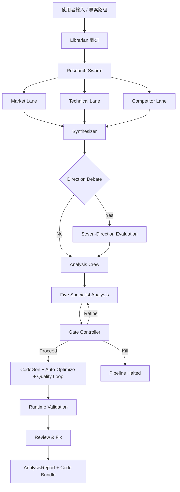

# Crucible — 詳細使用手冊

<p align="center">
  
</p>

**語言 / Languages:** **中文（目前頁面）** · [Full English manual](README_FULL.md)
**簡短版本 / Short version:** [簡短中文 README](README_zh.md) · [Short English README](README.md)

---

**AI 原生多代理研究引擎 — 將投資研究、SaaS 產品分析、Agent 架構評估與學術論文實踐分解為可重複、可審計、帶風險閘門的多階段流程。**

> 這是 **詳細使用手冊**。高階概覽請見 [README.md](README.md)。內部架構請見 [ARCHITECTURE.md](ARCHITECTURE.md)。版本歷史請見 [CHANGELOG.md](CHANGELOG.md)。

---

## 為什麼需要這個系統

傳統研究流程（無論量化、產品還是架構評估）存在三個系統性問題:

1. **單次 Prompt 不穩定。** 單一 LLM 呼叫無法穩定產出研究級輸出。每次執行結果差異極大,幻覺難以偵測,且缺乏挑戰弱假設的機制。
2. **研究過程不可重複、不可審計。** 當分析師寫備忘錄時,推理路徑不透明。當 AI 生成報告時,證據鏈更不透明。兩者都無法被系統性地審查、重播或改進。
3. **可行性、風險與局限性是事後補充。** 多數研究工具為了生成結論而優化。它們不會系統性地評估結論是否可實現、可能出什麼問題、或缺少什麼證據。

Crucible 採用不同的方法:**將研究視為帶有明確品質閘門的多階段、多代理工作流。**

---

## 流程概覽

Pipeline 將研究分解為多個階段,每個階段產出結構化、帶型別的輸出,供下游使用:

```
研究問題 / 專案路徑
       │
       ▼
┌──────────────────────┐
│  0. Librarian 調研   │  Web search + 文獻引用 + 市場數據
│     (Idea 模式)      │  → ResearchContext
└──────────┬───────────┘
           ▼
┌──────────────────────┐
│  1. Research Swarm   │  3 條平行 lane (Market, Technical, Competitor)
│                      │  → Synthesizer 合併並做 citation grounding
└──────────┬───────────┘
           ▼
┌──────────────────────┐
│  2. Direction Debate │  7 個策略方向 → Evidence Audit
│     (選用)           │  → Multi-axis Comparator → Judge 擇優
└──────────┬───────────┘
           ▼
┌──────────────────────┐
│  3. Analysis Crew    │  5 位專業分析師 (Research, Risk, Ops, Biz, Critic)
│                      │  → Gate Controller (proceed / refine / kill)
└──────────┬───────────┘
           ▼
┌──────────────────────┐
│  4. CodeGen + QA     │  多檔案產碼 → Runtime validation
│                      │  → Quality loop → Review & Fix
└──────────┬───────────┘
           ▼
    AnalysisReport + Code Bundle
    (consensus, disagreement, experiments, score, risk level, 可執行程式碼)
```

---

## 各階段說明

### Stage 0: Librarian 調研

由 Web search agent 與 Librarian LLM 協同,對研究問題做初步文獻與市場調研,產出 `ResearchContext` 供下游所有階段引用。搜尋結果採兩層快取:

- 整體 `ResearchContext` 由 `run_librarian_research` 透過 SHA256 key 快取(TTL = `LIBRARIAN_CACHE_WINDOW_HOURS`)
- 個別 (provider, query) 查詢由 `_SEARCH_QUERY_CACHE`(TTL 1 小時)快取,避免不同 user_problem 間的重疊 query 造成重複 HTTP 請求
- `context7` provider 因每次呼叫帶有完整 context 參數,排除在 per-query 快取之外

### Stage 1: Research Swarm

三條獨立研究 agent 平行執行,各自帶有專門的證據提取規則:

| Lane | 聚焦範圍 |
|------|---------|
| **Market** | 使用者痛點、工作流摩擦、採用障礙、市場先例 |
| **Technical** | 架構模式、生產約束、故障模式 |
| **Competitor** | 競爭者、替代方案、開源替代品、定位 |

**Research Synthesizer** 合併三條 lane,做交叉驗證:只有帶引用支撐的論點會保留。不支撐的論點移至 `unknowns` 或標記為 `hallucination_flags`。

### Stage 2: Direction Debate

當研究問題有多條可行路徑時,系統生成 **七個互斥策略方向**,經結構化評估:

1. **Direction Proposer** — 生成 7 個選項,附 thesis、metric、test、risk
2. **Evidence Auditor** — 評分各方向的證據品質
3. **Direction Comparator** — 多軸排序(可行性、可逆性、驗證速度、證據強度、下行嚴重度、未解未知數)
4. **Direction Judge** — 擇優,附 go-conditions、kill-criteria、驗證計畫

#### 選用功能:Direction Debate Audit Mode

Direction Debate Audit Mode 是可選的擴充能力,專門擷取每位 specialist 之間的**分歧紀錄** —— 這是相較於單純 PROCEED / KILL 結論最有結構性價值的輸出。同一模型族的 crew 容易共享盲區,所以全員一致且高信心的結論,反而是審查者最該警覺的場景。Audit mode 把這種懷疑物化成可審計的軌跡。

啟用 (`CRUCIBLE_DEBATE_AUDIT_MODE=1`) 後,每位 specialist(Explorer、Comparator、Skeptic、Evidence Auditor、Judge)都會輸出結構化的 `AUDIT_FINDING` 區塊,內含該 agent 的 assumptions、supporting_evidence、concerns、與其他 agent 的明確 disagreement,以及「哪些資訊會改變我的結論」。Judge 額外輸出 `GATE_VERDICT` 區塊,使用擴張後的決策空間 —— `PROCEED` / `BRANCH` / `KILL` / `NEEDS_MORE_DATA` —— 而不是舊版的二元 force-none 訊號。

兩個新的 ledger 事件 (`direction_debate_finding`、`direction_debate_verdict`) 都寫進既有的 `.crucible_insights/debate.jsonl` stream。確定性、零 embedding 的 consensus-risk 計算會自動偵測 `zero_disagreement_recorded`、`low_diversity_high_confidence`、個別 agent 過度自信 (`<role>_too_confident_no_concerns`)、共同假設 groupthink 等指標 —— 全程無需任何 LLM 呼叫。

可選的 **External Critic** (`CRUCIBLE_DEBATE_EXTERNAL_CRITIC=1`) 是第六位 agent,僅根據「原始研究證據 + Judge 的決策 token」重新審判 Judge 的結論。Critic 看不到其他 agent 的推理過程,因此免於 sequential anchoring 偏差。預設情況下 Critic 的反對意見會寫入 audit_trail,但仍以 Judge 結論為準;設定 `CRUCIBLE_DEBATE_CRITIC_OVERRIDE_PROCEED=1` 可讓 Critic 的 `KILL` 覆寫 Judge 的 `PROCEED`。

整個 audit-mode 流程是**只觀察不覆寫**:它擷取分歧軌跡但不會改變實際被選用的方向,因此可以在生產環境直接啟用,不會影響執行結果。完整 env 參數列表見 `.env.example`,Settings 頁面的「Direction Debate Audit」群組提供每個旗標的詳細說明。

#### 選用功能:Librarian Web Research Hardening

librarian 研究階段新增五項韌性與品質強化,預設值都安全(操作員通常不必動):

- **磁碟持久化 search cache**(`saved_projects/.cache/search_cache.sqlite3`)。每個 provider 各自 TTL(DuckDuckGo 12h、GitHub 24h、arXiv 168h)。同主題重跑時,refinement 命中 cache,典型重複 run 的 HTTP cost 降 80% 以上。
- **Per-provider adaptive cooldown**:provider 回 429 / 202 時自動 backoff(60s → 120s → ... 最高 30min),期間 dispatcher 直接 route 過該 provider,不再撞牆。
- **四個免認證新 provider**:OpenAlex(100k req/天的學術)、Crossref(DOI metadata 跨領域)、Wikipedia REST(定義性 Tier-1 baseline)、SearXNG(opt-in 聯合搜索)。透過 `LIBRARIAN_EXTRA_PROVIDERS` 設定(預設 `openalex,crossref,wikipedia`)。全部共用同一套 cache / cooldown / dedup / SSRF 基建。
- **跨 provider query 去重**:同一 normalised query 對同 class 內多個 provider 只打第一個,典型省 30% HTTP call。透過 `LIBRARIAN_CROSS_PROVIDER_DEDUP_ENABLED` 切換。
- **領域權威來源 pinning**(`crucible/config/domain_pins.json`):user_problem 命中 operator 定義的 pin(例如 crypto 永續 → Binance docs;tradfi 指標 → Wikipedia Sharpe 頁面)時,librarian 在 search dispatch 前先抓這些 URL 作為 Tier-1 錨點。修補 DDG 只回媒體轉述、漏掉官方 docs 的盲點。
- **CJK 查詢雙語擴增**:原文結果數低於 `LIBRARIAN_BILINGUAL_QUERY_THRESHOLD=3` 時自動加打英文 mirror(預設用 librarian 自身的 LLM 翻譯)。跨語言結果會 dedup,同論文中英文標題各命中一次只算一條 citation。
- **HTTP/2 + connection keep-alive**:outbound 呼叫(`h2` 套件選裝;沒裝就 graceful degrade 回 HTTP/1.1)。

以上全部繼承 v1.1.x 既有的 SSRF 防護(不 follow_redirects=True、每跳重 check `_is_public_http_url`、不接受 IPv6 scope-id smuggling、不接受 IPv4-embedded-IPv6 繞過)。詳細 env 參數見 `.env.example`,Settings 頁新增四個群組(`Librarian Search Cache`、`Librarian Provider Resilience`、`Librarian Extra Providers`、`Librarian Query Quality`)涵蓋所有旋鈕。

互補的 `CRUCIBLE_DEBATE_TOLERATE_UNVERIFIABLE_EVIDENCE` 旗標可讓操作員為 direction-debate gate 開啟「degrade-not-die」語意,當 refinement 用盡仍 force-none 時不再回 `None`。目前為觀察模式 —— ledger event 標出哪些 run 會受益,實際行為改寫留待後續更新。

### Stage 3: Analysis Crew

五位專業分析師獨立評估:

| 分析師 | 角色 |
|--------|------|
| **Research** | 市場機會、使用者假設、product-market 信號 |
| **Risk** | 不可逆風險、失敗條件、kill criteria |
| **Ops** | 執行順序、交付約束、監控需求 |
| **Biz** | 變現、分發、單位經濟 |
| **Critic** | 挑戰假設、揭示隱藏耦合、嚴格審查 |

產出經品質閘門:

- **Gate Context Compactor** — 去重與壓縮分析師發現
- **Gate Controller** — 決定 proceed、targeted analyst rerun 或 kill
- **Format Checker** — 組裝最終 `AnalysisReport`,不添加新資訊

### Stage 4: CodeGen + Quality Loop

通過 Gate 後進入多檔案產碼:

- 依 manifest 與依賴圖分批生成程式碼
- `py_compile` + entrypoint 偵測 + import / smoke 驗證
- Quality loop(LLM-backed 品質閘門,受 max iteration 上限保護)
- Review & Fix 迴圈修補
- **Auto-Optimize**(選用):`codegen_critic` agent 評分並注入 critique 反饋,最多 N 輪迭代直到達標

---

## Pipeline 模式

| 模式 | 研究聚焦 | 目標用戶 |
|------|---------|---------|
| **Quant** | 市場微結構、信號衰減、數據品質、執行可行性、回測自動化、參數最佳化 | 量化交易團隊、Quant 研究員 |
| **SaaS** | 使用者痛點、工作流摩擦、採用障礙、整合模式 | 產品團隊、SaaS 建構者 |
| **Agent** | 自動化範圍、狀態邊界、重播安全、確定性執行 | AI Agent 開發者、自動化工程師 |
| **Scientist** | 論文搜索與理解、演算法實作、可重現性驗證、消融實驗、基準比較 | 研究人員、ML 工程師、學術從業者 |

---

## 輸入模式

系統支援兩種輸入模式,決定 pipeline 的前半段行為。後半段(CodeGen + 後置處理)對兩種模式共用。

### Idea 模式

**適用場景:** 從零開始做新專案、MVP、策略研究或技術方案分析。

**運行邏輯:**

1. 使用者輸入想法、需求或研究問題
2. **Librarian 調研**(Stage 0):Web search + 文獻引用 → `ResearchContext`
3. **Research Swarm**(Stage 1):3 條平行 lane 收集 Market/Technical/Competitor 證據
4. **Direction Debate**(Stage 2,選用):生成 7 個策略方向 → 辯論 → 擇優
5. **Analysis Crew**(Stage 3):5 位分析師獨立評估 → Gate Controller 決策
6. **CodeGen + QA**(Stage 4):多檔案產碼 → Runtime validation → Review & Fix
7. **後置處理**:安全掃描 → 部署 artifact(含 K8s/Helm) → 測試生成 → API 修補 → 獨立驗證 → 自動修復 → 回測自動化 → Memory → 依賴掃描 → 品質分析 → HTML 報告 → CI → Registry → 通知

### Project Path 模式

**適用場景:** 對既有專案做最小變更修正、bug 修復或功能增強。

**運行邏輯:**

1. 使用者指定專案路徑(本機目錄)
2. 系統讀取專案結構、入口點與相依關係,建立上下文
3. 以修復導向 agent 聚焦 bug、結構問題或指定的功能需求
4. 保留既有 API、主要行為與檔案結構(additive changes 為主)
5. 對修改結果做 review 與 runtime validation
6. **後置處理**:與 Idea 模式相同的後置處理流程

> **後置處理對兩種模式共用。** 無論 Idea 或 Path 模式,CodeGen 完成後皆可選用 `--security-scan`、`--deployment-artifacts`、`--generate-tests`、`--api-autopatch`、`--independent-validation`、`--auto-remediation`、`--backtest-runner`、`--dependency-audit`、`--code-quality`、`--html-report`、`--run-registry`、`--notify`、`--ci-output` 等旗標。差異僅在前半段的上下文收集與分析方式。

---

## 範例輸出

每次 pipeline 執行產出帶型別的 JSON artifacts。以下是真實分析報告的內容結構:

```json
{
  "project_name": "metadata_universe_builder",
  "score": 74,
  "risk_level": "Medium",
  "consensus": "All analysts agree that a static-first, empirically-validated coverage catalog is the correct starting point...",
  "disagreement": "Risk and Ops analysts disagree on schema drift severity...",
  "experiments": [
    {
      "goal": "Validate field accuracy across 5 exchanges using live API probes",
      "criteria": "Accuracy >= 90% on 8 core fields"
    }
  ],
  "analyst_findings": {
    "research": "Strong market signal: no open-source tool provides...",
    "risk": "Three material risks identified: (1) Schema drift...",
    "ops": "Execution sequence: Week 1-2: manual curation...",
    "biz": "Two viable monetization paths...",
    "critic": "The 15-exchange target may be overambitious..."
  }
}
```

執行後結果寫入 `saved_projects/`,常見內容包含:

- `analysis_result.json` — 分析報告(`AnalysisReport` Pydantic 模型序列化,含 `schema_version` 欄位;可透過 `load_analysis_report_safe(path)` 載入,自動處理舊版欄位缺失與未知欄位,不拋出例外)
- `run_meta.json` — 執行元資料
- `run_snapshot.json` — pipeline 快照
- `runtime_validation.log` — runtime 驗證日誌
- `review_report.json` — review 報告
- `README.md` — 專案說明
- `requirements.txt` — 依賴清單
- `code/` — 生成的程式碼

---

## Quick Start

### 前置需求

- Python 3.10+
- LLM Provider API key(三選一):
  - [OpenRouter](https://openrouter.ai/) — 預設
  - [Alibaba Coding Plan](https://help.aliyun.com/zh/model-studio/) — token-only 成本追蹤
  - [Ollama](https://ollama.ai) — 完全本地端,不需 API key

### 安裝

```bash
git clone https://github.com/Starlight143/crucible.git
cd crucible
pip install -r requirements.txt
```

需要本地測試 / lint / 型別檢查 / 安全掃描:

```bash
pip install -r requirements.txt -r requirements-dev.txt
```

依賴分界:

- [requirements.txt](/requirements.txt):runtime 依賴
- [requirements-dev.txt](/requirements-dev.txt):開發與驗證依賴
- `bandit`、`pip-audit` 屬於 dev 依賴,不在 runtime 安裝集合內
- `yfinance`、`ccxt` 為 backtest runner 可選依賴(`--backtest-runner` 旗標需要真實市場數據時安裝)

### 設定

```bash
cp .env.example .env
# 編輯 .env 填入 API key 與模型設定
```

### 執行

```bash
# 互動模式
python run_crucible.py

# 只做離線自檢
python run_crucible.py --self-check

# 只掃描 context,不呼叫 LLM
python run_crucible.py --dry-run
```

---

## WebUI

WebUI 提供圖形介面執行所有 pipeline 功能,無需記憶 CLI 旗標。

### 啟動

雙擊 `launch_webui.bat`,瀏覽器將自動開啟。首次執行會自動安裝 `flask`。

```
launch_webui.bat   ← 雙擊執行
```

- 自動偵測可用 localhost port(8080–9000 範圍)
- 若以系統管理員身分執行,自動將自訂網域加入 hosts 並由瀏覽器顯示
- 否則 fallback 至 `http://localhost:<port>`

### 頁面

| 頁面 | 功能 |
|------|------|
| **Project Path** | 指定現有專案路徑進行分析或修復;支援全部 CLI 旗標勾選 |
| **Idea Mode** | 輸入自然語言想法或策略,直接生成程式碼;支援全部 CLI 旗標勾選 |
| **Dashboard** | 執行歷史、成本趨勢、品質分佈、Pipeline 階段雷達圖、每日/每月預算狀態列 |
| **Leaderboard** | Backtest 策略排行榜,按 Sharpe / Return / Drawdown 等指標排序 |
| **Compare Runs** | 側欄並排比對兩次 run 的 analysis 結果、品質分數、成本、閘門決策與程式碼檔案數 |
| **A/B Test** | 同時啟動兩個不同 pipeline 設定(Variant A / B),完成後側欄對比指標並顯示勝出者 |
| **Settings** | 圖形化編輯 `.env` 檔案;API Key 欄位附即時「Test」按鈕驗證連線;底部顯示 Webhook 投遞歷史。涵蓋全部可設定項目,包含 Backtest、Quant Analytics Suite(Walk-Forward、Signal、Regime、MC、Factor、Risk)、Transaction Cost Model、Tearsheet Report、Multi-Language Codegen、Document Ingestion、GitHub Analyzer 等 |

### 旗標選擇器

Project Path 與 Idea 兩個頁面均提供可展開的旗標分組面板:

- **Core Settings** — Provider / Runtime Profile / Scope(下拉選單)
- **Analysis Flags** — dry-run、direction-debate、strict-json、cache 等(checkbox)
- **Code Generation** — auto-optimize rounds / threshold(數字 input)
- **Budget & Limits** — soft-cost / hard-cost / max-tokens(數字 input)
- **Post-Processing** — security-scan、deployment-artifacts、generate-tests 等(checkbox,有預設值標示)
- **Advanced Features** — backtest-runner、dedup-check、multilang-codegen 等(checkbox)
- **Per-Stage Model Overrides** — 可分別為 Librarian、Analysis、Direction Judge 指定不同模型
- **Diff & VCS**(Project Path 專屬)— diff-aware、diff-base-ref
- **External Data** — sources、symbols、date range

有預設值的旗標(memory、security-scan、deployment-artifacts)預先勾選並標示 `ON`。

### Backend API 路由

| 方法 | 路由 | 說明 |
|------|------|------|
| GET | `/` | 主 SPA |
| GET | `/api/env` | 讀取 `.env` 為 `{key: value}` |
| POST | `/api/env` | 原子寫回 `.env` |
| GET | `/api/env/schema` | 從 `.env.example` 取得分組 schema |
| POST | `/api/run` | 啟動 pipeline run,回傳 `{run_id}` |
| GET | `/api/run/<id>` | Run 狀態 + 已緩衝輸出 |
| GET | `/api/run/<id>/stream` | SSE 逐行輸出(自動終止) |
| DELETE | `/api/run/<id>` | 終止執行中 run |
| GET | `/api/dashboard` | 從 `saved_projects/` 彙整統計資料 |
| GET | `/api/runs` | 列出最近完成的 run |
| GET | `/api/cost-trend` | 歷史 score/run 趨勢(供圖表用);支援 `?limit=30&mode=quant` 過濾 |
| GET | `/api/leaderboard` | Backtest 排行榜;支援 `?sort_by=sharpe_ratio&mode=quant&limit=50` |
| GET | `/api/run/<id>/detail` | Run 完整 JSON 報告 + 程式碼檔案列表 |
| GET | `/api/run/<id>/backtest-chart` | Equity curve + Drawdown curve + 月度收益(供圖表用) |
| GET | `/api/run/<id>/stages` | 階段執行時序與 Token 估算(Human-in-the-loop 狀態) |
| POST | `/api/run/<id>/signal` | 向執行中 run 的 stdin 發送訊號(Human-in-the-loop 核准) |
| GET | `/api/run/compare` | 並排比對兩個 run:`?a=<id>&b=<id>` |
| POST | `/api/ab-test/run` | 啟動 A/B 測試(兩組 pipeline 設定同時執行) |
| GET | `/api/ab-test/<ab_id>` | A/B 測試執行狀態與結果比對 |
| POST | `/api/env/validate` | 驗證 API Key 可連線性;回傳 `{valid, latency_ms}` |
| GET | `/api/run/stage-models` | 取得各階段目前設定的模型名稱 |
| GET | `/api/budget/status` | 今日 / 本月 / 累計成本統計 |
| GET | `/api/webhook/history` | Webhook 投遞歷史(最近 50 筆) |
| POST | `/api/notify/test` | 測試通知 Webhook 連線(含重試回報) |
| GET | `/api/insights/summary` | Run Insights ledger 摘要:各 stream 事件計數 + 跨 stream 最近事件 |
| GET | `/api/insights/events` | 分頁事件列表;支援 `?stream=output\|error\|debate\|params&run_id=&kind=&limit=&since=` |
| GET | `/api/run/<id>/insights` | 單一 run 的全部 ledger 事件,依 stream 分組 |

### 生產部署(Gunicorn)

除開發用 Flask 伺服器外,提供 `gunicorn_config.py`(repo 根目錄)作為生產部署設定:

```bash
# 安裝 Gunicorn
pip install gunicorn

# 啟動(所有設定均可透過環境變數覆蓋)
gunicorn --config gunicorn_config.py "webui.app:app"
```

主要設定(均可透過環境變數覆蓋):

| 環境變數 | 預設值 | 說明 |
|---------|--------|------|
| `GUNICORN_BIND` | `0.0.0.0:8080` | 監聽位址與埠號 |
| `GUNICORN_WORKERS` | `min(2×CPU+1, 8)` | Worker 進程數(必須 > 0) |
| `GUNICORN_THREADS` | `2` | 每 worker 執行緒數 |
| `GUNICORN_TIMEOUT` | `300` | Worker 靜默逾時(秒),需長於最長 pipeline run |
| `GUNICORN_MAX_REQUESTS` | `500` | Worker 重啟前最大請求數(防記憶體洩漏) |
| `GUNICORN_FORWARDED_ALLOW_IPS` | `127.0.0.1` | 信任 X-Forwarded-For 的 IP;生產環境應設為上游 Proxy IP |
| `GUNICORN_LOG_LEVEL` | `info` | 日誌等級 |

### 依賴

WebUI 只額外需要 `flask`(launcher 自動安裝)。生產部署另需 `gunicorn`。其他所有依賴與主 pipeline 共用。

---

## 架構



> 模組層級架構(pipeline section、infrastructure 模組、feature 模組、web research)請見 [ARCHITECTURE.md](ARCHITECTURE.md)。

---

## LLM Provider 設定

本專案支援三種 LLM provider,透過 `LLM_PROVIDER` 環境變數切換:

| Provider | `LLM_PROVIDER` 值 | API Base | 備註 |
|----------|-------------------|----------|------|
| **OpenRouter** | `openrouter` | `https://openrouter.ai/api/v1` | 預設值,支援多模型路由,有 USD 成本追蹤 |
| **Alibaba Coding Plan** | `alibaba_coding_plan` | `https://coding-intl.dashscope.aliyuncs.com/v1` | Token-only 成本追蹤,單檔批次產碼;自動注入 `x-source: opencode` 識別標頭 |
| **Ollama** | `ollama` | `http://localhost:11434/v1`(預設) | 本地端 LLM,完全離線;不需 API key;使用 OpenAI-compatible API |

### 環境變數

先複製 [.env.example](/.env.example) 為 `.env`,再填入必要值。

**OpenRouter(預設):**

| 變數 | 說明 |
|------|------|
| `OPENROUTER_API_KEY` | **必填** — OpenRouter API key |
| `OPENROUTER_PRIMARY_MODEL` | 主流程模型 |
| `OPENROUTER_DIRECTION_JUDGE_MODEL` | Stage 0 Direction Judge 模型 |
| `OPENROUTER_LIBRARIAN_MODEL` | Librarian / research 模型 |
| `OPENROUTER_LLM_TIMEOUT_SECONDS` | 請求逾時(秒) |

**Alibaba Coding Plan:**

| 變數 | 說明 |
|------|------|
| `ALIBABA_CODING_PLAN_API_KEY` | **必填** — Alibaba Coding Plan API key |
| `ALIBABA_CODING_PLAN_BASE_URL` | API base URL override |
| `ALIBABA_CODING_PLAN_PRIMARY_MODEL` | 主流程模型 |
| `ALIBABA_CODING_PLAN_DIRECTION_JUDGE_MODEL` | Direction Judge 模型 |
| `ALIBABA_CODING_PLAN_LIBRARIAN_MODEL` | Librarian 模型 |

**Ollama(本地端 LLM):**

1. 安裝 [Ollama](https://ollama.ai) 並啟動服務:`ollama serve`(或讓系統服務自動啟動)
2. Pull 所需模型(首次需下載,可能需數分鐘):`ollama pull llama3.2`
3. 驗證服務正常:`curl http://localhost:11434/api/tags`
4. 在 `.env` 中設定 `LLM_PROVIDER=ollama`

> **注意:** Ollama 模型在本機 CPU/GPU 推理,速度比雲端 API 慢,建議將 `OPENROUTER_LLM_TIMEOUT_SECONDS` 調高(例如 1800)以避免逾時。若 Ollama 服務未啟動,啟動時會出現 `Connection refused` 錯誤。

| 變數 | 預設 | 說明 |
|------|------|------|
| `OLLAMA_BASE_URL` | `http://localhost:11434/v1` | Ollama 服務 API base URL |
| `OLLAMA_PRIMARY_MODEL` | `llama3.2` | 主流程模型 |
| `OLLAMA_DIRECTION_JUDGE_MODEL` | `llama3.2` | Stage 0 Direction Judge 模型 |
| `OLLAMA_LIBRARIAN_MODEL` | `llama3.2` | Librarian / research 模型 |

### 功能旗標

| 變數 | 說明 |
|------|------|
| `STRICT_JSON=1` | 強制 JSON 輸出 |
| `COST_TRACE=1` | 啟用成本追蹤 |
| `LOCAL_CACHE=1` | 啟用本地 LLM cache |
| `CRUCIBLE_LOG_LEVEL=INFO` | 日誌等級 |
| `CRUCIBLE_JSON_LOGS=1` | JSON 格式日誌 |
| `CRUCIBLE_ENV_FILE=.env` | 自訂 env 檔案路徑 |
| `CODEX_ENTRYPOINT=api/main.py:app` | Runtime validation entrypoint override |
| `API_VERSION_CHECK_ENABLED=1` | 啟用 API 版本檢查 |

### Run Insights Ledger

| 變數 | 預設 | 說明 |
|------|------|------|
| `CRUCIBLE_RUN_INSIGHTS_ENABLED` | `1` | 主開關。設 `0` 即整個子系統停用(recorder 回 `_NullRecorder`、所有 emit 點變 no-op、WebUI 顯示「subsystem is disabled」)。 |
| `CRUCIBLE_RUN_INSIGHTS_RECORD_OUTPUT` | `1` | section 07 成功儲存專案時記錄 `output_method` 事件。 |
| `CRUCIBLE_RUN_INSIGHTS_RECORD_ERRORS` | `1` | `resilience.kickoff_crew_with_retry` 重試耗盡時記錄 `error_record` 事件。 |
| `CRUCIBLE_RUN_INSIGHTS_RECORD_DEBATE` | `1` | Stage 0 force-none 或所有 fallback 後仍 parse 失敗時,記錄 `direction_debate_rejection` 事件。 |
| `CRUCIBLE_RUN_INSIGHTS_RECORD_PARAMS` | `auto` | `auto` = 僅 Quant 模式記錄(對應「Quant 記錄運行參數、非 Quant 不記錄」需求);`1` 強制開、`0` 強制關。拼錯的值 fallback 回 `auto`(不會被 truthy-coerce)。 |
| `CRUCIBLE_RUN_INSIGHTS_REDACT` | `1` | 寫入前對敏感欄位(`api_key`、`token`、`secret`、`webhook_url`、`auth` 等)做遞迴遮蔽。設 `0` 寫入原始 payload。 |
| `CRUCIBLE_RUN_INSIGHTS_BACKEND` | `local` | 儲存後端:`local`(`.crucible_insights/` 下的 JSONL streams,預設且為 source of truth)、`dual`(本地寫入**並**非同步鏡像到你自行部署的 Cloudflare Worker + D1 後端)、或 `cloudflare`(雲端優先讀取、本地 fallback)。`dual` / `cloudflare` 需要 `CRUCIBLE_RUN_INSIGHTS_API_URL` + `_API_TOKEN`。詳見下方 **雲端後端與共享語料**。 |
| `CRUCIBLE_RUN_INSIGHTS_DIR` | `.crucible_insights` | Ledger 根目錄(相對路徑會錨定到 `PROJECT_ROOT`)。 |
| `CRUCIBLE_RUN_INSIGHTS_INLINE_MAX_BYTES` | `4096` | 大於此值的 payload 寫到 `blobs/<content_id>.json`,事件以 `payload_blob` hash 引用。 |
| `CRUCIBLE_RUN_INSIGHTS_MAX_ENTRIES_PER_STREAM` | `2000` | 每條 stream 的 FIFO 上限,超過時以原子 temp-file swap 刪除最舊項目。 |
| `CRUCIBLE_RUN_ID` | — | WebUI spawn pipeline subprocess 時自動注入,綁定 `run_correlation.set_run_id()` 使 telemetry / logs / ledger 共用同一 run_id。直接從 CLI 執行時會自動產生 UUID4。 |

雲端同步 key `CRUCIBLE_RUN_INSIGHTS_API_URL` / `CRUCIBLE_RUN_INSIGHTS_API_TOKEN`(以及 `_TIMEOUT_SECONDS` / `_MAX_RETRIES` / `_BATCH_FLUSH_SECONDS` / `_BATCH_SIZE`)已由 `dual` / `cloudflare` 後端實際使用。規劃中的 retrieval + LLM skill distillation 層的 key 仍為保留、尚未生效:`CRUCIBLE_RUN_INSIGHTS_RETRIEVAL_*`、`CRUCIBLE_RUN_INSIGHTS_INJECT_*`、`CRUCIBLE_RUN_INSIGHTS_DISTILLATION_*`。

### Direction Debate / Gate 相關

| 變數 | 說明 |
|------|------|
| `DIRECTION_REFINEMENT_ENABLED=1` | 允許 Direction Debate 內部在證據不足時做補充 research refinement;不會自行啟用 Stage 0 |
| `DIRECTION_REFINEMENT_MAX_ITERATIONS=2` | Refinement 最大迭代次數 |
| `GATE_DIRECTION_FEEDBACK_ENABLED=1` | 允許 Gate Controller 在條件成立時把 `evidence` / `detail` 不足打回 refinement |

`GATE_DIRECTION_FEEDBACK_ENABLED` 只有在以下條件同時成立時才真的生效:

- 有啟用 Gate Controller
- 有啟用 selective rerun
- 不是 `Project Path` 流程

### 基礎設施模組環境變數

以下變數可調整核心基礎設施模組的行為,無需修改程式碼。模組內部設計請見 [ARCHITECTURE.md](ARCHITECTURE.md)。

**Context Budget(`context_budget.py`)**

| 變數 | 預設 | 說明 |
|------|------|------|
| `CONTEXT_BUDGET_TOKENS` | `80000` | context window 最大 token 估算值,達 `COMPACT_RATIO` 時觸發壓縮 |
| `CONTEXT_BUDGET_COMPACT_RATIO` | `0.85` | 觸發壓縮的閾值(佔 token_budget 的比例,範圍 0.5–1.0) |
| `CONTEXT_BUDGET_KEEP_RECENT` | `6` | 壓縮後永遠保留的最新訊息數量 |
| `CONTEXT_BUDGET_CHARS_PER_TOKEN` | `4` | 字元/token 估算係數 |

**Convergence Guard(`convergence_guard.py`)**

| 變數 | 預設 | 說明 |
|------|------|------|
| `CONVERGENCE_MAX_ITERATIONS` | `50` | loop 最大迭代次數(0 = 無限制) |
| `CONVERGENCE_TIMEOUT_SECONDS` | `3600` | loop 最大 wall-clock 時間秒數(0.0 = 無限制) |
| `CONVERGENCE_STALE_THRESHOLD` | `5` | 連續相同簽名達此次數時發出 `StaleLoopWarning`(0 = 停用) |
| `CONVERGENCE_STALE_RAISES` | `false` | 設為 `true` 時重複簽名會 raise `ConvergenceError` 而非 warning |

**HTTP Retry(`http_retry.py`)**

| 變數 | 預設 | 說明 |
|------|------|------|
| `HTTP_RETRY_MAX_ATTEMPTS` | `3` | `@with_http_retry` 最大重試次數 |
| `HTTP_RETRY_BACKOFF_SECONDS` | `2.0` | 初始 backoff 秒數(指數退避基底) |
| `HTTP_RETRY_MAX_BACKOFF_SECONDS` | `30.0` | backoff 上限秒數 |
| `HTTP_RETRY_TIMEOUT_SECONDS` | `30` | `safe_get`/`safe_post` 每次請求超時秒數 |
| `HTTP_RETRY_MAX_BYTES` | `2097152` | `safe_get` 回應體最大位元組數(2 MB) |

**Project Memory(`features/project_memory.py`)**

| 變數 | 預設 | 說明 |
|------|------|------|
| `PROJECT_MEMORY_PROMPT_CHARS` | `16000` | 注入 prompt 的記憶文字最大字元數(約 4000 tokens);超出預算的舊條目自動捨棄 |

**Telemetry(`telemetry.py`)**

| 變數 | 預設 | 說明 |
|------|------|------|
| `TELEMETRY_QUEUE_SIZE` | `1000` | 背景事件佇列深度;佇列滿時新事件靜默丟棄(`dropped` 計數器遞增) |

**File Cache(`_file_cache.py`)**

| 變數 | 預設 | 說明 |
|------|------|------|
| `FILE_CACHE_MAX_ENTRIES` | `256` | LRU file cache 最大條目數(以 (abspath, mtime_ns) 為 key) |

---

## 常用命令

### 顯示說明

```bash
python run_crucible.py --help
```

### Runtime validation entrypoint

```bash
python run_crucible.py --entrypoint api/main.py:app
python run_crucible.py --entrypoint api/main.py:app,service.py:application
python run_crucible.py --entrypoint api/main.py:create_app()
```

### Direction Debate

```bash
python run_crucible.py --direction-debate
python run_crucible.py --direction-debate-only
python run_crucible.py --direction-debate --strict-json --cost-trace --cache --cost-report --api-version-check
```

Stage 0 Direction Debate 目前只由 CLI 旗標控制:

- `--direction-debate`
- `--direction-debate-only`

不再有「用 env 預設開啟 Stage 0 Direction Debate」的主線行為。

### API version check

```bash
python run_crucible.py --api-version-check
python run_crucible.py --no-api-version-check
```

### CodeGen scope(產出規模)

`--scope` 控制 CodeGen 產出的完整程度。預設為 `mvp`(最小可執行版本),可提升至 `full`(完整模組化系統)或 `production`(含測試、Docker、CI 的生產就緒版本)。

```bash
# 預設(最小可執行實作)
python run_crucible.py --scope mvp

# 完整模組化系統
python run_crucible.py --scope full

# 生產就緒版本(含 tests、Dockerfile、GitHub Actions CI)
python run_crucible.py --scope production

# 搭配 auto-optimize
python run_crucible.py --scope full --codegen-auto-optimize --codegen-optimize-rounds 3
```

| 旗標 | 預設值 | 說明 |
|------|--------|------|
| `--scope mvp` | ✓ 預設 | 最小可執行實作,行為與舊版相同 |
| `--scope full` | 關閉 | 完整模組化系統,不含測試與部署設定 |
| `--scope production` | 關閉 | Full scope + pytest 測試套件 + Dockerfile + CI |

**各模式 `full` / `production` 產出內容:**

**Quant 模式:**
- `full`:完整量化交易系統 — risk_manager.py(Kelly / 波動率目標 / 最大回撤防護)、portfolio.py(多資產持倉帳本)、performance.py(Sharpe / Sortino / Calmar / CAGR / rolling 指標 + HTML/CSV 報告)、cli.py(backtest / live / report / optimize 子命令)、結構化日誌
- `production`:上述 + tests/(strategy / backtest / data_provider / risk_manager / performance 各模組測試)+ Dockerfile + docker-compose + .github/workflows/ci.yml + Makefile

**SaaS 模式:**
- `full`:完整 FastAPI 服務 — SQLAlchemy 2.0 async + Alembic migrations、JWT auth(python-jose + passlib)、完整 CRUD(schemas.py + crud.py)、pydantic-settings 設定、結構化日誌 + correlation ID middleware
- `production`:上述 + pytest-asyncio 測試套件 + Dockerfile + docker-compose(含 PostgreSQL)+ CI

**Agent 模式:**
- `full`:完整 headless 服務 — job_queue.py(asyncio.Queue + JobWorker)、tool_registry.py(ToolRegistry + input schema validation)、retry.py(async decorator + CircuitBreaker)、pydantic-settings 設定、JSON 結構化日誌、graceful shutdown(SIGINT/SIGTERM)
- `production`:上述 + pytest-asyncio 測試套件 + Dockerfile + systemd service file + CI

> **注意:** Validation-scope(Gate Controller 啟用驗證範圍時)永遠優先於 `--scope`。
> 此時所有 codegen 元件(primary crew、timeout recovery crew、manifest planner)的 goal、backstory、manifest 規劃規則,以及產出規則全部切換為驗證模式,確保 Gate 決策不被覆蓋。
>
> **Timeout recovery 行為:** 當 primary crew 超時後啟動 recovery fallback 時,recovery agent 也會收到與 `--scope` 一致的目標(full/production scope 下會被告知「嘗試完整系統,context 不足時盡力而為」,而非靜默降級為 minimal scaffold)。
>
> **Code fixer(Project Path 模式):** `_mode_code_fix_rule_lines` 刻意不接受 `scope` 參數——code fix 的目標永遠是「最小改動修 bug」,與原始生成的 scope 無關,以防 full/production 規則誤導 fixer 新增模組。

### CodeGen auto-optimize

`--codegen-auto-optimize` 在 CodeGen 階段之後插入一個 **generate → critique → refine** 迴圈。每輪產碼後由 `codegen_critic` agent 評分,若分數未達閾值則將具體問題與改進建議注入下一輪的 prompt。

```bash
# 啟用,使用預設設定(最多 3 輪,閾值 0.80)
python run_crucible.py --codegen-auto-optimize

# 自訂輪數與閾值
python run_crucible.py --codegen-auto-optimize --codegen-optimize-rounds 5 --codegen-optimize-threshold 0.85

# 搭配其他旗標
python run_crucible.py --codegen-auto-optimize --codegen-optimize-rounds 3 --budget-hard-cost 4 --cost-report
```

| 旗標 | 預設值 | 說明 |
|------|--------|------|
| `--codegen-auto-optimize` | 關閉 | 啟用 generate → critique → refine 迴圈 |
| `--codegen-optimize-rounds N` | `3` | 最多執行 N 輪(最小值 1)。每輪都執行 critic 評分,提前達到 threshold 時停止,最終返回最高分的 bundle。 |
| `--codegen-optimize-threshold SCORE` | `0.80` | critic 評分達到此閾值時提前停止(範圍 0.0–1.0)。 |

**行為說明:**

- 每輪 `codegen` 結束後,`codegen_critic` agent 輸出 `CritiqueBundle`(score, issues, suggestions, summary)。
- 若 score ≥ threshold,立即輸出當前最佳 bundle。
- 若 score < threshold,將 critique 注入 prompt context,重新產碼。
- 系統全程追蹤各輪分數,最終輸出歷史最高分的 bundle。
- **高原偵測(plateau detection)**:連續 2 輪分數改善低於 0.01 時自動提前停止,避免無效迭代消耗 budget。
- 若 budget hard limit 觸發,在下一輪開始前停止,輸出現有最佳 bundle。
- critic 失敗(JSON 解析失敗或 LLM 逾時)不影響主流程,當前 bundle 直接沿用。
- `--codegen-auto-optimize` 只在 Idea 模式下生效;Project Path 模式的 code fixer 不會套用。

### Gate Controller / Selective Rerun

```bash
python run_crucible.py --gate-control
python run_crucible.py --no-gate-control
python run_crucible.py --selective-rerun
python run_crucible.py --no-selective-rerun
```

Gate feedback 實際行為:

- `evidence` 路徑:只重跑 Gate 點名的 analyst
- 若同時有 `--direction-debate`,`evidence` 路徑會回到目前已選定方向做補證據 / 補細節,不會重開新的方向發想
- `detail` 路徑:只重跑 Gate 點名的 analyst,不會重開 Direction Debate
- feedback loop 最多回送 2 次

### Runtime profile / budget

```bash
python run_crucible.py --runtime-profile lite
python run_crucible.py --runtime-profile pro --budget-soft-cost 3 --budget-hard-cost 6 --budget-max-tokens 120000
python run_crucible.py --runtime-profile enterprise --cost-report
```

---

## 驗證與測試

### Self-check

```bash
python run_crucible.py --self-check
```

### Smoke test

```bash
python crucible/smoke_test.py
```

### 全量 pytest

```bash
python -m pytest tests -q -p no:cacheprovider
```

> 每一版發佈完整 pytest 套件全數通過；該版本的測試數請見 `CHANGELOG.md`。

### unittest

```bash
python -m unittest discover -s tests -p "test_*.py"
```

### Ruff / mypy

```bash
python -m ruff check <changed-python-files>
python -m mypy
```

測試與 runtime 會透過 `CODEX_TMP_DIR` 使用 repo-local 暫存根:預設為 `.tmp/runtime/session-<pid>-<uuid>`。每個 Python 程序使用獨立 session 目錄,避免 Windows / sandbox 環境中 pytest 的 numbered temp directory 殘留或 ACL 問題互相污染。

### 安全掃描

```bash
python -m bandit -q -r crucible -x crucible/modules/section_04_web_research_and_direction.py
python -m pip_audit -r requirements.txt
python -m pip_audit -r requirements-dev.txt
```

---

## 設計原則

**研究,不是結論。** 系統產出結構化研究 artifacts — consensus *與* disagreement,evidence *與* unknowns,proposed experiments *與* kill criteria。不輸出單一建議。

**閘門式,不是端到端。** Gate Controller 在證據不足時可以中止 pipeline。防止 AI 系統從弱輸入產出自信輸出的常見失敗。

**帶型別,不是自由文本。** 每個階段產出 Pydantic 驗證的輸出。下游永遠不需解析自由文本。Schema 演化是顯式且向後相容的。

**可審計,不是不透明。** 每個論點可追溯到引用。每個決策可追溯到特定分析師發現。完整證據鏈保存在輸出 artifacts 中。

**可平行則平行,該序列則序列。** Research lane 平行執行。Gate Controller 在所有分析師完成後序列執行。在吞吐量與品質控制之間取得平衡。

---

## Enhanced Runner(進階入口)

`run_crucible_enhanced.py` 是核心 pipeline 之上的進階入口,提供以下功能層:

```bash
python run_crucible_enhanced.py [subcommand] [flags]
```

不帶 subcommand 時,所有參數直接轉發給核心 pipeline(完全向後相容)。

### Subcommands

| 命令 | 適用模式 | 說明 |
|------|---------|------|
| `run` | Idea / Path | 標準執行核心 pipeline(Stages 0-4),完成後依序執行已啟用的後置處理功能。所有前置/後置旗標皆可搭配使用。 |
| `watch <dir>` | Path | 監看指定目錄的檔案異動(watchdog 優先,fallback 為 polling),debounce 後以 subprocess 重觸發 `run`。每次觸發為獨立子進程,不共享 LLM 狀態。支援 `--security-scan`、`--deployment-artifacts`、`--use-memory`、`--independent-validation` 旗標轉發。 |
| `batch <dir>` | Idea | 掃描 `<dir>` 下所有包含 Python 檔案的子目錄,對每個子專案以 subprocess 執行 `run`。支援有限度平行(`--batch-workers N`,最多 4)。產出 `batch_summary.json`。支援 `--security-scan`、`--deployment-artifacts`、`--independent-validation` 旗標轉發。 |
| `compare <run_a> <run_b>` | — | 不執行 pipeline。比較兩次已完成的 run 目錄:計算 score/risk/confidence delta、新增/解除 blocking risks、方向變更、程式碼 unified diff。產出 `comparison_report.json` 到 `<run_b>/`。 |
| `postprocess <run_dir>` | — | 不執行 pipeline。對已存在的 run 目錄重新執行後置處理(安全掃描、部署 artifact、測試生成、API 修補、獨立驗證等),適用於回頭對舊 run 補跑功能或更新 artifact。所有後置旗標皆可使用。 |
| `abtest` | Idea / Path | 以相同輸入執行兩個 pipeline 變體(variant A / variant B),比較兩者在 score、risk、gate decision、consensus、blocking risks 等維度的差異。每個變體都在完全隔離的子進程中執行,避免 LLM 狀態污染。可透過 `--variant-a-context` / `--variant-b-context` 為每個變體注入不同的額外指引;`--variant-a-args` / `--variant-b-args` 可為每個變體傳遞不同的核心 CLI 旗標;`--shared-args` 可傳遞兩個變體共用的旗標。子進程 stdout/stderr 永遠寫入 `{output_dir}/{label}.log` 避免輸出交錯(並行模式尤其重要)。產出 `ab_test_report.json` 到 `--output-dir`。支援 `AB_TEST_PARALLEL=1` 並行執行兩個變體。 |

### `run` subcommand 旗標

#### 前置旗標(Pipeline 開始前執行)

| 旗標 | 預設 | 適用模式 | 說明 |
|------|------|---------|------|
| `--diff-aware / --no-diff-aware` | 關 | **僅 Path** | 在 pipeline 啟動前,對 `--project-dir` 指定的專案執行 `git diff`,顯示自 `--diff-base-ref` 以來的新增/修改/刪除檔案清單。**純資訊用途**,不影響 pipeline 行為本身。在 Idea 模式下無意義(沒有既有專案可 diff)。 |
| `--diff-base-ref REF` | `HEAD~1` | **僅 Path** | 指定 `--diff-aware` 使用的 git 比較基準 ref(可為 commit SHA、branch 名、tag)。僅在 `--diff-aware` 啟用時有效。 |
| `--project-dir PATH` | — | **僅 Path** | 指定 `--diff-aware` 讀取的專案目錄絕對路徑。若未指定,`--diff-aware` 不會執行。 |
| `--use-memory / --no-use-memory` | 開 | **Idea + Path** | 啟用跨執行 project memory。Pipeline 開始時顯示 memory store 狀態;Pipeline 結束後,將本次 run 的方向決策、確認技術選型、失敗實驗、blocking risks 保存到 `project_memory.jsonl`(JSONL append-only ledger)。下次執行同類專案時,分析師 agent 可參考歷史決策避免重複錯誤。每個專案最多保留 `ENHANCED_PROJECT_MEMORY_MAX_ENTRIES` 筆(預設 50)。 |
| `--interactive / --no-interactive` | 關 | **Idea + Path** | Pipeline 啟動前,開啟互動式上下文收集對話(TTY only,CI 環境自動跳過)。引導用戶輸入:研究聚焦方向(focus areas)、設計限制(constraints)、風險偏好(conservative/moderate/aggressive)、先驗假設(hypotheses)、自由文字備註。收集到的上下文寫入 `_interactive_context.txt` 並透過 `PIPELINE_INTERACTIVE_CONTEXT` 環境變數注入 pipeline,使 librarian / analyst 階段參考該指引。run 結束後自動清理暫存檔案。 |
| `--dedup-check / --no-dedup-check` | 關 | **Idea + Path** | Pipeline 啟動前,以 TF-IDF cosine similarity 比對本次 run 的 topic 與歷史 run 的 `analysis_result.json` 摘要,偵測語意相似的重複 run。當相似度 ≥ `DEDUP_SIMILARITY_THRESHOLD`(預設 0.85)時,在 TTY 環境提示用戶確認是否繼續;非 TTY(CI)環境自動繼續。若安裝了 `scikit-learn`,自動升級為 bigram + sublinear TF 品質。 |

#### 後置旗標(CodeGen 完成後執行)

後置處理在核心 pipeline 產出 `code/` 目錄後自動依序執行。**所有後置旗標同時適用 Idea 模式與 Path 模式**,因為它們都作用於「已經生成的代碼」,與前半段的上下文收集方式無關。

**執行順序:** External Data → Security Scan → Deployment Artifacts → Test Generation → API Auto-patch → Independent Validation → Auto-Remediation → Backtest Runner → Project Memory → Dependency Audit → Code Quality → HTML Report → CI/CD Output → Run Registry → Multi-language CodeGen → Agent Metrics → Prompt Version Tracking → Notifications → Post-Analysis Chat

| 旗標 | 預設 | 需要 LLM | 說明 |
|------|------|---------|------|
| `--security-scan / --no-security-scan` | 開 | 否 | 對 `code/` 下所有 `.py` 檔案執行靜態安全掃描。優先使用 `bandit`(若已安裝),fallback 為內建 14 條 regex pattern rules(涵蓋 `eval()`、hardcoded credentials、SQL injection、unsafe deserialization 等)。產出 `security_report.json`,報告 HIGH/CRITICAL 嚴重度問題數。 |
| `--deployment-artifacts / --no-deployment-artifacts` | 開 | 否 | 對 `code/` 使用 AST 分析偵測所用的 web framework(FastAPI/Flask/Django/aiohttp/tornado/Streamlit)與 ORM(SQLAlchemy/Alembic 等),自動產生:multi-stage Dockerfile(非 root user、healthcheck)、docker-compose.yml(含 PostgreSQL 服務,當偵測到 ORM 時)、`.env.example`、GitHub Actions CI workflow、alembic.ini(僅 ORM)、Kubernetes Deployment/Service manifests、Helm chart(Chart.yaml + values.yaml + templates)。所有檔案寫入 `deployment/`。**自動偵測本機閒置端口**(從 framework 慣用端口起掃描最多 100 個,全忙時退回 OS ephemeral port),所有 artifact 共用同一個解析端口;`.env.example` 的 `ALLOWED_HOSTS` 自動包含帶端口的 localhost 條目。 |
| `--generate-tests / --no-generate-tests` | 關 | **是** | 對 `code/` 下每個 Python source 檔案(排除 `test_*`、`__init__.py`、`tests/` 目錄)提取 public API(函式、類別),呼叫 LLM 生成 pytest 測試套件。包含語法驗證與一次 retry(若首次生成有 SyntaxError,以修復 prompt 重新呼叫 LLM)。產出 `code/tests/test_<module>.py` + `conftest.py` + `pytest.ini`。最多處理 `ENHANCED_GENERATE_TESTS_MAX_FILES`(預設 20)個檔案。 |
| `--api-autopatch / --no-api-autopatch` | 關 | **是** | 讀取 `run_snapshot.json` 中的 API 版本報告,找出使用 deprecated API 的位置,呼叫 LLM 生成修補 patch 並直接套用到 source 檔案。適用於生成代碼引用了即將淘汰的第三方 API 版本時。產出 `api_autopatch_report.json`。 |
| `--independent-validation / --no-independent-validation` | 關 | **選用** | 獨立驗證 agent,以「驗收方」角度(非生成代碼的同一個 crew)驗證產出品質。分兩個 phase:<br>**Phase B(Subprocess,不需 LLM):** ① `py_compile` 逐檔語法檢查 ② 若 `code/tests/` 存在,執行 `pytest`(含 timeout 保護) ③ 若 `main.py` 存在,執行 `python main.py --help` smoke check(驗證 import 與初始化,不觸發業務邏輯)<br>**Phase A(LLM 對抗性 review,需 LLM):** 以 adversarial persona(嚴苛 code reviewer)將源碼 + `analysis_result.json` 的聲稱送入 LLM,獨立審查邏輯錯誤、安全漏洞、需求不符、缺失錯誤處理。產出結構化 JSON findings(severity/category/file/line)。<br>可透過 `ENHANCED_INDEPENDENT_VALIDATION_LLM=0` 僅執行 Phase B(適合 CI 環境無 LLM 的情況)。產出 `independent_validation_report.json`。 |
| `--ci-output / --no-ci-output` | 關 | 否 | 產生 GitHub Actions 格式的 workflow commands(`::error file=...`/`::warning`/`::notice`)寫入 `github_annotations.txt`,以及 Markdown 格式的 step summary 寫入 `ci_summary.md`。當環境變數 `GITHUB_ACTIONS=true` 時自動啟用(無需手動指定旗標)。適用於在 CI/CD pipeline 中執行時讓 GitHub Actions 自動顯示 annotation。 |
| `--auto-remediation / --no-auto-remediation` | 關 | **是** | 閉環自動修復:收集安全掃描與獨立驗證中的 HIGH+ 問題,呼叫 LLM 生成修補程式碼,驗證語法正確性後套用 patch。每輪修補後重新掃描,最多執行 `ENHANCED_AUTO_REMEDIATION_MAX_ROUNDS`(預設 3)輪。產出 `auto_remediation_report.json`。 |
| `--backtest-runner / --no-backtest-runner` | 關 | **選用** | **Quant 模式專用。** 自動化回測 pipeline:① 偵測 `code/` 中的回測入口點(`backtest.py`/`run_backtest.py`/`main.py`) ② 自動從網路取得真實歷史數據:優先調用專案自帶 `data_provider.py`,其次用 yfinance(股票/ETF)或 Binance 公開 API(加密貨幣)下載真實 OHLCV,最後才 fallback 到合成 GBM 數據 ③ 在隔離子進程中執行回測,解析結果(Sharpe、Max Drawdown、Win Rate 等) ④ 若回測失敗且 LLM 可用,自動呼叫 LLM 修復代碼並重試(最多 `BACKTEST_FIX_MAX_ROUNDS` 輪) ⑤ 偵測可調參數(支援 `# tunable:` 註解與模組級常數),執行 grid/random search 參數掃描 ⑥ 產出最佳參數組合與完整分析報告。產出 `backtest_report.json`、`backtest_analysis.md`、`best_params.env`。 |
| `--dependency-audit / --no-dependency-audit` | 關 | 否 | 對 `code/requirements.txt`(或 run 根目錄)執行 `pip-audit` 漏洞掃描。偵測已知 CVE/PYSEC 漏洞並列出修復版本。`pip-audit` 未安裝時優雅降級(報告為 skipped)。產出 `dependency_audit_report.json`。 |
| `--code-quality / --no-code-quality` | 關 | 否 | 對 `code/` 下所有 Python 檔案執行 AST 分析:計算 LOC(total/blank/comment/code)、McCabe cyclomatic complexity、函式行數、巢狀深度、參數數量。超過閾值(complexity >10、函式 >50 行、巢狀 >4 層、參數 >7)時產生警告。產出 `code_quality_report.json`。 |
| `--html-report / --no-html-report` | 關 | 否 | 將所有 run artifact(analysis、security、validation、dependency audit、remediation)合併為單一自包含 HTML 報告(dark theme、inline CSS、無外部依賴)。產出 `report.html`。 |
| `--run-registry / --no-run-registry` | 關 | 否 | 將完成的 run 索引到 SQLite 資料庫(`run_registry.db`),支援跨 run 查詢:最高分、專案歷史、失敗安全掃描等。每次 sync 掃描 `saved_projects/` 並 upsert 所有 run。 |
| `--notify / --no-notify` | 關 | 否 | 在 run 完成後透過設定的 webhook 發送通知。支援 generic HTTP POST、Slack Incoming Webhook、Discord Webhook。URL 透過 `NOTIFY_WEBHOOK_URL`、`NOTIFY_SLACK_WEBHOOK_URL`、`NOTIFY_DISCORD_WEBHOOK_URL` 設定。`NOTIFY_ON_FAIL_ONLY=1` 僅在失敗時通知(success 由 `analysis_result.json` 的 score ≥ 50 且 risk_level ≠ critical 判定)。 |
| `--external-data SOURCES` | — | 否 | 在 pipeline 執行前從外部數據來源抓取真實市場數據,並寫入 `{run_dir}/code/data/` 供 backtest_runner 直接使用。`SOURCES` 為逗號分隔的來源名稱:`alpha_vantage`(或 `av`)、`coingecko`(或 `gecko`)、`fred`。需搭配 `--external-symbols` 使用。 |
| `--external-symbols SYMS` | — | 否 | 指定要抓取的 symbol 列表(逗號分隔)。格式因來源而異:Alpha Vantage 使用股票代碼(如 `AAPL,MSFT`);CoinGecko 使用 CoinGecko coin ID(如 `bitcoin,ethereum`);FRED 支援 series ID 或別名(如 `CPI,GDP`)。 |
| `--external-start DATE` | 2 年前 | 否 | 外部數據抓取的開始日期(`YYYY-MM-DD` 格式)。預設為執行日起算兩年前。 |
| `--external-end DATE` | 今天 | 否 | 外部數據抓取的結束日期(`YYYY-MM-DD` 格式)。預設為執行當日。 |
| `--multilang-codegen / --no-multilang-codegen` | 關 | **是** | 將 Stage 4 Python 產出翻譯成多語言等價實作。預設語言為 TypeScript 5.x 與 Go 1.21+(可透過 `--multilang-langs` 自訂)。各語言輸出寫入 `{run_dir}/code_typescript/`、`{run_dir}/code_go/` 等目錄;manifest 寫入 `multilang_manifest.json`。透過 `MULTILANG_ENABLE_RUST=1` 可額外啟用 Rust 2021 翻譯。 |
| `--multilang-langs LANGS` | `typescript,go` | **是** | 指定多語言翻譯目標(逗號分隔,如 `typescript,go,rust`)。僅在 `--multilang-codegen` 啟用時有效。 |
| `--agent-metrics / --no-agent-metrics` | 關 | 否 | Pipeline 結束後,掃描 `saved_projects/` 下所有歷史 run,彙整各專案的 avg/max/min score、gate pass rate、hallucination flag 數、security pass rate、avg experiments 等指標,在終端輸出 dashboard 並產出 `agent_metrics_report.json`。 |
| `--prompt-version-label LABEL` | — | 否 | 為本次 run 指定 prompt 版本標籤(SQLite prompt_versions.db),若標籤尚未存在則自動建立。Run 結束後,將 analysis score 記錄到 `prompt_scores` 表,可跨 run 比較不同 prompt 版本的表現分布(`metrics` subcommand 中可查詢 best-version)。 |
| `--post-chat / --no-post-chat` | 關 | **是** | Pipeline 完成後,開啟互動式 Q&A 對話,以本次 run 的 `analysis_result.json`、`run_snapshot.json`、生成代碼等為 grounding context 回答追問。**對話歷史自動持久化**至 `{run_dir}/.postchat_history.json`,再次啟動時自動恢復(輸入 `reset` 清除歷史)。輸入 `exit`/`quit` 離開(TTY only;CI 環境自動跳過)。 |

#### 前置旗標 — Input Enhancement

| 旗標 | 預設 | 說明 |
|------|------|------|
| `--ingest-docs / --no-ingest-docs` | 關 | Pipeline 啟動前,將本地文件(PDF/Markdown/TXT/DOCX)的內容注入 pipeline research context。需搭配 `--ingest-docs-dir` 指定目錄。注入內容透過 `PIPELINE_INTERACTIVE_CONTEXT` env var 傳遞,librarian / analyst 階段可直接參考文件摘要。每份文件最多 `DOCUMENT_INGESTION_MAX_CHARS`(預設 8000)字元;全部文件合計最多 `DOCUMENT_INGESTION_TOTAL_CHARS`(預設 32000)字元。 |
| `--ingest-docs-dir DIR` | — | 指定文件注入的來源目錄路徑。僅在 `--ingest-docs` 啟用時有效。支援遞迴掃描子目錄。 |
| `--github-repo URL` | — | Pipeline 啟動前,抓取指定 GitHub repository 的 README、最新 issues、closed PRs、commits、repo metadata,作為額外 research context 注入。URL 格式為 `https://github.com/owner/repo` 或 `owner/repo`。使用 `GITHUB_TOKEN`/`GH_TOKEN` env var 提升 rate limit(選填)。帶指數退避重試(最多 2 次)。 |

> **Project Profile(自動)**:若 CWD 或 workspace 根目錄存在 `project_profile.yaml` 或 `project_profile.json`,pipeline 會自動載入並將專案名稱、技術棧、已知限制、過往決策等預填入 context。無需額外旗標。可透過 `PIPELINE_PROJECT_PROFILE` env var 指定自訂路徑覆蓋自動搜尋。

### 後置輸出檔案

每次執行完畢後,相關功能在 run 目錄下產出:

```text
saved_projects/<run_dir>/
├── security_report.json                # 安全掃描報告
├── api_autopatch_report.json           # API 版本自動修補報告
├── independent_validation_report.json  # 獨立驗證報告(syntax/pytest/smoke + adversarial review)
├── auto_remediation_report.json        # 自動修復報告(LLM patch 結果)
├── dependency_audit_report.json        # 依賴漏洞掃描報告
├── code_quality_report.json            # 程式碼品質指標
├── report.html                         # 自包含 HTML 彙整報告
├── github_annotations.txt              # GitHub Actions annotation commands
├── ci_summary.md                       # CI/CD Markdown 摘要
├── backtest_report.json                # 回測執行報告(JSON)
├── backtest_analysis.md                # 回測分析報告(Markdown)
├── best_params.env                     # 最佳參數組合(.env 格式)
├── comparison_report.json              # 與前次 run 的比較報告(compare subcommand)
├── checkpoints/                        # 階段 checkpoint 資料
│   ├── <stage_name>.json
│   └── <stage_name>.meta.json
├── code/
│   └── data/
│       ├── <source>_<symbol>.csv       # 外部數據抓取結果(--external-data)
│       └── external_data_manifest.json # 各數據檔案的 metadata(source/symbol/rows/path)
├── ab_test_output/                     # A/B 測試輸出(abtest subcommand,--output-dir 可自訂)
│   └── ab_test_report.json             # 兩個變體的 score delta、risk、gate decision 比較
└── deployment/
    ├── Dockerfile
    ├── docker-compose.yml
    ├── .env.example
    ├── alembic.ini                     # 僅當偵測到 ORM 時
    ├── .github/workflows/ci.yml
    ├── k8s/
    │   ├── deployment.yaml
    │   └── service.yaml
    └── helm/
        ├── Chart.yaml
        ├── values.yaml
        └── templates/
            ├── deployment.yaml
            └── service.yaml
```

### 環境變數(Enhanced Runner)

詳細設定見 [.env.example](/.env.example),`# Enhanced runner` 區段。

環境變數是對應 CLI 旗標的持久化預設值,設定後不需每次在命令列指定。CLI 旗標優先於環境變數(當兩者衝突時,CLI 旗標勝出)。

| 變數 | 預設 | 對應旗標 | 說明 |
|------|------|---------|------|
| `ENHANCED_SECURITY_SCAN` | `1` | `--security-scan` | 控制靜態安全掃描是否在每次 run 後自動執行 |
| `ENHANCED_DEPLOYMENT_ARTIFACTS` | `1` | `--deployment-artifacts` | 控制部署 artifact(Dockerfile 等)是否在每次 run 後自動生成 |
| `ENHANCED_PROJECT_MEMORY` | `1` | `--use-memory` | 控制 project memory 跨執行持久化是否啟用 |
| `ENHANCED_PROJECT_MEMORY_MAX_ENTRIES` | `50` | — | 每個專案在 `project_memory.jsonl` 中最多保留的記憶條目數(超出時淘汰最舊,JSONL 原子覆寫) |
| `ENHANCED_GENERATE_TESTS` | `0` | `--generate-tests` | 控制 LLM 測試生成是否在每次 run 後執行(需要 LLM) |
| `ENHANCED_GENERATE_TESTS_MAX_FILES` | `20` | — | 每次測試生成最多處理的 Python source 檔案數 |
| `ENHANCED_API_AUTOPATCH` | `0` | `--api-autopatch` | 控制 API 版本自動修補是否在每次 run 後執行(需要 LLM) |
| `ENHANCED_INDEPENDENT_VALIDATION` | `0` | `--independent-validation` | 控制獨立驗證 agent 是否在每次 run 後執行 |
| `ENHANCED_INDEPENDENT_VALIDATION_LLM` | `1` | — | 獨立驗證啟用時,是否同時啟用 Phase A(LLM 對抗性 review)。設為 `0` 時僅執行 Phase B(subprocess 驗證),適合 CI 環境無 LLM 可用的情況 |
| `ENHANCED_INDEPENDENT_VALIDATION_TIMEOUT` | `60` | — | Phase B 中 pytest 與 smoke check 的 subprocess 超時秒數 |
| `ENHANCED_CI_OUTPUT` | `0` | `--ci-output` | 控制 CI/CD annotation 輸出。當 `GITHUB_ACTIONS=true` 時自動啟用,無需手動設定 |
| `ENHANCED_WATCH_DEBOUNCE_SECONDS` | `30` | `--watch-debounce` | watch 模式中 debounce 延遲秒數(檔案異動後等待此時間無新異動才觸發) |
| `ENHANCED_BATCH_MAX_WORKERS` | `1` | `--batch-workers` | batch 模式預設平行 workers 數(`1` = 序列,最高 `4`) |
| `ENHANCED_AUTO_REMEDIATION` | `0` | `--auto-remediation` | 控制閉環自動修復是否在每次 run 後執行(需要 LLM) |
| `ENHANCED_AUTO_REMEDIATION_MAX_ROUNDS` | `3` | — | 自動修復最大迭代輪數 |
| `ENHANCED_DEPENDENCY_AUDIT` | `0` | `--dependency-audit` | 控制 pip-audit 依賴漏洞掃描是否在每次 run 後執行 |
| `ENHANCED_CODE_QUALITY` | `0` | `--code-quality` | 控制 AST 程式碼品質分析是否在每次 run 後執行 |
| `ENHANCED_BACKTEST_RUNNER` | `0` | `--backtest-runner` | 控制 Quant 模式回測自動化 pipeline 是否在每次 run 後執行 |
| `BACKTEST_TIMEOUT` | `120` | — | 每次回測子進程的最大執行秒數 |
| `BACKTEST_SYMBOL` | `SPY` | — | 要下載的 ticker/symbol(如 `SPY`、`BTCUSDT`、`ETH/USDT`);會自動從代碼偵測 |
| `BACKTEST_DATA_SOURCE` | `auto` | — | 數據來源:`auto`(自動偵測)、`yfinance`、`binance`、`project`(調用專案的 data_provider.py)、`synthetic`(僅合成數據) |
| `BACKTEST_PERIOD` | `auto` | — | 下載歷史數據的時間範圍(yfinance 格式:`2y`、`6mo`、`30d` 等)。`auto` 時根據偵測到的 interval 自動選擇合適長度 |
| `BACKTEST_INTERVAL` | `auto` | — | K 線粒度:`1m`、`5m`、`15m`、`30m`、`1h`、`4h`、`1d`、`1w`、`1M` 等。`auto` 時從策略原始碼自動偵測(掃描 `TIMEFRAME`/`INTERVAL`/`CANDLE_INTERVAL` 等常數) |
| `BACKTEST_DATA_ROWS` | `500` | — | 合成 OHLCV 數據的行數(僅在所有網路 fetch 失敗時使用;`auto` interval 時使用 profile 預設值) |
| `BACKTEST_PARAM_SEARCH` | `grid` | — | 參數搜索策略:`grid` 或 `random` |
| `BACKTEST_MAX_COMBOS` | `50` | — | 參數掃描最大組合數 |
| `BACKTEST_TARGET_METRIC` | `sharpe_ratio` | — | 最佳化目標指標(可選:`sharpe_ratio`、`total_return_pct`、`max_drawdown_pct`、`sortino_ratio` 等) |
| `BACKTEST_FIX_MAX_ROUNDS` | `3` | — | LLM 修復代碼最大迭代輪數 |
| `BACKTEST_INITIAL_CAPITAL` | `100000` | — | 回測初始資金 |
| `ENHANCED_HTML_REPORT` | `0` | `--html-report` | 控制 HTML 彙整報告是否在每次 run 後生成 |
| `ENHANCED_RUN_REGISTRY` | `0` | `--run-registry` | 控制 run 是否索引到 SQLite registry |
| `NOTIFY_WEBHOOK_URL` | — | — | Generic HTTP POST webhook URL(留空則不發送) |
| `NOTIFY_SLACK_WEBHOOK_URL` | — | — | Slack Incoming Webhook URL |
| `NOTIFY_DISCORD_WEBHOOK_URL` | — | — | Discord Webhook URL |
| `NOTIFY_ON_FAIL_ONLY` | `0` | — | 設為 `1` 時僅在 pipeline 失敗時發送通知 |
| `ENHANCED_INTERACTIVE` | `0` | `--interactive` | 控制互動式上下文收集是否在每次 run 前自動執行(非 TTY 環境自動跳過) |
| `ENHANCED_DEDUP_CHECK` | `0` | `--dedup-check` | 控制語意重複偵測是否在每次 run 前自動執行 |
| `DEDUP_SIMILARITY_THRESHOLD` | `0.85` | — | 觸發重複警告的 TF-IDF cosine similarity 閾值(`0.0`–`1.0`) |
| `DEDUP_LOOKBACK_DAYS` | `30` | — | 僅考慮最近 N 天的歷史 run;`0` 不限制時間範圍 |
| `DEDUP_MAX_CORPUS_RUNS` | `100` | — | 相似度比對語料庫的最大歷史 run 數 |
| `ALPHA_VANTAGE_API_KEY` | — | — | Alpha Vantage API key(`--external-data alpha_vantage` 時必填) |
| `ALPHA_VANTAGE_BASE_URL` | `https://www.alphavantage.co` | — | Alpha Vantage API base URL |
| `FRED_API_KEY` | — | — | FRED API key(可選;有 key 時享更高 rate limit) |
| `FRED_BASE_URL` | `https://api.stlouisfed.org` | — | FRED API base URL |
| `COINGECKO_BASE_URL` | `https://api.coingecko.com/api/v3` | — | CoinGecko API base URL(免費層無需 key) |
| `EXTERNAL_DATA_TIMEOUT` | `30` | — | 外部數據 HTTP 請求超時秒數 |
| `EXTERNAL_DATA_MAX_RETRIES` | `3` | — | 外部數據 HTTP 請求最大重試次數(指數退避) |
| `AB_TEST_TIMEOUT` | `3600` | — | A/B 測試中每個變體子進程的最大執行秒數 |
| `AB_TEST_PARALLEL` | `0` | — | 設為 `1` 時並行執行兩個 A/B 變體(較耗資源) |
| `ENHANCED_INGEST_DOCS` | `0` | `--ingest-docs` | 控制文件注入是否在每次 run 前自動執行 |
| `ENHANCED_INGEST_DOCS_DIR` | — | `--ingest-docs-dir` | 文件注入預設來源目錄(留空則不執行) |
| `ENHANCED_GITHUB_REPO` | — | `--github-repo` | GitHub repo URL 預設值(留空則不執行)。格式:`owner/repo` 或完整 URL |
| `ENHANCED_MULTILANG_CODEGEN` | `0` | `--multilang-codegen` | 控制多語言代碼翻譯是否在每次 run 後執行 |
| `ENHANCED_MULTILANG_LANGS` | `typescript,go` | `--multilang-langs` | 多語言翻譯目標列表(逗號分隔) |
| `ENHANCED_POST_CHAT` | `0` | `--post-chat` | 控制 run 結束後是否開啟互動式 Q&A 對話(非 TTY 自動跳過) |
| `ENHANCED_AGENT_METRICS` | `0` | `--agent-metrics` | 控制 agent 效能指標 dashboard 是否在每次 run 後生成 |
| `ENHANCED_PROMPT_VERSION_LABEL` | — | `--prompt-version-label` | 預設 prompt 版本標籤(留空則不記錄版本 tracking) |
| `GITHUB_TOKEN` / `GH_TOKEN` | — | — | GitHub Personal Access Token,用於 GitHub repo analyzer 的 API 認證(可選;提升 rate limit 從 60 → 5000 req/hr) |
| `OTEL_EXPORTER_OTLP_ENDPOINT` | — | — | OpenTelemetry OTLP exporter endpoint(如 `http://localhost:4317` 或 `http://localhost:4318/v1/traces`)。設定後自動啟用 `OtelSpanSink`,pipeline 每個 `TelemetryEvent` 均以 OTel span 形式匯出。支援 gRPC(port 4317)與 HTTP(path 含 `/v1/traces`)兩種協議。需安裝 `opentelemetry-sdk` |
| `DOCUMENT_INGESTION_MAX_CHARS` | `8000` | — | 每份注入文件的字元上限(超出時截斷) |
| `DOCUMENT_INGESTION_TOTAL_CHARS` | `32000` | — | 所有注入文件的合計字元上限 |
| `GITHUB_ANALYZER_TIMEOUT` | `15` | — | GitHub repo analyzer HTTP 請求超時秒數 |
| `GITHUB_ANALYZER_MAX_RETRIES` | `2` | — | GitHub repo analyzer 最大重試次數(5xx / rate limit,指數退避) |
| `ENHANCED_QUANT_ANALYTICS` | `0` | `--quant-analytics` | Walk-forward 驗證 + 統計顯著性測試(Quant 模式) |
| `ENHANCED_WALK_FORWARD` | `1` | `--walk-forward` | `--quant-analytics` 內啟用 walk-forward(預設開) |
| `ENHANCED_SIGNIFICANCE_TEST` | `1` | `--significance-test` | `--quant-analytics` 內啟用顯著性測試(預設開) |
| `ENHANCED_REGIME_DETECTION` | `0` | `--regime-detection` | 市場機制偵測(Quant 模式) |
| `REGIME_METHOD` | `volatility` | `--regime-method` | 機制偵測方法:`volatility`、`trend`、`hmm` |
| `REGIME_N_REGIMES` | `3` | — | HMM 隱藏狀態數 |
| `REGIME_VOL_WINDOW` | `20` | — | 滾動波動率窗口(volatility 方法) |
| `REGIME_TREND_WINDOW` | `50` | — | SMA 趨勢窗口(trend 方法) |
| `ENHANCED_FACTOR_ANALYSIS` | `0` | `--factor-analysis` | CAPM/Fama-French 因子暴露回歸(Quant 模式) |
| `ENHANCED_TRANSACTION_COST` | `0` | `--transaction-cost` | 交易成本敏感性分析(Quant 模式) |
| `ENHANCED_MONTE_CARLO` | `0` | `--monte-carlo` | Monte Carlo 模擬 + 壓力測試(Quant 模式) |
| `MC_N_SIMULATIONS` | `5000` | — | Monte Carlo 模擬路徑數 |
| `MC_HORIZON_DAYS` | `252` | — | 模擬天數(交易日) |
| `ENHANCED_TEARSHEET` | `0` | `--tearsheet` | 產生策略 Tearsheet(Markdown + HTML) |
| `ENHANCED_SIGNAL_ANALYSIS` | `0` | `--signal-analysis` | 信號衰減分析(Quant 模式) |
| `ENHANCED_COINTEGRATION` | `0` | `--cointegration` | 協整配對交易分析(Quant 模式,需 ≥2 個資產 CSV) |
| `ENHANCED_DYNAMIC_CORRELATION` | `0` | `--dynamic-correlation` | 滾動相關矩陣 + PCA 分解(Quant 模式) |
| `ENHANCED_LOCKFILE_GEN` | `0` | `--lockfile-gen` | 為生成代碼產生 pyproject.toml + 固定版本 requirements.txt |
| `WALK_FORWARD_N_SPLITS` | `5` | — | Walk-forward 折數 |
| `WALK_FORWARD_OOS_PCT` | `0.3` | — | 每折 OOS 比例 |
| `SIG_N_PERMUTATIONS` | `1000` | — | 顯著性排列測試次數 |
| `SIG_N_BOOTSTRAP` | `1000` | — | 顯著性 Bootstrap CI 重採樣次數 |
| `POST_CHAT_CONTEXT_CHARS` | `12000` | — | Post-analysis chat 的 run context 字元上限 |
| `MULTILANG_MAX_FILES` | `10` | — | 多語言翻譯最多處理的 Python source 檔案數 |
| `MULTILANG_MAX_CHARS` | `4000` | — | 每個翻譯檔案送入 LLM 的最大字元數 |
| `MULTILANG_ENABLE_RUST` | `0` | — | 設為 `1` 時啟用 Rust 2021 多語言翻譯(預設關閉) |
| `PIPELINE_PROJECT_PROFILE` | — | — | 自訂 project profile 檔案路徑(YAML 或 JSON)。設定後覆蓋自動搜尋邏輯 |

---

## 範例用法

### Idea 模式(從零開始)

```bash
# 最簡執行 — 輸入想法,pipeline 自動走完全流程
# 預設開啟安全掃描與部署 artifact,其餘後置功能關閉
python run_crucible_enhanced.py run

# 全功能後置處理
python run_crucible_enhanced.py run \
  --generate-tests --api-autopatch --independent-validation \
  --auto-remediation --dependency-audit --code-quality --html-report
```

### Path 模式(既有專案修復)

```bash
# 帶 diff-aware context — 顯示最近 git 變更再進入 pipeline
python run_crucible_enhanced.py run \
  --diff-aware --project-dir /path/to/project

# 指定 diff 基準為特定 commit
python run_crucible_enhanced.py run \
  --diff-aware --project-dir /path/to/project --diff-base-ref abc1234
```

### 獨立驗證

```bash
# 啟用獨立驗證 agent(Phase B subprocess + Phase A LLM review)
python run_crucible_enhanced.py run --independent-validation

# 僅 subprocess 驗證(不呼叫 LLM,適合 CI 環境)
ENHANCED_INDEPENDENT_VALIDATION_LLM=0 \
  python run_crucible_enhanced.py run --independent-validation

# 對既有 run 目錄補跑獨立驗證
python run_crucible_enhanced.py postprocess \
  saved_projects/20240101_120000_myproject --independent-validation
```

### 自動修復 + 品質分析 + HTML 報告

```bash
# 對既有 run 補跑:自動修復安全問題 + 程式碼品質分析 + HTML 報告
python run_crucible_enhanced.py postprocess \
  saved_projects/20240101_120000_myproject \
  --auto-remediation --code-quality --html-report

# 依賴漏洞掃描(需要 pip-audit:pip install pip-audit)
python run_crucible_enhanced.py postprocess \
  saved_projects/20240101_120000_myproject --dependency-audit

# Run 完成後發送 Slack 通知
NOTIFY_SLACK_WEBHOOK_URL=https://hooks.slack.com/services/... \
  python run_crucible_enhanced.py run --notify

# 將所有歷史 run 索引到 SQLite registry
python run_crucible_enhanced.py postprocess \
  saved_projects/20240101_120000_myproject --run-registry
```

### Quant 模式回測自動化

```bash
# 執行完整 Quant pipeline 後自動回測 + 參數掃描
python run_crucible_enhanced.py run --backtest-runner

# 搭配自動修復:若回測代碼有 bug,先修復再回測
python run_crucible_enhanced.py run --auto-remediation --backtest-runner

# 對既有 Quant run 補跑回測
python run_crucible_enhanced.py postprocess \
  saved_projects/20240101_120000_myquant --backtest-runner

# 自訂回測參數
BACKTEST_TIMEOUT=300 \
BACKTEST_DATA_ROWS=1000 \
BACKTEST_PARAM_SEARCH=random \
BACKTEST_MAX_COMBOS=100 \
BACKTEST_TARGET_METRIC=sortino_ratio \
  python run_crucible_enhanced.py run --backtest-runner
```

**Quant 模式 CodeGen 產出結構:**

Quant 模式的 codegen 強制包含以下檔案:

| 檔案 | 用途 |
|------|------|
| `strategy.py` | 策略邏輯(信號生成、進出場規則) |
| `backtest.py` | 回測引擎(自動調用 `data_provider` 準備數據) |
| `data_provider.py` | 數據供應模組(優先從 yfinance/Binance API 下載真實 OHLCV → 本地 CSV 快取 → 合成 fallback + 數據驗證) |
| `trade.py` | 交易/執行模組 |
| `live_trader.py` | 實盤/紙交易模組(從 `.env` 讀取 broker 設定) |
| `export.py` | 信號/結果匯出 |
| `config.py` | 集中式設定(所有參數從環境變數載入,支援 `BACKTEST_PARAM_*` 覆蓋) |
| `.env.example` | 環境變數範本(含所有 broker/交易/策略參數的安全佔位值) |
| `README.md` | 專案說明(含 quick-start、旗標說明、回測用法、實盤設定指南) |

**數據取得優先順序(`BACKTEST_DATA_SOURCE=auto` 時):**

1. 專案已有數據檔案(`code/data/*.csv` 等)→ 直接使用
2. 專案有 `data_provider.py` → 調用它抓取/生成數據
3. 安裝了 `yfinance` 且 symbol 是股票/ETF → 從 Yahoo Finance 下載真實 OHLCV
4. Binance 公開 API 可用 → 下載加密貨幣 OHLCV(無需 API key)
5. 最後手段 → 生成合成 GBM 數據(在報告中標記為 `synthetic`)

系統會自動從代碼偵測交易標的(掃描 `SYMBOL`/`TICKER`/`PAIR` 常數),或使用 `BACKTEST_SYMBOL` 環境變數。

**K 線粒度自動偵測(`BACKTEST_INTERVAL=auto` 時):**

系統從策略原始碼掃描 `TIMEFRAME`/`INTERVAL`/`CANDLE_INTERVAL`/`KLINE_INTERVAL`/`GRANULARITY`/`RESOLUTION`/`BAR_SIZE` 等常數,自動匹配對應的數據抓取粒度與歷史區間。若偵測不到則預設 `1d` / `2y`。

| 偵測到的粒度 | 自動 Period | yfinance interval | Binance interval | 合成數據行數 |
|---|---|---|---|---|
| `1m` | 7d | 1m | 1m | 5000 |
| `5m` | 30d | 5m | 5m | 5000 |
| `15m` | 60d | 15m | 15m | 4000 |
| `30m` | 60d | 30m | 30m | 3000 |
| `1h` | 6mo | 1h | 1h | 4000 |
| `4h` | 1y | 1h | 4h | 2000 |
| `1d`(預設) | 2y | 1d | 1d | 500 |
| `1w` | 5y | 1wk | 1w | 260 |
| `1M` | 10y | 1mo | 1M | 120 |

子日粒度(分鐘/小時級)的 CSV timestamp 含完整 `%Y-%m-%d %H:%M:%S`,日級以上僅 `%Y-%m-%d`。

**參數掃描機制:**

策略檔中可用 `# tunable: PARAM_NAME = [v1, v2, v3]` 註解標記可調參數,或使用模組級常數(`LOOKBACK = 20`),backtest runner 會自動偵測並生成參數空間。每個參數組合透過 `BACKTEST_PARAM_<NAME>` 環境變數傳入子進程,`config.py` 負責讀取。

### Quant 進階分析套件

透過 `--quant-analytics` 與相關旗標啟用,僅 Quant 模式適用。模組清單見 [ARCHITECTURE.md](ARCHITECTURE.md)。所有模組純 Python stdlib 實作(不依賴 numpy/pandas),可選用 scipy 提升統計精度。

```bash
# 完整 Quant 分析:回測 + 進階套件
python run_crucible_enhanced.py run \
  --backtest-runner \
  --quant-analytics \
  --regime-detection --regime-method hmm \
  --factor-analysis \
  --transaction-cost \
  --monte-carlo \
  --tearsheet \
  --signal-analysis

# 對既有 run 目錄補跑進階分析
python run_crucible_enhanced.py postprocess \
  saved_projects/20240101_120000_myquant \
  --quant-analytics --monte-carlo --tearsheet
```

所有模組皆有模式隔離保護:若 `analysis_result.json` 顯示非 Quant 模式,量化專屬分析會自動跳過,其他模式的 run 不受汙染。

### 監看 / 批次 / 比較 / 後置處理

```bash
# 監看模式(Path 模式適用,debounce 60s,含獨立驗證)
python run_crucible_enhanced.py watch . \
  --watch-debounce 60 --independent-validation

# 批次分析多個專案(2 個平行 workers)
python run_crucible_enhanced.py batch ./projects --batch-workers 2

# 比較兩次執行結果(不執行 pipeline,純分析)
python run_crucible_enhanced.py compare \
  saved_projects/run_old saved_projects/run_new

# 對既有 run 目錄重新執行後置處理(例如補跑測試生成)
python run_crucible_enhanced.py postprocess \
  saved_projects/20240101_120000_myproject --generate-tests
```

### 文件注入 / GitHub 分析 / 多語言 CodeGen / Post-Chat

```bash
# 注入本地文件(PDF/Markdown/TXT/DOCX)作為 research context
python run_crucible_enhanced.py run \
  --ingest-docs --ingest-docs-dir ./docs

# 注入 GitHub repo 分析作為 research context
python run_crucible_enhanced.py run \
  --github-repo https://github.com/owner/repo

# Run 後生成 TypeScript + Go 翻譯版本
python run_crucible_enhanced.py run \
  --multilang-codegen --multilang-langs typescript,go

# Run 後開啟互動式 Q&A(TTY only)
python run_crucible_enhanced.py run --post-chat

# 對既有 run 開啟互動式 Q&A
python run_crucible_enhanced.py chat \
  saved_projects/20240101_120000_myproject

# 查看所有歷史 run 的代理效能 dashboard
python run_crucible_enhanced.py metrics

# 將 dashboard 輸出到 JSON 檔案
python run_crucible_enhanced.py metrics \
  --output agent_metrics_report.json

# 以 prompt 版本標籤追蹤各版本表現
python run_crucible_enhanced.py run \
  --prompt-version-label "v2_with_constraints"

# 啟用 OpenTelemetry OTLP 匯出(需安裝 opentelemetry-sdk)
OTEL_EXPORTER_OTLP_ENDPOINT=http://localhost:4317 \
  python run_crucible_enhanced.py run

# 完整功能組合
python run_crucible_enhanced.py run \
  --ingest-docs --ingest-docs-dir ./research_docs \
  --github-repo myorg/myrepo \
  --multilang-codegen \
  --agent-metrics \
  --prompt-version-label "prod_v1" \
  --post-chat

# 回歸測試(在有 saved_projects/ run 的環境中執行)
pytest tests/regression/ -v
```

---

## WebUI 主要功能

### Human-in-the-Loop(WebUI)
終端會偵測 pipeline 發出的 `[AWAIT_INPUT:…]` 標記,並顯示內嵌橫幅提示操作員輸入回應。點擊 **Submit** 直接透過 `POST /api/run/<id>/signal` 將文字傳到正在執行的進程的 stdin —— 無需終端互動。請求進行中橫幅停用以防重複信號。

### Pipeline Stage 視覺化與計時
**Agent Flow** 分頁在 DAG 下方顯示 `.stage-stats-panel`,呈現各完成 stage 的牆鐘耗時與估計 token 用量。Stage 事件從即時輸出偵測,透過 `GET /api/run/<id>/stages` 提供。

### Run 比較(WebUI)
**Compare Runs** 頁面可選擇任意兩個已存 run,並排顯示彩色差異表格:analysis score、總成本、token 數、gate 決策、風險等級、程式碼檔案數。差異以綠/紅高亮。後端 `GET /api/run/compare?a=<id>&b=<id>`。

### A/B Test WebUI
**A/B Test** 頁面同時啟動兩個 pipeline 變體,輪詢直到兩者完成,然後渲染指標比較表並宣告勝者。後端 `POST /api/ab-test/run` 與 `GET /api/ab-test/<ab_id>`。

### Settings 增強
- **分組欄位顯示**,提供 provider 感知的啟用高亮
- **API Key Test 按鈕**位於 OpenRouter 與 Alibaba API key 欄位旁。點擊呼叫 `POST /api/env/validate`,對 provider 發出真實 HTTP 探測並回報延遲。Key 永不在錯誤訊息中暴露。
- **Webhook History 卡片**位於 Settings 底部,顯示最近 20 筆投遞嘗試(timestamp、URL、狀態碼、嘗試次數、成功 badge)。**Test Webhook** 按鈕使用 `POST /api/notify/test`。

### Backtest 詳細頁
Run detail modal 渲染:
1. **回撤曲線** — 紅色反向 y 軸折線圖,從淨值曲線的滾動峰值計算
2. **月度收益熱圖** — 緊湊表格,儲存格從紅(負)到綠(正)色階,從淨值曲線計算

兩個資料集均由增強的 `GET /api/run/<id>/backtest-chart` 回應提供。

### 各階段模型覆蓋
Run 表單中的 **Per-Stage Model Overrides** 摺疊區可分別設定每個 run 的 `librarian_model`、`primary_model`、`direction_judge_model`,覆蓋全域 `.env` 值而無需編輯設定檔。

### 輸出 Schema 版本化
所有 run 輸出檔案皆帶 `schema_version` 欄位。後端 `_apply_schema_compat()` 在讀取時透明遷移 v0/legacy 欄位名(`win_loss_rate` → `win_rate`、`return_pct` → `total_return_pct`),舊存的 run 在 WebUI 中仍可正確顯示。

### Cost Budget Cap & 每日/每月追蹤
Dashboard **Budget Bar** 顯示今日花費、月度累計、可選每日上限(`BUDGET_DAILY_LIMIT` env var)。若今日成本超過上限 80%,bar 變琥珀色;超過 100% 變紅。資料持久化到 `saved_projects/.cache/webui_run_index.db`(`budget_daily` 表),透過 `GET /api/budget/status` 提供。

### Webhook 通知重試與歷史
外送通知 webhooks(Slack、Discord、自訂 URL)使用 `_send_notification_with_retry()` 帶指數退避(1 秒、2 秒、4 秒,最多 3 次)。每次嘗試 — 成功或失敗 — 都記錄到 `webhook_history` SQLite 表,並在 Settings 頁面的 **Webhook History** 卡片中可見。

### 策略排行榜
跨 run 的策略表現排名。`/api/leaderboard` 端點彙整所有 `saved_projects/` 中有 backtest 資料的 run 的 backtest 指標(Sharpe ratio、max drawdown、total return、win rate),可按指標排序與過濾。

### Backtest 結果視覺化(WebUI)
使用 Chart.js 直接在 WebUI 中渲染淨值曲線與回撤圖。從每個 run 讀取 `ledger.csv` 與 `backtest_report.json` 透過 `/api/run/<id>/backtest-chart` 進行即時繪圖。

### Run 詳情視圖(WebUI)
完整 run 檢視 modal:`analysis_result.json`、`review_report.json`、`security_report.json`、`backtest_report.json`、生成的程式碼檔案清單 — 全部可在瀏覽器中存取。runs 列表支援搜尋與模式過濾。

### Run Insights Ledger
跨每個 pipeline run 捕捉「什麼有效、什麼失敗、為什麼」的四條 JSONL 流帳本 — 設計上讓未來的 retrieval 層能讀取這些紀錄,避免重蹈覆轍並重複使用成功 pattern。記錄是 mode 感知的:Quant 模式記錄產出方式、錯誤、direction debate 拒絕**以及**運行參數;非 Quant 模式記錄除運行參數外的全部(`CRUCIBLE_RUN_INSIGHTS_RECORD_PARAMS=auto`)。

**四條事件 stream**(位於 `.crucible_insights/`):

| Stream | 檔案 | 來源 | 觸發時機 |
|--------|------|------|----------|
| 產出方式 | `output.jsonl` | `section_07_selfcheck_output_main.py` | 專案成功儲存時(模型 id、framework、驗證結論、artefact 清單、score) |
| 錯誤紀錄 | `error.jsonl` | `resilience.py` | 可重試操作所有重試都耗盡時(例外類別、message head、retry 次數) |
| Direction Debate 拒絕 | `debate.jsonl` | `section_02_research_and_llm.py` | Stage 0 force-none 候選方向,或所有 fallback 後仍 parse 失敗時(judge 評語節錄、拒絕原因) |
| 運行參數 | `params.jsonl` | `section_07_selfcheck_output_main.py` | 專案儲存**且**為 Quant 模式時(cli flags、gate config、budget policy) |

每個事件帶有 content-addressable 的 `content_id = "sha256:" + sha256(canonical_json(event \ content_id))`、可未來 Jaccard-indexable 檢索用的標籤型 `signals[]` 陣列(`mode:quant`、`asset:gold`、`venue:ftmo`、…)、`env_fingerprint` 區塊(python 版本、platform、arch、模型 id、provider),以及 `outcome` 區塊(`status` ∈ {success/failure/partial/skipped}、`score`、`note`)。Payload 大於 `CRUCIBLE_RUN_INSIGHTS_INLINE_MAX_BYTES`(預設 4 KB)會 spill 到 `blobs/<content_id>.json`,事件以 hash 引用。寫入前敏感欄位會做遞迴遮蔽。

**WebUI 介面:**
- Project 與 Idea 模式皆有 per-run **📚 Insights** 分頁 — 打 `GET /api/run/<run_id>/insights`,渲染當前 session 的四條 stream,附 outcome badge 與 signal tag。
- Dashboard **Run Insights Ledger** 卡片 — 打 `GET /api/insights/summary`,顯示全域事件計數與跨 stream 最近 10 筆事件。每次 dashboard 載入時自動更新。

**匯出與停用:**
- 用 `python -m crucible.features.run_insights.export ./insights.tar.gz` 匯出整個 ledger — 產生含 `manifest.json`、每條 stream 的 sha256、與所有 blob 的 tarball。
- 設 `CRUCIBLE_RUN_INSIGHTS_ENABLED=0` 完全停用;recorder 回 `_NullRecorder`、所有 emit 點變 no-op。

**雲端後端與共享語料(選用)。**儲存層是 `StorageBackend` protocol;除了預設的 `local` 後端,Crucible 另附一個可自行部署的 **Cloudflare Worker + D1** 後端(`cloudflare/insights-worker/`,R2 選用)。設 `CRUCIBLE_RUN_INSIGHTS_BACKEND=dual` 可讓本地 JSONL 帳本維持為 source of truth,同時由背景 daemon 非同步把事件鏡像到 Worker(以 `content_id` 去重);`cloudflare` 則雲端優先讀取、本地 fallback。canonical-JSON / `content_id` 演算法在 Python 與 JavaScript 兩側 byte-identical,所以本地寫入的事件與其雲端副本共用同一個 id。

Worker 也支援**多貢獻者共享語料**。部署者可讓其他人以「每人一把、可個別撤銷」的 token 貢獻(伺服器端只存 SHA-256 雜湊):

- **自助註冊** — 設好 GitHub OAuth 後,貢獻者在 Worker 的註冊頁用 GitHub 登入即可取得 `contributor` token(可寫可讀)。
- **格式閘 + 來源標記寫入** — 每筆非操作員的上傳都必須符合 Crucible 自身的事件 schema(伺服器端驗證)並通過洩漏密鑰掃描;合格者標記貢獻者 id。操作員自己的寫入為受信任、繞過 enum 閘。
- **貢獻者只讀彙總** — `contributor` / `read` token 只能取得語料的**彙總與中繼資料**(筆數、各 project / mode / outcome 統計、索引欄位),永遠讀不到原始 run payload。
- **操作員主控台** — 內建 admin 頁(與一支零依賴 CLI)可列出 / 發放 / 撤銷 token、顯示語料筆數、刪除紀錄。

Scope 有 `ingest`(只寫)、`read`(只讀彙總 / 蒸餾)、`contributor`(可寫可讀)、`admin`(全部,含刪除)。Worker 原始碼、D1 schema 與部署指南見原始碼樹的 `cloudflare/insights-worker/`(含其 `README.md`)。

---

## 額外能力

### PDF 報告匯出
`export_pdf_report(run_dir)` 在現有 HTML 匯出之外生成獨立的 PDF 報告。已安裝 `fpdf2` 時使用;否則 fallback 為純 stdlib PDF writer。不需外部系統依賴。

### CJK 感知 Token 計算
`context_pressure` 與 `context_budget` 中的 `count_tokens(text)` 在 tiktoken 可用時使用;否則套用 CJK 感知啟發式(CJK 字 = 1 token,Latin 字 = 0.25 tokens)。對中文研究輸入可降低多達 4 倍的誤判 budget-exhaustion 警告。

### 貝氏參數最佳化(Optuna)
`BACKTEST_PARAM_SEARCH=bayesian` 啟用 Optuna TPE sampler 進行策略參數搜索。設定 `BACKTEST_BAYESIAN_N_TRIALS`(預設 30)。Optuna 未安裝時 fallback 到隨機搜索。比 grid search 在更少評估次數內找到更好的參數。

### Portfolio-level Backtest
`crucible/features/portfolio_backtest.py` — 將多個策略 run 組合為加權 portfolio。計算 portfolio Sharpe、Sortino、Calmar、max drawdown、相關矩陣;匯出 `portfolio_report.json`。不需外部依賴(純 stdlib math)。

```python
from crucible.features.portfolio_backtest import run_portfolio_backtest

result = run_portfolio_backtest(
    run_dirs=["saved_projects/run_a", "saved_projects/run_b"],
    weights=[0.6, 0.4],   # 必須加總為 1.0
    output_dir="saved_projects/portfolio_report",
)
print(f"Sharpe: {result.portfolio_sharpe:.3f}  MaxDD: {result.portfolio_max_drawdown:.1%}")
```

| 變數 | 預設 | 說明 |
|------|------|------|
| `PORTFOLIO_REBALANCE_PERIOD` | `monthly` | 再平衡頻率:`daily` / `weekly` / `monthly` |
| `PORTFOLIO_RISK_FREE_RATE` | `0.04` | 無風險利率(年化小數,例如 0.04 = 4%) |

> 若某策略的 equity curve 數據不足(< 2 個資料點),該策略會被自動排除並記錄 WARNING 日誌,剩餘策略的權重會重新正規化。

### MLflow 實驗追蹤
`crucible/features/mlflow_sink.py` — 自動 MLflow run 記錄,作為 `TelemetrySink`。設定 `MLFLOW_TRACKING_URI` 時啟用。每次 pipeline run 記錄 score、cost、tokens 與 backtest 指標。可選:設定 `MLFLOW_LOG_ARTIFACTS=1` 上傳 HTML 報告為 artifact。

```bash
pip install mlflow
mlflow ui --host 0.0.0.0 --port 5000   # 在瀏覽器開啟 http://localhost:5000
```

接著在 `.env` 中設定 `MLFLOW_TRACKING_URI=http://localhost:5000`。每次 pipeline run 在 `Crucible` experiment 下顯示為新 MLflow run(可透過 `MLFLOW_EXPERIMENT_NAME` 設定)。若 MLflow server 無法到達,sink 安靜降級為 no-op 並記錄 warning。

| 變數 | 預設 | 說明 |
|------|------|------|
| `MLFLOW_TRACKING_URI` | — | MLflow server URI(留空則不啟用) |
| `MLFLOW_EXPERIMENT_NAME` | `Crucible` | MLflow experiment 名稱 |
| `MLFLOW_LOG_ARTIFACTS` | `0` | 設為 `1` 則上傳 HTML 報告為 artifact |

### Webhook Trigger Endpoint
`POST /webhook/trigger` — 透過 HTTP webhook 觸發 pipeline run(例如從 GitHub Actions、n8n、Zapier)。需透過 `WEBHOOK_SECRET` env var 進行 HMAC-SHA256 簽名驗證。成功時回傳 `{"run_id": str, "queued": true}`。`GET /api/webhook/status` 回報是否已設定。

```bash
# 簽名必須以精確的 request body bytes 計算
BODY='{"idea": "RSI momentum strategy on BTC", "mode": "quant"}'
SIG="sha256=$(echo -n "$BODY" | openssl dgst -sha256 -hmac "$WEBHOOK_SECRET" | awk '{print $2}')"

curl -X POST http://localhost:8080/webhook/trigger \
  -H "Content-Type: application/json" \
  -H "X-Webhook-Signature: $SIG" \
  -d "$BODY"
# 回應: {"run_id": "20250101_120000_abc123", "queued": true}
```

> **注意:** 簽名 header 格式為 `sha256=<hex_digest>`。用於計算簽名的 body 必須與發送的 body 逐字節相同。

| 變數 | 說明 |
|------|------|
| `WEBHOOK_SECRET` | HMAC-SHA256 簽名金鑰(留空則停用簽名驗證) |
| `NOTIFY_WEBHOOK_URL` | Generic HTTP POST 通知 webhook URL |
| `NOTIFY_SLACK_WEBHOOK_URL` | Slack Incoming Webhook URL |
| `NOTIFY_DISCORD_WEBHOOK_URL` | Discord Webhook URL |

### WebUI Run Index(SQLite-backed)
`saved_projects/.cache/webui_run_index.db` 快取 run metadata,消除每次 `/api/runs` 請求的全目錄重掃描。Index 最多 30 秒同步一次,讓大型專案集合的列表延遲保持 O(1)。

### 擴充的 mypy 覆蓋
靜態型別檢查涵蓋 29 個項目。執行 `mypy --config-file pyproject.toml` 驗證。所有基礎設施模組與關鍵 feature 模組皆已涵蓋。

---

## 專案結構

```text
crucible/
├── run_crucible.py          # 核心主啟動器(互動式)
├── run_crucible_enhanced.py      # 進階入口(batch/watch/compare/postprocess)
├── launch_webui.bat                # WebUI 啟動器(Windows)
├── .env.example                    # 環境變數範本
├── requirements.txt                # runtime 依賴
├── requirements-dev.txt            # 開發與驗證依賴
├── pyproject.toml                  # ruff / mypy 設定
├── gunicorn_config.py              # 生產 WSGI 設定
├── crucible/
│   ├── modules/                    # Pipeline section 模組(Stages 0–4)
│   ├── features/                   # 前置/後置處理 feature 模組
│   ├── web_research/               # Web search clients + crew factory
│   └── ...                         # 基礎設施模組
├── webui/
│   ├── app.py                      # Flask backend + REST API
│   └── templates/index.html        # 單頁前端
├── tests/                          # 完整測試套件（測試數請見 CHANGELOG.md）+ regression suite
│   └── regression/
│       ├── golden_constraints.json # Golden constraint 範本
│       └── test_regression_runner.py
└── saved_projects/                 # Pipeline 輸出(gitignored)
```

各模組責任(pipeline sections、infrastructure、features、web research)請見 [ARCHITECTURE.md](ARCHITECTURE.md)。

---

## 文件導覽

- [README.md](README.md) — 高階英文概覽與 quick start
- [README_zh.md](README_zh.md) — 中文概覽
- [ARCHITECTURE.md](ARCHITECTURE.md) — 模組層級架構,給貢獻者與整合者
- [CHANGELOG.md](CHANGELOG.md) — 版本歷史(v0.1.0 → 目前)
- [README_FULL.md](README_FULL.md) — 英文詳細手冊

---

## License / 授權

Crucible 採用 **雙重授權（dual license）**：

- **開源使用 — [AGPL v3](LICENSE)。** 免費，但任何修改或部署（包含對外提供網路服務）都必須依 AGPL-3.0 §13（Remote Network Interaction）公開原始碼。
- **商業授權** — 若你的情境屬於下列任一，必須取得商業授權：閉源產品散布、不公開原始碼的商用 SaaS、嵌入私有系統、需要技術支援 / 免責 / SLA 保固、或無法 / 不願遵守 AGPL-3.0。詳見 [COMMERCIAL_LICENSE.md](COMMERCIAL_LICENSE.md)。

**商業授權聯絡：supervenus928@gmail.com**
