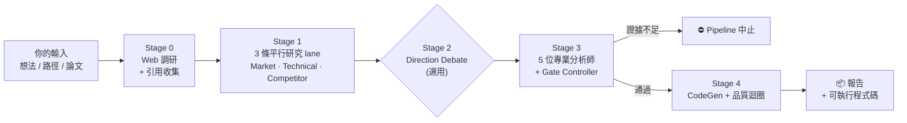

# Crucible

<p align="center">
  
</p>

<p align="center">
  
  
  
</p>

<p align="center">
  <b>語言:</b> <b>中文（目前頁面）</b> · <a href="README.md">English</a><br>
  <b>完整介紹:</b> <a href="README_FULL_zh.md">完整中文手冊</a> · <a href="README_FULL.md">Full English manual</a>
</p>

---

> **把「我有一個想法」變成「可執行程式碼 + 5 位 AI 分析師的風險審查報告」。**
> AI 原生多代理研究引擎 — 為投資研究、SaaS 產品分析、AI agent 架構評估、學術論文重現而設計。

---

## 30 秒看懂

**輸入** — 一句話想法、一個現有專案路徑、或一篇論文標題
**輸出** — 結構化分析報告（共識 / 分歧 / 風險 / kill criteria）**外加可直接執行的程式碼**
**怎麼做** — 5 位專業 AI 分析師 + 品質閘門：**證據不足時自動中斷 pipeline**（而不是自信地產出垃圾）

---

## 你會用它來做什麼？

| | |
|---|---|
| **🪙 量化交易者 / 研究員**<br>「我有一個策略想法，值不值得做？」<br><sub>→ Quant 模式：研究 + backtest + tearsheet</sub> | **🛠️ SaaS / 產品建構者**<br>「我想做差異化產品，真正的痛點在哪？」<br><sub>→ SaaS 模式：市場 + 競品 + 採用障礙</sub> |
| **📚 學術研究者**<br>「我想重現並做這篇 paper 的消融實驗」<br><sub>→ Scientist 模式：演算法實作 + 可重現性 + 基準</sub> | **🤖 AI Agent 開發者**<br>「我在做一個 agent，想驗證架構穩不穩」<br><sub>→ Agent 模式：狀態邊界 + 重播安全</sub> |

**手上有現成專案要改？** 任何一種研究模式都可以搭配 **Project Path 模式** — 指向資料夾，Crucible 會做分析、修 bug，只做 additive changes（既有 API 完全保留）。

→ 完整模式說明：[README_FULL_zh.md](README_FULL_zh.md)

---

## 3 步驟開跑

### 推薦：用 WebUI（不用記任何 CLI 旗標）

```bash
git clone https://github.com/Starlight143/crucible.git
cd crucible
pip install -r requirements.txt
```

接著雙擊 `launch_webui.bat`（Windows）— 瀏覽器自動打開。

**第一次只需做一件事：** 開 Settings 頁面，填一組 API key：

- [**OpenRouter**](https://openrouter.ai/) — 推薦；支援多模型路由與 USD 成本追蹤
- [**Alibaba Coding Plan**](https://help.aliyun.com/zh/model-studio/) — token 計價
- **或本地跑 [Ollama](https://ollama.ai)** — 設 `LLM_PROVIDER=ollama`，免 API key、零持續成本

完成。選一個模式、輸入想法（或貼上專案路徑）、點 Run 即可。

<details>
<summary><b>想用 CLI？點此展開。</b></summary>

```bash
# 互動模式
python run_crucible.py

# 只掃描 context，不呼叫 LLM
python run_crucible.py --dry-run

# 離線自檢
python run_crucible.py --self-check

# 啟用 Direction Debate
python run_crucible.py --direction-debate

# Production scope + 成本追蹤
python run_crucible.py --scope production --cost-trace --cost-report
```

完整旗標：見 [README_FULL_zh.md](README_FULL_zh.md) 或執行 `python run_crucible.py --help`。

</details>

<details>
<summary><b>生產部署（Gunicorn）。點此展開。</b></summary>

```bash
pip install gunicorn
gunicorn --config gunicorn_config.py "webui.app:app"
```

主要環境變數：`GUNICORN_BIND`（預設 `0.0.0.0:8080`）、`GUNICORN_WORKERS`、`GUNICORN_TIMEOUT`（預設 `300` 秒 — 必須大於你最長的 pipeline run）。

</details>

---

## 它怎麼運作



五個階段，任何一站的品質閘門失敗都會中止 pipeline — 這是設計上的選擇。

→ 逐階段詳細說明：[README_FULL_zh.md](README_FULL_zh.md)

---

## 我可以信任產出嗎？

- ✅ **每個論點可追溯到引用來源** — Research Synthesizer 會把不支撐的論點移至 `unknowns` 或標為 `hallucination_flags`
- ✅ **每個決策可追溯到分析師發現** — 完整證據鏈保存在輸出 artifacts
- ✅ **證據不足時自動中斷** — 不會出現「自信但錯誤」的輸出
- ✅ **3 255+ 自動化測試，100% 通過** — 含 injection、SSRF、redaction、數值穩定性、跨 process race 等覆蓋
- ✅ **Backtest 資料完整性預設啟用** — synthetic fallback 預設被拒絕，除非顯式 opt in（`BACKTEST_REQUIRE_REAL_DATA=1` 為預設）
- ✅ **Pydantic 驗證的型別輸出** — 下游永遠不解析自由文本

---

## 授權

- **個人 / 開源 / 學術研究：免費** — [AGPL v3](LICENSE)
- **商業使用** — 閉源散布、不公開原始碼的商用 SaaS、嵌入私有系統、或無法滿足 AGPL-3.0 任何條件，需取得商業授權

商業授權聯絡：**supervenus928@gmail.com** · 詳見 [COMMERCIAL_LICENSE.md](COMMERCIAL_LICENSE.md)

---

## 更多

- 📘 [完整中文手冊](README_FULL_zh.md) · [Full English manual](README_FULL.md)
- 🏗️ [架構文件](ARCHITECTURE.md)
- 📝 [CHANGELOG](CHANGELOG.md)
- 🤝 [貢獻指南](CONTRIBUTING.md)
- ⚙️ [完整環境變數](.env.example)

完整版本歷史見 [CHANGELOG.md](CHANGELOG.md)。
