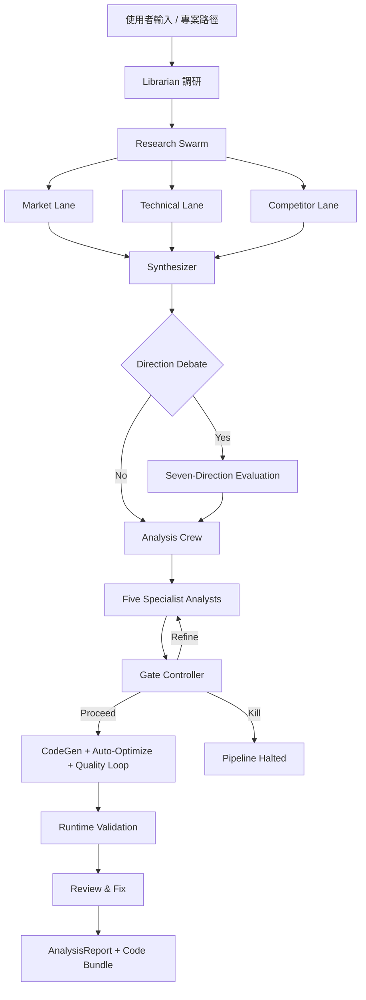

# Crucible

**AI 原生多代理研究引擎 — 將投資研究、SaaS 產品分析、Agent 架構評估與學術論文實踐分解為可重複、可審計、帶風險閘門的多階段流程。**

---

## 為什麼需要這個系統

傳統研究流程（無論量化、產品還是架構評估）存在三個系統性問題：

1. **單次 Prompt 不穩定。** 單一 LLM 呼叫無法穩定產出研究級輸出。每次執行結果差異極大，幻覺難以偵測，且缺乏挑戰弱假設的機制。

2. **研究過程不可重複、不可審計。** 當分析師寫備忘錄時，推理路徑不透明。當 AI 生成報告時，證據鏈更不透明。兩者都無法被系統性地審查、重播或改進。

3. **可行性、風險與局限性是事後補充。** 多數研究工具為了生成結論而優化。它們不會系統性地評估結論是否可實現、可能出什麼問題、或缺少什麼證據。

本專案採用不同的方法：**將研究視為帶有明確品質閘門的多階段、多代理工作流。**

---

## 流程概覽

Pipeline 將研究分解為多個階段，每個階段產出結構化、帶型別的輸出，供下游使用：

```
研究問題 / 專案路徑
       │
       ▼
┌──────────────────────┐
│  0. Librarian 調研   │  Web search + 文獻引用 + 市場數據
│     (Idea 模式)      │  → ResearchContext
└──────────┬───────────┘
           ▼
┌──────────────────────┐
│  1. Research Swarm   │  3 條平行 lane (Market, Technical, Competitor)
│                      │  → Synthesizer 合併並做 citation grounding
└──────────┬───────────┘
           ▼
┌──────────────────────┐
│  2. Direction Debate │  7 個策略方向 → Evidence Audit
│     (選用)           │  → Multi-axis Comparator → Judge 擇優
└──────────┬───────────┘
           ▼
┌──────────────────────┐
│  3. Analysis Crew    │  5 位專業分析師 (Research, Risk, Ops, Biz, Critic)
│                      │  → Gate Controller (proceed / refine / kill)
└──────────┬───────────┘
           ▼
┌──────────────────────┐
│  4. CodeGen + QA     │  多檔案產碼 → Runtime validation
│                      │  → Quality loop → Review & Fix
└──────────┬───────────┘
           ▼
    AnalysisReport + Code Bundle
    (consensus, disagreement, experiments, score, risk level, 可執行程式碼)
```

---

## 各階段說明

### Stage 0: Librarian 調研

由 Web search agent 與 Librarian LLM 協同，對研究問題做初步文獻與市場調研，產出 `ResearchContext` 供下游所有階段引用。搜尋結果採兩層快取：整體 `ResearchContext` 由 `run_librarian_research` 透過 SHA256 key 快取（TTL = `LIBRARIAN_CACHE_WINDOW_HOURS`）；個別 (provider, query) 查詢由 `_SEARCH_QUERY_CACHE`（TTL 1 小時）快取，避免重複 HTTP 請求。

### Stage 1: Research Swarm

三條獨立研究 agent 平行執行，各自帶有專門的證據提取規則：

| Lane | 聚焦範圍 |
|------|---------|
| **Market** | 使用者痛點、工作流摩擦、採用障礙、市場先例 |
| **Technical** | 架構模式、生產約束、故障模式 |
| **Competitor** | 競爭者、替代方案、開源替代品、定位 |

**Research Synthesizer** 合併三條 lane，做交叉驗證：只有帶引用支撐的論點會保留。不支撐的論點移至 `unknowns` 或標記為 `hallucination_flags`。

### Stage 2: Direction Debate

當研究問題有多條可行路徑時，系統生成 **七個互斥策略方向**，經結構化評估：

1. **Direction Proposer** — 生成 7 個選項，附 thesis、metric、test、risk
2. **Evidence Auditor** — 評分各方向的證據品質
3. **Direction Comparator** — 多軸排序（可行性、可逆性、驗證速度、證據強度、下行嚴重度、未解未知數）
4. **Direction Judge** — 擇優，附 go-conditions、kill-criteria、驗證計畫

### Stage 3: Analysis Crew

五位專業分析師獨立評估：

| 分析師 | 角色 |
|--------|------|
| **Research** | 市場機會、使用者假設、product-market 信號 |
| **Risk** | 不可逆風險、失敗條件、kill criteria |
| **Ops** | 執行順序、交付約束、監控需求 |
| **Biz** | 變現、分發、單位經濟 |
| **Critic** | 挑戰假設、揭示隱藏耦合、嚴格審查 |

產出經品質閘門：

- **Gate Context Compactor** — 去重與壓縮分析師發現
- **Gate Controller** — 決定 proceed、targeted analyst rerun 或 kill
- **Format Checker** — 組裝最終 `AnalysisReport`，不添加新資訊

### Stage 4: CodeGen + Quality Loop

通過 Gate 後進入多檔案產碼：

- 依 manifest 與依賴圖分批生成程式碼
- `py_compile` + entrypoint 偵測 + import / smoke 驗證
- Quality loop（LLM-backed 品質閘門，受 max iteration 上限保護）
- Review & Fix 迴圈修補
- **Auto-Optimize**（選用）：`codegen_critic` agent 評分並注入 critique 反饋，最多 N 輪迭代直到達標

---

## Pipeline 模式

| 模式 | 研究聚焦 | 目標用戶 |
|------|---------|---------|
| **Quant** | 市場微結構、信號衰減、數據品質、執行可行性、回測自動化、參數最佳化 | 量化交易團隊、Quant 研究員 |
| **SaaS** | 使用者痛點、工作流摩擦、採用障礙、整合模式 | 產品團隊、SaaS 建構者 |
| **Agent** | 自動化範圍、狀態邊界、重播安全、確定性執行 | AI Agent 開發者、自動化工程師 |
| **Scientist** | 論文搜索與理解、演算法實作、可重現性驗證、消融實驗、基準比較 | 研究人員、ML 工程師、學術從業者 |

---

## 輸入模式

### Idea 模式

從零開始做新專案、MVP、策略研究或技術方案分析。

1. 使用者輸入想法、需求或研究問題
2. **Librarian 調研**（Stage 0）：Web search + 文獻引用 → `ResearchContext`
3. **Research Swarm**（Stage 1）：3 條平行 lane
4. **Direction Debate**（Stage 2，選用）：7 個策略方向 → 辯論 → 擇優
5. **Analysis Crew**（Stage 3）：5 位分析師 → Gate Controller 決策
6. **CodeGen + QA**（Stage 4）：多檔案產碼 → Runtime validation → Review & Fix
7. **後置處理**：安全掃描、部署 artifact、測試生成、API 修補、獨立驗證等

### Project Path 模式

對既有專案做最小變更修正、bug 修復或功能增強。

1. 使用者指定專案路徑（本機目錄）
2. 系統讀取專案結構、入口點與相依關係，建立上下文
3. 以修復導向 agent 聚焦 bug、結構問題或指定的功能需求
4. 保留既有 API、主要行為與檔案結構（additive changes 為主）
5. 對修改結果做 review 與 runtime validation
6. **後置處理**：與 Idea 模式相同的後置處理流程

---

## 範例輸出

```json
{
  "project_name": "metadata_universe_builder",
  "score": 74,
  "risk_level": "Medium",
  "consensus": "All analysts agree that a static-first, empirically-validated coverage catalog is the correct starting point...",
  "disagreement": "Risk and Ops analysts disagree on schema drift severity...",
  "experiments": [
    {
      "goal": "Validate field accuracy across 5 exchanges using live API probes",
      "criteria": "Accuracy >= 90% on 8 core fields"
    }
  ],
  "analyst_findings": {
    "research": "Strong market signal: no open-source tool provides...",
    "risk": "Three material risks identified: (1) Schema drift...",
    "ops": "Execution sequence: Week 1-2: manual curation...",
    "biz": "Two viable monetization paths...",
    "critic": "The 15-exchange target may be overambitious..."
  }
}
```

執行後結果寫入 `saved_projects/`，常見內容包含：

- `analysis_result.json` — 分析報告
- `run_meta.json` — 執行元資料
- `run_snapshot.json` — pipeline 快照
- `code/` — 生成的程式碼
- `deployment/` — Dockerfile、K8s manifests、Helm chart

---

## Quick Start

### 前置需求

- Python 3.10+
- LLM Provider API key（三選一）：
  - [OpenRouter](https://openrouter.ai/) API key（預設）
  - [Alibaba Coding Plan](https://help.aliyun.com/zh/model-studio/) API key
  - [Ollama](https://ollama.ai)（本地端，無需 API key）

### 安裝

```bash
git clone https://github.com/YOUR_USERNAME/crucible.git
cd crucible
pip install -r requirements.txt
```

需要本地測試 / lint / 型別檢查 / 安全掃描：

```bash
pip install -r requirements.txt -r requirements-dev.txt
```

### 設定

```bash
cp .env.example .env
# 編輯 .env 填入 API key 與模型設定
```

完整環境變數說明請見 [.env.example](.env.example)。

### 執行

```bash
# 互動模式
python run_crucible.py

# 只做離線自檢
python run_crucible.py --self-check

# 只掃描 context，不呼叫 LLM
python run_crucible.py --dry-run
```

---

## WebUI

WebUI 提供圖形介面執行所有 pipeline 功能，無需記憶 CLI 旗標。

### 啟動

雙擊 `launch_webui.bat`，瀏覽器將自動開啟。首次執行會自動安裝 `flask`。

- 自動偵測可用 localhost port（8080–9000 範圍）
- 若以系統管理員身分執行，自動將自訂網域加入 hosts

### 頁面

| 頁面 | 功能 |
|------|------|
| **Project Path** | 指定現有專案路徑進行分析或修復 |
| **Idea Mode** | 輸入自然語言想法或策略，直接生成程式碼 |
| **Dashboard** | 執行歷史、成本趨勢、品質分佈、Pipeline 階段雷達圖 |
| **Leaderboard** | Backtest 策略排行榜，按 Sharpe / Return / Drawdown 排序 |
| **Compare Runs** | 側欄並排比對兩次 run 的分析結果、品質分數、成本、閘門決策 |
| **A/B Test** | 同時啟動兩個不同 pipeline 設定，完成後對比指標 |
| **Settings** | 圖形化編輯 `.env`；API Key 欄位附即時「Test」按鈕；底部顯示 Webhook 投遞歷史 |

### 生產部署（Gunicorn）

```bash
pip install gunicorn
gunicorn --config gunicorn_config.py "webui.app:app"
```

主要環境變數覆蓋：`GUNICORN_BIND`（預設 `0.0.0.0:8080`）、`GUNICORN_WORKERS`、`GUNICORN_TIMEOUT`（預設 `300`）。

---

## 架構



---

## LLM Provider 設定

| Provider | `LLM_PROVIDER` 值 | 備註 |
|----------|-------------------|------|
| **OpenRouter** | `openrouter` | 預設值，支援多模型路由，有 USD 成本追蹤 |
| **Alibaba Coding Plan** | `alibaba_coding_plan` | Token-only 成本追蹤，單檔批次產碼 |
| **Ollama** | `ollama` | 本地端 LLM，完全離線，不需 API key |

完整環境變數請見 [.env.example](.env.example)。

---

## 常用命令

```bash
# 顯示說明
python run_crucible.py --help

# Direction Debate
python run_crucible.py --direction-debate
python run_crucible.py --direction-debate-only

# CodeGen scope
python run_crucible.py --scope mvp         # 最小可執行（預設）
python run_crucible.py --scope full         # 完整模組化系統
python run_crucible.py --scope production   # Full + 測試 + Dockerfile + CI

# Auto-optimize
python run_crucible.py --codegen-auto-optimize --codegen-optimize-rounds 3

# Gate Controller
python run_crucible.py --gate-control
python run_crucible.py --selective-rerun

# 後置處理（Enhanced Runner）
python run_crucible_enhanced.py run \
  --security-scan \
  --deployment-artifacts \
  --generate-tests \
  --independent-validation \
  --backtest-runner \
  --html-report
```

---

## 驗證與測試

```bash
# 全量 pytest（1747 項測試）
python -m pytest tests -q -p no:cacheprovider

# Smoke test
python crucible/smoke_test.py

# Self-check
python run_crucible.py --self-check

# Ruff / mypy
python -m ruff check crucible/
python -m mypy
```

---

## 設計原則

**研究，不是結論。** 系統產出結構化研究 artifacts — consensus *與* disagreement，evidence *與* unknowns，proposed experiments *與* kill criteria。不輸出單一建議。

**閘門式，不是端到端。** Gate Controller 在證據不足時可以中止 pipeline。防止 AI 系統從弱輸入產出自信輸出的常見失敗。

**帶型別，不是自由文本。** 每個階段產出 Pydantic 驗證的輸出。下游永遠不需解析自由文本。Schema 演化是顯式且向後相容的。

**可審計，不是不透明。** 每個論點可追溯到引用。每個決策可追溯到特定分析師發現。完整證據鏈保存在輸出 artifacts 中。

**可平行則平行，該序列則序列。** Research lane 平行執行。Gate Controller 在所有分析師完成後序列執行。在吞吐量與品質控制之間取得平衡。

---

## 基礎設施模組

以下模組為 pipeline 提供橫切面能力，不包含業務邏輯，但被所有主線模組共用。

| 模組 | 說明 |
|------|------|
| `context_budget.py` | Context window 預算管理；超過閾值時自動壓縮早期訊息 |
| `cost_tracker.py` | 每階段 LLM 成本累積追蹤；超過 budget 時 raise `StageBudgetExceededError` |
| `progress.py` | 事件驅動進度回報（STARTED / STEP / PROGRESS / WARNING / FINISHED / FAILED） |
| `feature_registry.py` | Feature 登錄與拓撲排序（Kahn's 演算法） |
| `_file_cache.py` | LRU 檔案內容快取（mtime_ns-based 失效，thread-safe） |
| `convergence_guard.py` | Feedback loop 收斂保護：迭代上限 + wall-clock 超時 + 重複簽名偵測 |
| `hooks.py` | Post-stage hook 系統（per-stage 順序鎖 + 例外隔離） |
| `http_retry.py` | HTTP retry 裝飾器；`safe_get` / `safe_post` 帶重試與大小保護 |
| `error_budget.py` | 每階段錯誤預算追蹤；超出時 raise `BudgetExhaustedError`，事件寫入 JSONL 審計日誌 |
| `telemetry.py` | 非阻塞結構化遙測；背景 daemon thread 非同步分發事件到 sinks |

---

## 專案結構

```
crucible/
├── run_crucible.py          # 根目錄主啟動器
├── run_crucible_enhanced.py      # Enhanced runner（後置處理流程）
├── launch_webui.bat                # WebUI 啟動器
├── .env.example                    # 環境變數範本（完整設定說明）
├── requirements.txt                # runtime 依賴
├── requirements-dev.txt            # 開發與驗證依賴
├── gunicorn_config.py              # 生產部署 WSGI 設定
├── crucible/
│   ├── modules/                    # Pipeline 主線 section modules（Stage 0–4 runtime）
│   ├── features/                   # 後置處理與增強功能模組
│   ├── web_research/               # Web search clients + crew factory
│   ├── runtime_logging.py          # 結構化日誌 + context propagation
│   ├── resilience.py               # Circuit breaker + retry with backoff
│   └── ...                         # 基礎設施模組
├── webui/
│   ├── app.py                      # Flask backend + REST API
│   └── templates/index.html        # 前端 SPA
└── tests/                          # 1747 項測試
```

各基礎設施模組、功能模組與 pipeline section 的詳細說明，見 [ARCHITECTURE.md](ARCHITECTURE.md)。

---

## 版本歷史

見 [CHANGELOG.md](CHANGELOG.md)。
